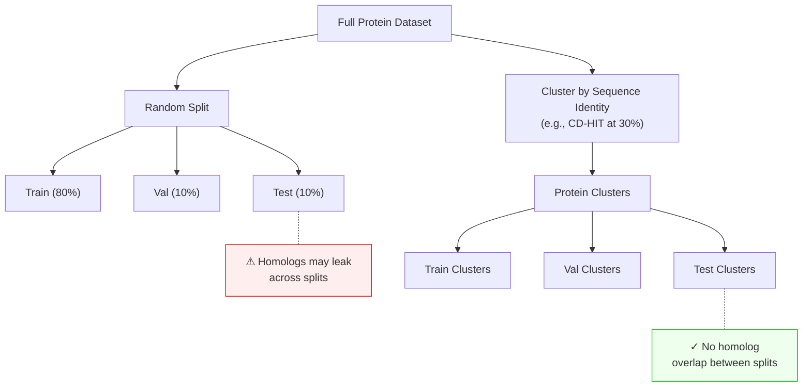

<p style="color: #666; font-size: 0.9em; margin-bottom: 1.5em;">
<em>This is a preliminary self-study note for the Protein &amp; Artificial Intelligence course (Spring 2026), co-taught by <a href="https://sungsoo-ahn.github.io">Prof. Sungsoo Ahn</a> and Prof. Homin Kim at KAIST. Students with a biology background are encouraged to work through these notes before the course begins. The material assumes basic Python fluency (variables, functions, loops) but no prior experience with numerical computing or bioinformatics libraries.</em>
</p>

## Introduction

Suppose you receive a dataset of one million protein sequences and want to train a neural network that predicts whether each protein folds correctly, binds to a drug molecule, or causes disease when mutated.
Before any model can learn from this data, you face a practical question: how do you represent a protein in a form that a computer can process?

Proteins are not simple data points like house prices or customer ratings.
They are variable-length chains of amino acids that fold into intricate three-dimensional shapes.
Their sequences range from tens to thousands of residues.
Their structures involve thousands of atoms, each with precise spatial coordinates.
The way you load, transform, and prepare this data determines whether your downstream models succeed or fail.

This note builds the foundational toolkit for working with protein data in Python.
We cover three pillars --- NumPy for numerical computation, Pandas for tabular data analysis, and specialized libraries for reading protein file formats --- and connect each to concrete tasks in protein AI.

### Roadmap

| Section | Why It's Needed |
|---------|-----------------|
| **NumPy: Numerical Protein Data** | Proteins become arrays of coordinates and encodings; fast linear algebra enables structure alignment and distance computation |
| **Pandas: Tabular Protein Data** | Real datasets mix sequences, labels, and metadata in CSV files; Pandas handles filtering, aggregation, and feature engineering |
| **Protein File Formats** | Raw biological data lives in FASTA (sequences) and PDB (3D structures); parsing these correctly is the entry point to any protein ML pipeline |
| **Preparing Data for ML** | Naive random splits cause data leakage in protein datasets; proper splitting by sequence similarity is essential for honest evaluation |
| **Visualizing Protein Data** | Contact maps and 3D viewers reveal structural patterns and catch preprocessing errors before they reach the model |

### Learning Objectives

By the end of this note, you will be able to:

1. Perform efficient numerical computations on protein data using NumPy arrays.
2. Manipulate and analyze tabular protein datasets with Pandas.
3. Load and parse FASTA (sequence) and PDB (structure) files using Biopython and Biotite.
4. Prepare biological data for machine learning pipelines while avoiding common pitfalls like data leakage.

---

## 1. NumPy: The Language of Numerical Protein Data

When biologists think about proteins, they think about sequences of amino acids and three-dimensional folds.
When computers process proteins, they think in numbers.
Every protein sequence becomes a matrix of encoded values.
Every atomic position becomes a triplet of coordinates.
Every evolutionary relationship becomes a numerical distance.
NumPy (Numerical Python) translates between these two worlds.[^numpy-name]

[^numpy-name]: NumPy stands for "Numerical Python." It is the foundational array-computing library in the Python ecosystem, underlying virtually every scientific and machine learning package.

### 1.1 Representing Proteins as Arrays

The fundamental data structure in NumPy is the **array** (or `ndarray`), a grid of values that can have any number of dimensions.
For protein AI, arrays represent three main types of data.

**Sequence encodings.**
A protein sequence like `MVLSPADKTN...` becomes a matrix where each row corresponds to a residue position and each column corresponds to one of the 20 standard amino acids.
A protein of length $$N$$ is encoded as an $$N \times 20$$ matrix.

**3D coordinates.**
Every atom in a protein structure has an $$(x, y, z)$$ position in space.
The alpha-carbon ($$\text{C}_\alpha$$) trace --- one atom per residue --- is a common simplified representation, stored as an $$N \times 3$$ array where $$N$$ is the number of residues.

**Distance matrices.**
An $$N \times N$$ symmetric matrix where entry $$(i, j)$$ records the Euclidean distance between residues $$i$$ and $$j$$.
Distance matrices encode the essential topology of a protein fold.

Here is how to create these arrays in practice:

```python
import numpy as np

# Sequence encoding: 100 residues, 20 amino acid channels (one-hot)
sequence_encoding = np.zeros((100, 20))

# 3D coordinates: 76 Calpha atoms of Ubiquitin, each with (x, y, z)
coords = np.random.randn(76, 3)

# Inspect array properties
print(f"Shape: {coords.shape}")   # (76, 3) — 76 atoms, 3 coordinates each
print(f"Dtype: {coords.dtype}")   # float64 — 64-bit floating point precision
print(f"Size:  {coords.size}")    # 228 — total number of elements (76 * 3)
```

The `shape` attribute reports dimensions.
The `dtype` attribute specifies numerical precision --- `float64` provides about 15 decimal digits, which is standard for scientific computation.
The `size` attribute gives the total element count, useful for estimating memory usage.

### 1.2 Broadcasting: Operations Across Dimensions

One of NumPy's most powerful features is **broadcasting**, which allows arithmetic between arrays of different shapes by automatically expanding the smaller array to match the larger one.
Broadcasting eliminates the need for explicit Python loops and runs at compiled-C speed.

A concrete example: **centering a protein structure**.
Before comparing two structures, we often translate each one so that its center of mass[^center-of-mass] sits at the origin.
Without broadcasting, this requires a loop over all atoms.
With broadcasting, a single line suffices.

[^center-of-mass]: Strictly, the center of mass weights each atom by its mass. For the $$\text{C}_\alpha$$ trace (where all atoms are carbon), the center of mass equals the arithmetic mean of the coordinates.

```python
# Centering: subtract the mean position from every atom
coords = np.random.randn(100, 3)      # 100 atoms, 3 coordinates
centroid = coords.mean(axis=0)         # shape (3,) — mean x, mean y, mean z
centered = coords - centroid           # broadcasting: (100, 3) - (3,) -> (100, 3)
```

The centroid has shape `(3,)` --- three numbers.
When subtracted from `coords` with shape `(100, 3)`, NumPy broadcasts the centroid across all 100 rows, subtracting the same three values from every atom.

**Broadcasting rule.**
Two dimensions are compatible if they are equal or if one of them is 1.
NumPy expands any dimension of size 1 to match the other array.
This rule will appear repeatedly as we build more complex operations.

### 1.3 Distance Matrices: The Fingerprint of Protein Structure

If one operation defines structural biology, it is computing distances between atoms.
A **distance matrix** $$D \in \mathbb{R}^{N \times N}$$ captures the pairwise distances between all residues:

$$
D_{ij} = \lVert \mathbf{r}_i - \mathbf{r}_j \rVert_2
$$

where $$\mathbf{r}_i \in \mathbb{R}^3$$ is the coordinate vector of residue $$i$$, and $$\lVert \cdot \rVert_2$$ denotes the Euclidean norm.

Distance matrices matter because they are **invariant to rotation and translation**.
Two copies of the same protein, oriented differently in space, produce identical distance matrices.
This invariance makes distance matrices a natural input representation for neural networks that should not depend on the arbitrary orientation of the input structure.

The implementation uses a broadcasting trick:

```python
def compute_distance_matrix(coords):
    """
    Compute pairwise Euclidean distances between all atoms.

    Args:
        coords: np.ndarray of shape (N, 3), Calpha coordinates

    Returns:
        np.ndarray of shape (N, N), pairwise distance matrix
    """
    # Reshape for broadcasting:
    #   coords[:, np.newaxis, :] has shape (N, 1, 3)
    #   coords[np.newaxis, :, :] has shape (1, N, 3)
    # Subtraction broadcasts to (N, N, 3) — all pairwise difference vectors
    diff = coords[:, np.newaxis, :] - coords[np.newaxis, :, :]

    # Square, sum over the coordinate axis, take square root
    return np.sqrt(np.sum(diff ** 2, axis=-1))

# Example: Ubiquitin (76 residues)
ca_coords = np.random.randn(76, 3)
D = compute_distance_matrix(ca_coords)
print(f"Distance matrix shape: {D.shape}")  # (76, 76)
print(f"D[0, 1] = {D[0, 1]:.2f} Angstroms")
```

This function will appear throughout the course.
It is used for contact map prediction, structure validation, and as input to geometric deep learning models such as AlphaFold [7].

<div class="col-sm-8 mt-3 mb-3 mx-auto">
    
    <div class="caption mt-1">A Cα distance matrix for a 76-residue protein. The color scale (in Angstroms) reveals the protein's topology: nearby residues along the diagonal are close in space, while off-diagonal blue patches indicate residues brought together by tertiary contacts.</div>
</div>

### 1.4 Linear Algebra: Structure Alignment with the Kabsch Algorithm

Comparing two protein structures requires **superposition** --- finding the rotation that best aligns one structure onto the other.
The standard method is the **Kabsch algorithm** [5], which finds the optimal rotation matrix $$R$$ minimizing the root-mean-square deviation (RMSD)[^rmsd] between two sets of corresponding points.

[^rmsd]: RMSD (root-mean-square deviation) measures the average distance between corresponding atoms after optimal superposition. It is the standard metric for evaluating structure prediction accuracy, with units in Angstroms.

The algorithm works in three steps.
First, center both structures at the origin.
Second, compute the cross-covariance matrix $$H = P^{\top} Q$$, where $$P$$ and $$Q$$ are the $$N \times 3$$ coordinate matrices of the two centered structures.
Third, decompose $$H$$ using singular value decomposition (SVD) to extract the optimal rotation.

```python
def kabsch_rotation(mobile, target):
    """
    Find the optimal rotation matrix to align 'mobile' onto 'target'.

    Both inputs must be centered (mean subtracted) and have shape (N, 3).

    Args:
        mobile: np.ndarray of shape (N, 3), structure to be rotated
        target: np.ndarray of shape (N, 3), reference structure

    Returns:
        R: np.ndarray of shape (3, 3), optimal rotation matrix
    """
    # Cross-covariance matrix
    H = mobile.T @ target                  # shape (3, 3)

    # Singular value decomposition
    U, S, Vt = np.linalg.svd(H)

    # Optimal rotation
    R = Vt.T @ U.T

    # Correct for reflection: ensure a proper rotation (det = +1)
    if np.linalg.det(R) < 0:
        Vt[-1, :] *= -1
        R = Vt.T @ U.T

    return R


def compute_rmsd(P, Q):
    """
    Compute RMSD between two structures after optimal superposition.

    Args:
        P, Q: np.ndarray of shape (N, 3), corresponding atom coordinates

    Returns:
        float, RMSD in the same units as the input coordinates (typically Angstroms)
    """
    # Center both structures
    P_centered = P - P.mean(axis=0)
    Q_centered = Q - Q.mean(axis=0)

    # Align
    R = kabsch_rotation(P_centered, Q_centered)
    P_aligned = P_centered @ R

    # RMSD = sqrt(mean of squared distances)
    return np.sqrt(np.mean(np.sum((P_aligned - Q_centered) ** 2, axis=1)))
```

The reflection check (line `if np.linalg.det(R) < 0`) is essential.
SVD can produce an improper rotation (a rotation combined with a mirror flip), which would be physically meaningless --- proteins are chiral molecules and their mirror images are different structures.

**Summary.**
NumPy provides the numerical foundation for protein AI: arrays represent sequences and structures; broadcasting enables fast vectorized operations; distance matrices and SVD-based alignment are the workhorses of structural analysis.

---

## 2. Pandas: Wrangling Tabular Protein Data

While NumPy excels at numerical arrays, real-world protein datasets arrive in messier formats: CSV files from experiments, database dumps with mixed data types, annotation tables with missing values.
Pandas provides the **DataFrame**, a two-dimensional table with labeled rows and columns that can hold different data types and handle missing values.

Protein datasets often combine numerical features (molecular weight, binding affinity), categorical data (organism, subcellular location), and text (sequences, annotations).
Pandas lets you filter, aggregate, and transform all of these in a unified framework.

### 2.1 Loading and Exploring Protein Datasets

Most protein machine learning benchmarks distribute data as CSV files.
The DeepSol dataset, for example, contains protein sequences labeled as soluble (1) or insoluble (0) --- a binary classification task relevant to drug development and protein engineering.[^deepsol]

[^deepsol]: DeepSol was introduced by Khurana et al. (2018) as a benchmark for predicting protein solubility from sequence alone. Solubility is a key property for recombinant protein production.

```python
import pandas as pd

# Load a protein solubility dataset
df = pd.read_csv("deepsol_train.csv")
print(df.head())
#    sequence                                            label
# 0  MKWVTFISLLFLFSSAYSRGVFRRDTHKSEIAHRFKDLGE...        1
# 1  MDPKISEMHPALRLVDPQIQLAVTRILDPDGNVLDKARKV...        0
```

The `head()` method displays the first few rows.
For protein datasets, you typically want to know: how many examples are there, are the classes balanced, and how long are the sequences?

```python
# Dataset overview
print(f"Number of proteins: {len(df)}")
print(f"Class distribution:\n{df['label'].value_counts()}")

# Sequence length analysis — critical for model architecture choices
df['length'] = df['sequence'].str.len()
print(f"Length range: {df['length'].min()} – {df['length'].max()}")
print(f"Mean length:  {df['length'].mean():.1f}")
```

Sequence length analysis is important because, unlike images that can be resized to a fixed resolution, proteins have intrinsic lengths.
A 50-residue peptide and a 500-residue enzyme cannot be stretched to the same size.
This variability affects model architecture choices, padding strategies, and computational requirements.

### 2.2 Filtering and Selecting Subsets

Pandas excels at selecting subsets of data based on conditions --- essential for creating focused training sets, analyzing specific protein families, or excluding problematic entries:

```python
# Select only short proteins (< 200 residues)
short_proteins = df[df['length'] < 200]

# Select only soluble proteins
soluble = df[df['label'] == 1]

# Compound filter: soluble proteins between 50 and 500 residues
filtered = df[
    (df['length'] >= 50) &
    (df['length'] <= 500) &
    (df['label'] == 1)
]
print(f"Filtered dataset: {len(filtered)} proteins")
```

The syntax `df[condition]` returns rows where the condition is `True`.
For compound conditions, use `&` (and) and `|` (or), wrapping each condition in parentheses.
This filtering is indispensable for curating clean training sets.

### 2.3 Feature Engineering: From Sequences to Numbers

Raw protein sequences are strings of single-letter amino acid codes.[^aa-codes]
Machine learning models need numbers.
**Feature engineering** transforms sequences into numerical representations that capture biologically meaningful properties.

[^aa-codes]: The 20 standard amino acids are represented by the letters A, C, D, E, F, G, H, I, K, L, M, N, P, Q, R, S, T, V, W, Y. Each letter corresponds to a specific amino acid (e.g., A = Alanine, G = Glycine).

The simplest approach is **amino acid composition**: for each protein, compute the fraction of each amino acid type in its sequence.
This produces a 20-dimensional feature vector.

```python
from collections import Counter

STANDARD_AAS = "ACDEFGHIKLMNPQRSTVWY"

def aa_composition(sequence):
    """
    Compute amino acid frequencies for a protein sequence.

    Args:
        sequence: str, single-letter amino acid sequence

    Returns:
        dict mapping each amino acid to its frequency (0.0 to 1.0)
    """
    counts = Counter(sequence)
    total = len(sequence)
    return {aa: counts.get(aa, 0) / total for aa in STANDARD_AAS}

# Apply to every sequence in the DataFrame
compositions = df['sequence'].apply(aa_composition)
aa_df = pd.DataFrame(compositions.tolist())
df = pd.concat([df, aa_df], axis=1)

# Now df has 20 new columns — one per amino acid
print(f"Feature columns: {list(aa_df.columns)}")
```

While simple, amino acid composition captures meaningful biochemical trends.
Proteins rich in charged residues (K, R, E, D) tend to be soluble; those enriched in hydrophobic residues (V, I, L, F) tend to aggregate.
These 20 features serve as a reasonable baseline before moving to learned representations in later lectures.

**Summary.**
Pandas transforms the messy reality of biological data --- mixed types, missing values, variable-length strings --- into clean, structured tables ready for analysis and machine learning.

---

## 3. Protein File Formats: FASTA and PDB

<div class="col-sm-8 mt-3 mb-3 mx-auto">
    
    <div class="caption mt-1"><strong>Protein 3D structure.</strong> A simplified ribbon representation showing the three main secondary structure elements: alpha-helices (red), beta-strands (blue), and loops/coils (gray). Real structures from the Protein Data Bank encode the precise 3D coordinates of every atom.</div>
</div>

The computational biology community has developed standardized file formats for storing protein data.
Understanding these formats is essential: they are the raw materials from which you build datasets.
The two most important formats are FASTA for sequences and PDB for three-dimensional structures.

### 3.1 FASTA: The Universal Sequence Format

FASTA is the simplest bioinformatics file format.
Each entry consists of a header line starting with `>`, followed by one or more lines of amino acid sequence:

```
>sp|P0A6Y8|DNAK_ECOLI Chaperone protein DnaK
MGKIIGIDLGTTNSCVAIMDGTTPRVLENAEGDRTTPSIIAYTQDGETLVGQPAKRQAVT
NPQNTLFAIKRLIGRRFQDEEVQRDVSIMPFKIIAADNGDAWVEVKGQKMAPPQISAEVL
```

The header in this example follows UniProt[^uniprot] conventions.
`sp` indicates Swiss-Prot (the manually curated portion of UniProt).
`P0A6Y8` is the accession number --- a unique identifier for this protein.
`DNAK_ECOLI` is the entry name.
The remaining text describes the protein's function.

[^uniprot]: UniProt (Universal Protein Resource) is the most comprehensive protein sequence database, containing over 200 million entries. Swiss-Prot is its curated subset with roughly 570,000 entries.

Different databases use different header conventions, so always check the source before writing a parser.

### 3.2 Parsing FASTA with Biopython

Biopython is the standard library for biological file parsing in Python.
Its `SeqIO` module provides a consistent interface across many sequence formats:

```python
from Bio import SeqIO

def load_fasta(filepath):
    """
    Load all sequences from a FASTA file into a dictionary.

    Args:
        filepath: str, path to the FASTA file

    Returns:
        dict mapping sequence IDs to amino acid strings
    """
    sequences = {}
    for record in SeqIO.parse(filepath, "fasta"):
        sequences[record.id] = str(record.seq)
    return sequences

# Example usage
seqs = load_fasta("proteins.fasta")
for name, seq in list(seqs.items())[:3]:
    print(f"{name}: {len(seq)} residues, starts with {seq[:10]}...")
```

`SeqIO.parse()` returns an iterator of `SeqRecord` objects, each containing the sequence and metadata.
The iterator design is important: it reads one record at a time rather than loading the entire file into memory, which matters when processing databases with millions of entries.

### 3.3 PDB: The Format for 3D Structures

While FASTA captures the *sequence* of a protein, the **PDB format** captures its *structure*: the three-dimensional positions of every atom.
PDB files use a fixed-width text format[^pdb-history] with a specific column layout.
The figure below shows an annotated example of a PDB file, illustrating the fixed-width column format inherited from the era of 80-column punch cards.

```
PDB ATOM Record Format (80-column fixed-width):
┌──────┬───────┬──────┬─────┬───┬─────┬────────────────────────────┬──────┬──────┬───┐
│Record│ Atom# │ Name │ Res │Chn│Res# │     X        Y        Z    │ Occ. │B-fac │Elm│
│ Type │       │      │     │ ID│     │                            │      │      │   │
├──────┼───────┼──────┼─────┼───┼─────┼────────────────────────────┼──────┼──────┼───┤
│ATOM  │     1 │  N   │ MET │ A │   1 │  27.340  24.430   2.614   │ 1.00 │ 9.67 │ N │
│ATOM  │     2 │  CA  │ MET │ A │   1 │  26.266  25.413   2.842   │ 1.00 │10.38 │ C │
│ATOM  │     3 │  C   │ MET │ A │   1 │  26.913  26.639   3.531   │ 1.00 │ 9.62 │ C │
└──────┴───────┴──────┴─────┴───┴─────┴────────────────────────────┴──────┴──────┴───┘
 Col:  1-6    7-11   13-16  18-20  22  23-26       31-38  39-46  47-54  55-60 61-66 77-78
```
<div class="caption mt-1">The fixed-width column layout of a PDB ATOM record. Each line contains the atom serial number, atom name, residue name, chain identifier, residue sequence number, (x, y, z) Cartesian coordinates in Ångströms, occupancy, temperature factor, and element symbol. This format dates back to 80-column punch cards from 1971.</div>

[^pdb-history]: The PDB file format dates back to 1971, when data was stored on 80-column punch cards. The fixed-width layout reflects this heritage. A newer format, mmCIF, is gradually replacing PDB for large structures, but PDB remains the most widely used format for single-chain proteins.

```
ATOM      1  N   MET A   1      27.340  24.430   2.614  1.00  9.67           N
ATOM      2  CA  MET A   1      26.266  25.413   2.842  1.00 10.38           C
ATOM      3  C   MET A   1      26.913  26.639   3.531  1.00  9.62           C
```

Each `ATOM` record occupies exactly 80 characters.
The key columns are:

| Columns | Content | Example |
|---------|---------|---------|
| 1--6 | Record type | `ATOM` |
| 7--11 | Atom serial number | `1`, `2`, `3` |
| 13--16 | Atom name | `N`, `CA`, `C`, `O` |
| 18--20 | Residue name (3-letter code) | `MET`, `ALA`, `GLY` |
| 22 | Chain identifier | `A` |
| 23--26 | Residue sequence number | `1` |
| 31--54 | X, Y, Z coordinates (Angstroms) | `27.340  24.430   2.614` |

The **$$\text{C}_\alpha$$** (alpha-carbon) atom is central to protein machine learning.
Every standard amino acid has exactly one $$\text{C}_\alpha$$, located at the backbone's central carbon.
The $$\text{C}_\alpha$$ trace --- one point per residue --- provides a simplified yet informative representation of protein structure.

### 3.4 Parsing PDB with Biotite

Biotite[^biotite] is a modern Python library for structural biology with clean APIs and good performance.
Here is how to load a PDB file and extract $$\text{C}_\alpha$$ coordinates:

[^biotite]: Biotite is an alternative to Biopython's `Bio.PDB` module, offering a more Pythonic API and better integration with NumPy arrays. Both are suitable for this course; we use Biotite for structure parsing and Biopython for sequence parsing.

```python
import biotite.structure.io.pdb as pdb
import biotite.structure as struc

def load_pdb(filepath, chain='A'):
    """
    Load a protein structure from a PDB file.

    Args:
        filepath: str, path to PDB file
        chain: str, chain identifier to extract (default 'A')

    Returns:
        biotite AtomArray containing the filtered structure
    """
    pdb_file = pdb.PDBFile.read(filepath)
    structure = pdb_file.get_structure(model=1)  # first model

    # Keep only standard amino acid atoms (removes water, ligands, ions)
    structure = structure[struc.filter_amino_acids(structure)]

    # Select a single chain
    if chain:
        structure = structure[structure.chain_id == chain]

    return structure

# Load Ubiquitin (PDB ID: 1UBQ) and extract Calpha coordinates
structure = load_pdb("1ubq.pdb")
ca_mask = structure.atom_name == "CA"
ca_coords = structure.coord[ca_mask]
print(f"Calpha coordinates shape: {ca_coords.shape}")  # (76, 3)
```

Ubiquitin (PDB ID: 1UBQ) is a small, well-studied protein with 76 residues.
After extraction, `ca_coords` is a standard NumPy array of shape `(76, 3)` that can be fed directly into `compute_distance_matrix` or `compute_rmsd` from Section 1.

### 3.5 Bridging Sequence and Structure

Sometimes you need to extract the amino acid sequence from a structure file --- to verify consistency or because only the PDB is available.
This requires mapping three-letter residue codes (used in PDB files) to the single-letter codes (used in FASTA files and sequence models):

```python
# Three-letter to one-letter amino acid code mapping
AA_3TO1 = {
    'ALA': 'A', 'CYS': 'C', 'ASP': 'D', 'GLU': 'E', 'PHE': 'F',
    'GLY': 'G', 'HIS': 'H', 'ILE': 'I', 'LYS': 'K', 'LEU': 'L',
    'MET': 'M', 'ASN': 'N', 'PRO': 'P', 'GLN': 'Q', 'ARG': 'R',
    'SER': 'S', 'THR': 'T', 'VAL': 'V', 'TRP': 'W', 'TYR': 'Y'
}

def get_sequence_from_structure(structure):
    """
    Extract the amino acid sequence from a Biotite AtomArray.

    Non-standard residues (e.g., selenomethionine) are mapped to 'X'.

    Args:
        structure: biotite AtomArray

    Returns:
        str, single-letter amino acid sequence
    """
    residue_ids, residue_names = struc.get_residues(structure)
    return ''.join(AA_3TO1.get(name, 'X') for name in residue_names)

# Verify: does the PDB sequence match what we expect?
seq = get_sequence_from_structure(structure)
print(f"Ubiquitin sequence ({len(seq)} residues): {seq[:20]}...")
```

The fallback to `'X'` handles non-standard amino acids --- modified residues, selenomethionine (used in X-ray crystallography), and other variants.
Real-world PDB files frequently contain such entries, so always validate your parsing output.

**Summary.**
FASTA and PDB files are the raw materials of protein AI.
Biopython handles sequence parsing; Biotite handles structure parsing.
Mastering these tools gives you access to the hundreds of thousands of experimentally determined protein structures in the Protein Data Bank and the hundreds of millions of sequences in UniProt.

---

## 4. Preparing Data for Machine Learning

You have loaded sequences, parsed structures, and computed features.
Now comes the stage where many practitioners make subtle errors: preparing data for machine learning.

### 4.1 Train / Validation / Test Splits

The standard approach divides data into three disjoint sets.
The following diagram illustrates two splitting strategies: naive random splitting (which risks data leakage) and the preferred sequence-identity-based clustering approach.




- **Training set** (~80%): used to fit model parameters.
- **Validation set** (~10%): used to tune hyperparameters and monitor for overfitting.
- **Test set** (~10%): used once at the end to report final performance.

```python
from sklearn.model_selection import train_test_split

# Standard 80/10/10 split with a fixed random seed for reproducibility
train_df, temp_df = train_test_split(df, test_size=0.2, random_state=42)
val_df, test_df = train_test_split(temp_df, test_size=0.5, random_state=42)

print(f"Train: {len(train_df)}, Val: {len(val_df)}, Test: {len(test_df)}")
```

The `random_state` parameter ensures reproducibility: you and your collaborators obtain the same split every time.

### 4.2 The Data Leakage Problem in Protein ML

Random splitting, while standard for images or text, is **dangerous for protein data**.
The reason is sequence similarity.
If your training set contains a protein that is 90% identical in sequence to a protein in your test set, the model can score well on the test example by memorizing the training example --- without learning anything generalizable.

This is not a theoretical concern.
Multiple published protein prediction methods have been later shown to overestimate performance due to such leakage.[^leakage]
To build truly predictive models, you must split data in a way that prevents homologous[^homolog] proteins from appearing in both train and test sets.

[^leakage]: See, e.g., Tsuboyama et al. (2023) for a systematic analysis of data leakage in protein stability prediction benchmarks.

[^homolog]: Two proteins are **homologous** if they descend from a common ancestor. Homologous proteins typically share detectable sequence similarity (often >30% identity) and similar structures.

Three strategies address this:

1. **Sequence identity clustering.** Group proteins sharing more than a threshold (e.g., 30%) sequence identity using tools like CD-HIT or MMseqs2, then split at the cluster level.
2. **Protein family splitting.** Use structural classification databases like CATH or SCOP to ensure different folds are separated across splits.
3. **Temporal splitting.** Train on structures deposited before a cutoff date; test on newer ones. This mimics real deployment conditions.

Here is an implementation of family-based splitting:

```python
def split_by_family(df, family_col='superfamily', test_frac=0.2):
    """
    Split a protein dataset so that no protein family appears in both splits.

    Args:
        df: pd.DataFrame with a column identifying protein families
        family_col: str, name of the column containing family labels
        test_frac: float, fraction of families to assign to the test set

    Returns:
        (train_df, test_df) tuple of DataFrames
    """
    families = df[family_col].unique()
    np.random.shuffle(families)
    n_test = int(len(families) * test_frac)

    test_families = set(families[:n_test])
    train_mask = ~df[family_col].isin(test_families)

    return df[train_mask].copy(), df[~train_mask].copy()
```

This function ensures that entire protein families are assigned to one split or the other, preventing the model from exploiting homology between train and test examples.

### 4.3 Handling Variable-Length Sequences

Proteins have intrinsic, variable lengths.
A 50-residue peptide and a 500-residue enzyme cannot be resized to a common dimension the way images can.
Three strategies handle this:

**Padding.**
Append a special value (typically 0) to make all sequences the same length.
The model must learn to ignore the padded positions.

**Truncation.**
Cut sequences to a maximum length, discarding the remainder.
This is acceptable when the important information is concentrated near the N-terminus or when the maximum length is generous.

**Bucketing.**
Group sequences of similar length into the same batch, minimizing the amount of padding per batch.
This reduces wasted computation.

Padding is the most common approach for introductory models:

```python
def pad_sequences(encoded_seqs, max_len=None, pad_value=0):
    """
    Pad a list of encoded sequences to uniform length.

    Args:
        encoded_seqs: list of 1D numpy arrays (integer-encoded sequences)
        max_len: int or None; if None, use the longest sequence's length
        pad_value: int, value used for padding (typically 0)

    Returns:
        np.ndarray of shape (num_sequences, max_len)
    """
    if max_len is None:
        max_len = max(len(s) for s in encoded_seqs)

    padded = np.full((len(encoded_seqs), max_len), pad_value)
    for i, seq in enumerate(encoded_seqs):
        length = min(len(seq), max_len)
        padded[i, :length] = seq[:length]

    return padded
```

Modern deep learning frameworks (PyTorch, JAX) provide attention masks that tell the model which positions are real and which are padding.
We will explore these mechanisms in later lectures on transformer architectures.

**Summary.**
Data preparation for protein ML demands careful attention to data leakage and variable-length handling.
Splitting by sequence similarity or protein family is essential for realistic performance evaluation.

---

## 5. Visualizing Protein Data

Visualization is not a presentation afterthought --- it is a tool for understanding data and catching errors before they propagate to your models.
For proteins, two visualizations are central: contact maps (2D summaries of 3D structure) and interactive 3D viewers.

### 5.1 Contact Maps: A 2D View of 3D Structure

A **contact map** is a binary $$N \times N$$ matrix where entry $$(i, j)$$ is 1 if residues $$i$$ and $$j$$ are within a distance threshold (typically 8 Angstroms between $$\text{C}_\alpha$$ atoms) and 0 otherwise:

$$
C_{ij} = \begin{cases} 1 & \text{if } D_{ij} < 8\,\text{A} \\ 0 & \text{otherwise} \end{cases}
$$

where $$D_{ij}$$ is the $$\text{C}_\alpha$$--$$\text{C}_\alpha$$ distance from Section 1.3.

```python
import matplotlib.pyplot as plt

def plot_contact_map(coords, threshold=8.0):
    """
    Compute and display a residue contact map.

    Args:
        coords: np.ndarray of shape (N, 3), Calpha coordinates
        threshold: float, distance cutoff in Angstroms
    """
    dist_matrix = compute_distance_matrix(coords)
    contacts = dist_matrix < threshold

    plt.figure(figsize=(8, 8))
    plt.imshow(contacts, cmap='Blues', origin='lower')
    plt.xlabel('Residue index')
    plt.ylabel('Residue index')
    plt.title(f'Contact map (threshold = {threshold} Angstroms)')
    plt.colorbar(label='Contact')
    plt.tight_layout()
    plt.show()
```

<div class="col-sm-8 mt-3 mb-3 mx-auto">
    
    <div class="caption mt-1">A contact map for a 76-residue protein (simulated ubiquitin-like fold). The diagonal band represents sequential neighbors. Off-diagonal features indicate residues brought into proximity by the 3D fold — the hallmark of tertiary structure.</div>
</div>

Contact maps reveal secondary structure patterns.
**Alpha helices** appear as thick bands along the main diagonal, because consecutive residues in a helix are spatially close.
**Beta sheets** create off-diagonal stripes, reflecting pairs of distant residues brought together by hydrogen bonding.
Contact prediction from sequence alone was one of the first successful applications of deep learning to protein structure [9].

### 5.2 Interactive 3D Structure Visualization

For full structural insight, nothing replaces a 3D view.
The `py3Dmol` library provides interactive molecular visualization inside Jupyter notebooks:

```python
import py3Dmol

def view_structure(pdb_path):
    """
    Display an interactive 3D view of a protein structure.

    Args:
        pdb_path: str, path to PDB file

    Returns:
        py3Dmol.view object (renders in Jupyter)
    """
    with open(pdb_path) as f:
        pdb_string = f.read()

    viewer = py3Dmol.view(width=600, height=400)
    viewer.addModel(pdb_string, 'pdb')
    viewer.setStyle({'cartoon': {'color': 'spectrum'}})  # rainbow: blue (N) to red (C)
    viewer.zoomTo()
    return viewer
```

The `spectrum` coloring runs from blue at the N-terminus to red at the C-terminus, helping you trace the protein chain through the fold.
You can rotate, zoom, and select individual residues interactively.

**Summary.**
Contact maps and 3D viewers are complementary tools.
Contact maps provide a compact, quantitative summary suitable for algorithmic analysis.
3D viewers provide qualitative structural insight and are invaluable for sanity-checking your data processing pipeline.

---

## Key Takeaways

1. **NumPy arrays** are the fundamental data structure for protein coordinates, encodings, and distance matrices. Broadcasting eliminates slow Python loops.

2. **Pandas DataFrames** handle the messy reality of biological datasets --- mixed data types, missing values, variable-length sequences. Use them for loading, filtering, and feature engineering.

3. **FASTA** stores sequences; **PDB** stores 3D structures. Biopython and Biotite parse these formats into Python objects and NumPy arrays.

4. **Data splitting** in protein ML must account for sequence similarity. Random splits cause data leakage. Split by sequence clusters, protein families, or deposition date.

5. **Visualization** with contact maps and 3D viewers helps you understand protein structure, validate preprocessing, and catch errors early.

These tools form the foundation for the rest of the course.
In the next note, we will explore how to represent proteins for deep learning, moving from the hand-crafted features introduced here to learned embeddings.

---

## Exercises

**Exercise 1: Amino acid composition analysis.**
Download a FASTA file from UniProt containing all reviewed human proteins (organism: *Homo sapiens*, database: Swiss-Prot).
Load it with Biopython, compute the amino acid composition for each sequence, and answer:
(a) Which amino acid is most frequent on average across the human proteome?
(b) Which is least frequent?
(c) Plot the distribution of leucine (L) content across all proteins using a histogram.

**Exercise 2: Distance matrix and contact counting.**
Obtain the PDB file for ubiquitin (1UBQ) from the RCSB Protein Data Bank.
Parse the structure, extract $$\text{C}_\alpha$$ coordinates, and compute the full distance matrix.
(a) Using a threshold of 8 Angstroms, compute the contact map.
(b) For each residue, count the number of contacts it makes. What is the average number of contacts per residue?
(c) Which residue has the most contacts? Look up its location in the 3D structure --- is it buried in the core or exposed on the surface?

**Exercise 3: Family-aware data splitting.**
The TAPE benchmark [8] provides protein datasets with CATH superfamily annotations.
Download the fluorescence dataset and implement a train/test split where no CATH superfamily appears in both splits.
(a) Compare the number of unique superfamilies in the train and test sets.
(b) Train a simple linear model (using amino acid composition as features) on the random split and the family-aware split.
Report test-set Spearman correlation for both.
(c) Which split gives a more optimistic estimate of performance? Why?

**Exercise 4: Variable-length sequence handling.**
Write a function that takes a list of protein sequences (strings), encodes each using a simple integer mapping (A=1, C=2, ..., Y=20), and pads them to uniform length.
Test it on three sequences of lengths 50, 120, and 300.
Verify that the padded array has the correct shape and that non-padded positions match the original encoding.

---

## References

1. Harris, C.R., Millman, K.J., van der Walt, S.J., et al. (2020). Array programming with NumPy. *Nature*, 585, 357--362.
2. McKinney, W. (2010). Data structures for statistical computing in Python. *Proceedings of the 9th Python in Science Conference*, 56--61.
3. Cock, P.J., Antao, T., Chang, J.T., et al. (2009). Biopython: freely available Python tools for computational molecular biology and bioinformatics. *Bioinformatics*, 25(11), 1422--1423.
4. Kunzmann, P. and Hamacher, K. (2018). Biotite: a unifying open source computational biology framework in Python. *BMC Bioinformatics*, 19, 346.
5. Kabsch, W. (1976). A solution for the best rotation to relate two sets of vectors. *Acta Crystallographica Section A*, 32(5), 922--923.
6. Berman, H.M., Westbrook, J., Feng, Z., et al. (2000). The Protein Data Bank. *Nucleic Acids Research*, 28(1), 235--242.
7. Jumper, J., Evans, R., Pritzel, A., et al. (2021). Highly accurate protein structure prediction with AlphaFold. *Nature*, 596, 583--589.
8. Rao, R., Bhatt, N., Lu, A., et al. (2019). Evaluating protein transfer learning with TAPE. *Advances in Neural Information Processing Systems*, 32.
9. Senior, A.W., Evans, R., Jumper, J., et al. (2020). Improved protein structure prediction using potentials from deep learning. *Nature*, 577, 706--710.
10. Khurana, S., Rawi, R., Kuber, K., et al. (2018). DeepSol: a deep learning framework for sequence-based protein solubility prediction. *Bioinformatics*, 34(15), 2605--2613.
