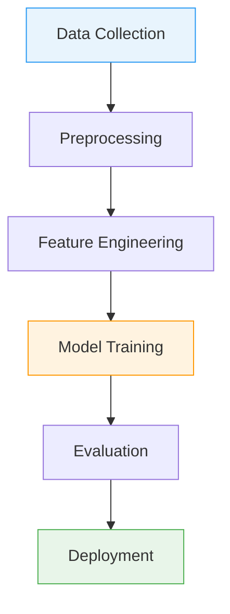
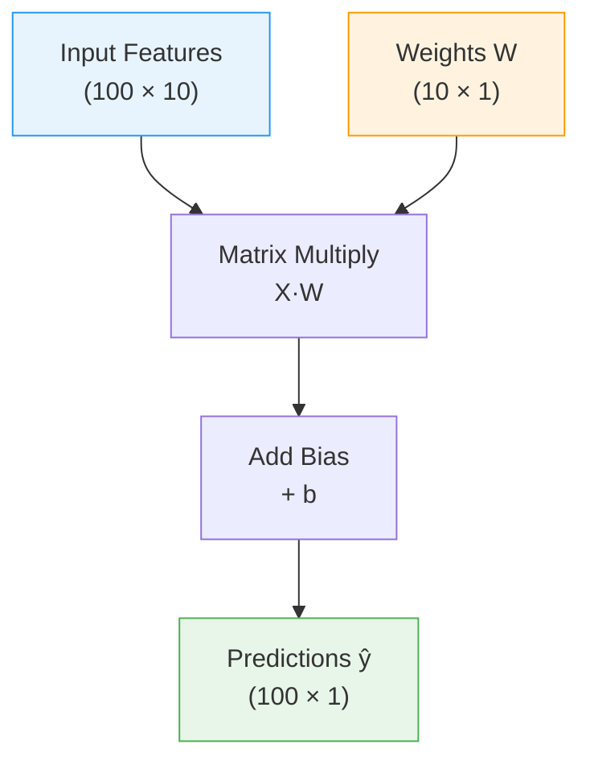

<p style="color: #666; font-size: 0.9em; margin-bottom: 1.5em;"><em>This is Preliminary Note 1 for the Protein &amp; Artificial Intelligence course (Spring 2026), co-taught by Prof. Sungsoo Ahn and Prof. Homin Kim at KAIST. It is designed as a self-study resource: biology-background students should be able to work through it independently before the first in-class lecture. This note assumes basic Python fluency and comfort with linear algebra.</em></p>

## Introduction

Imagine you have cloned a gene, designed a construct, and transformed *E. coli* cells.
After overnight expression you lyse the cells, spin down the debris, and pipette off the soluble fraction --- only to find that your target protein is trapped in insoluble inclusion bodies.
You have just wasted days of bench time.
Now imagine a computer program that, given nothing but the amino acid sequence of your construct, predicts with high accuracy whether the protein will be soluble.
Building that program is a machine learning problem, and understanding how to solve it is the goal of this note and the next three.

This note focuses on the **conceptual foundations**: what machine learning is, how PyTorch tensors work, and how a simple linear model learns from data through a single gradient step.
Preliminary Note 2 covers protein data representations and introduces neural network architectures.
Preliminary Note 3 covers training --- loss functions, optimizers, the training loop, and validation.
Preliminary Note 4 ties everything together in a complete solubility prediction case study.

### Roadmap

| Section | Topic | Why You Need It |
|---|---|---|
| 1 | What Is Machine Learning? | The foundational concepts: function approximation and generalization |
| 2 | The Machine Learning Pipeline | The big picture: how raw protein data becomes a trained model |
| 3 | PyTorch Tensors | Tensors are the data structure that stores every protein feature, every weight, and every gradient |
| 4 | Linear Regression: A First Model | Building a first model, measuring its mistakes, and using gradients to improve it |

### Prerequisites

This note assumes basic Python fluency and comfort with linear algebra: vectors, matrices, and matrix multiplication.
If the expression $$\mathbf{y} = \mathbf{W}\mathbf{x} + \mathbf{b}$$ looks unfamiliar, review the linear algebra appendix in Goodfellow et al. [1] before continuing.

---

## 1. What Is Machine Learning?

### Learning as Function Approximation

When a biochemist gains experience, they develop intuitions --- perhaps that highly charged proteins tend to be soluble, or that long hydrophobic stretches spell trouble.
These intuitions are patterns extracted from years of experimental observation.
Machine learning does the same thing, but with numbers instead of intuition.

At its core, machine learning is about **function approximation**.
There exists some unknown function $$f^*$$ that maps inputs to outputs.
In protein science, this might mean mapping an amino acid sequence to a solubility label (soluble or insoluble).
In a general setting, it might mean mapping a photograph of a person's face to their age, or mapping a house's features (square footage, location, number of rooms) to its sale price.
In both cases, we cannot write down $$f^*$$ explicitly because the relationship is too complex for any simple formula.
Instead, we define a family of candidate functions $$f_\theta$$, parameterized by adjustable numbers $$\theta$$ (called **parameters** or **weights**), and we search for the particular values of $$\theta$$ that make $$f_\theta$$ approximate $$f^*$$ as closely as possible.

This search is what "training" means.
We show the model thousands of proteins with known properties, and an optimization algorithm gradually adjusts $$\theta$$ to reduce the gap between the model's predictions and the true labels.
The result is a function that captures the statistical regularities in the data --- amino acid composition biases, charge distributions, hydrophobicity patterns --- as numerical weights.

### Generalization: The Real Goal

A model that perfectly reproduces the answers for proteins it has already seen is not necessarily useful.
What matters is **generalization**: the ability to make accurate predictions on *new* proteins that were not part of the training data.

Consider an analogy.
A student who memorizes every exam answer from past years may score perfectly on those specific exams, but fails when given a new question they have never seen.
A student who understands the underlying principles can solve new problems.
Machine learning models face the same tension: they must learn general patterns from specific examples, not just memorize the examples themselves.

The gap between training performance and performance on new data is the central challenge of machine learning.
Every technique we discuss in this course --- from choosing the right model size to regularization strategies --- is ultimately about improving generalization.
We formalize this tension as the **bias-variance tradeoff** in Preliminary Note 3.

---

## 2. The Machine Learning Pipeline

Every machine learning project follows a structured pipeline.



Each stage presents challenges specific to protein data.

**Stage 1: Data Collection.**
Gather proteins and their associated labels.
For solubility prediction, this might mean mining databases like UniProt[^uniprot] for experimentally validated soluble proteins, or analyzing high-throughput expression studies.
The quality of the data fundamentally limits what any model can learn.

[^uniprot]: UniProt (Universal Protein Resource) is the most comprehensive database of protein sequences and functional annotations, containing over 200 million entries as of 2025.

**Stage 2: Preprocessing.**
Transform raw data into a clean, consistent format.
Protein sequences may contain ambiguous amino acid codes (B for Asp or Asn, X for unknown) or unusual characters that need removal.
Structure data from the PDB requires validation for missing atoms, alternate conformations, and resolution quality.

**Stage 3: Feature Engineering.**
This is where domain knowledge meets machine learning.
Proteins can be represented as one-hot encodings, physicochemical feature vectors, learned embeddings, or graphs --- we cover these in Preliminary Note 2.
The choice of representation profoundly affects what patterns a model can discover.

**Stage 4: Model Training.**
The model sees thousands of proteins with known labels and gradually adjusts its internal parameters to minimize prediction errors.
This stage involves critical choices about model architecture, optimization algorithm, and regularization strategy.
We introduce the building blocks for models in this note (Section 4) and Preliminary Note 2, and the training process itself in Preliminary Note 3.

**Stage 5: Evaluation.**
Measure how well the model generalizes to new proteins.
This is trickier than it sounds.
Related sequences often have similar properties, so a naive random train/test split might let the model "cheat" by memorizing similar proteins.
Proper evaluation requires sequence-identity-aware splitting[^seqid] to ensure the test set contains truly novel proteins.

[^seqid]: Sequence-identity-aware splitting clusters proteins by sequence similarity (e.g., using CD-HIT at 30% identity) and assigns entire clusters to either train or test, preventing information leakage from homologous sequences.

**Stage 6: Deployment.**
Bring the model into production where it makes predictions on new proteins.
Practical constraints around inference speed, memory usage, and integration with existing laboratory workflows become important here.

---

## 3. PyTorch: Your Laboratory for Neural Networks

If machine learning is the science, PyTorch is the laboratory equipment.
Just as a biochemist needs pipettes, centrifuges, and spectrophotometers, a computational biologist needs tools for constructing and training neural networks.
PyTorch, developed by Meta AI Research [2], has become the dominant framework for deep learning research, including the models that have transformed protein science.

Three properties make PyTorch the standard choice.
First, its "eager execution" model means code runs line by line, making debugging straightforward.
Second, its design closely mirrors how researchers think about computation, so translating mathematical ideas into working code is natural.
Third, the entire ecosystem of protein AI --- from ESM to OpenFold --- builds on PyTorch.

### Tensors: The Atoms of Deep Learning

At the heart of PyTorch lies the **tensor**, a multi-dimensional array of numbers.
If you have used NumPy arrays, tensors will feel familiar.

A single number is a 0-dimensional tensor, called a **scalar**.
A list of numbers is a 1-dimensional tensor, called a **vector**.
A table of numbers is a 2-dimensional tensor, called a **matrix**.
Higher dimensions are common in practice: a batch of protein sequences might be stored as a 3-dimensional tensor with shape `(batch_size, sequence_length, features)`.

```python
import torch

# --- Creating tensors ---
# A 3x4 matrix of zeros (e.g., placeholder for 3 proteins with 4 features)
x = torch.zeros(3, 4)

# Random values from a standard normal distribution (mean=0, std=1)
x = torch.randn(3, 4)

# From a Python list (e.g., hydrophobicity values for three amino acids)
x = torch.tensor([1.8, -4.5, 2.5])

# From a NumPy array (bridge between NumPy and PyTorch)
import numpy as np
np_array = np.array([[1.0, 2.0], [3.0, 4.0]])
x = torch.from_numpy(np_array)

# --- Inspecting tensor properties ---
x = torch.randn(3, 4)
print(x.shape)   # torch.Size([3, 4]) — the dimensions
print(x.dtype)   # torch.float32 — the numerical precision
print(x.device)  # cpu — where the tensor lives (cpu or cuda:0)
```

What makes tensors special compared to NumPy arrays?
Two things: **GPU acceleration** and **automatic differentiation**.

### Worked Example: Encoding a Protein Sequence as a Tensor

Let us trace the encoding of a short protein sequence through each stage, watching the tensor shape evolve.

```python
import torch

# Our protein: the first 7 residues of human hemoglobin alpha chain
sequence = "MVLSPAD"

# Step 1: Map each amino acid to an integer index
# 20 standard amino acids → indices 1-20; 0 is reserved for padding
AA_TO_IDX = {aa: i + 1 for i, aa in enumerate("ACDEFGHIKLMNPQRSTVWY")}

indices = [AA_TO_IDX[aa] for aa in sequence]
print(f"Character sequence: {list(sequence)}")
print(f"Integer indices:    {indices}")
# Character sequence: ['M', 'V', 'L', 'S', 'P', 'A', 'D']
# Integer indices:    [11, 19, 10, 16, 14, 1, 3]

# As a tensor: shape (7,) — one integer per residue
seq_tensor = torch.tensor(indices)
print(f"Shape after integer encoding: {seq_tensor.shape}")  # torch.Size([7])

# Step 2: One-hot encode — each integer becomes a 20-dimensional binary vector
one_hot = torch.zeros(len(sequence), 20)
for i, idx in enumerate(indices):
    one_hot[i, idx - 1] = 1.0   # idx is 1-based, tensor indexing is 0-based

print(f"Shape after one-hot encoding: {one_hot.shape}")  # torch.Size([7, 20])
# Each row is all zeros except for a single 1 at the amino acid's position

# Step 3: Add a batch dimension (neural networks process batches of proteins)
batched = one_hot.unsqueeze(0)   # Add dim at position 0
print(f"Shape with batch dimension:   {batched.shape}")  # torch.Size([1, 7, 20])
# (batch_size=1, sequence_length=7, features=20)
```

The final shape `(1, 7, 20)` is the standard format for feeding protein sequences into neural networks: batch size, sequence length, and feature dimension.
When processing 32 proteins at once, the shape becomes `(32, max_len, 20)` --- and we will see later (Preliminary Note 3) how padding and masking handle the fact that different proteins have different lengths.

### The GPU Advantage

Modern GPUs (Graphics Processing Units) contain thousands of simple processors that perform arithmetic operations in parallel.
Neural networks are built from **matrix multiplications**, and each entry of the output matrix is an independent dot product --- meaning thousands of output entries can be computed *simultaneously*.

A CPU has a handful of powerful cores (typically 8--16) optimized for complex sequential tasks.
A GPU has thousands of simpler cores designed for exactly this kind of embarrassingly parallel arithmetic.
Moving computation to the GPU requires just one line in PyTorch:

```python
# Check whether a GPU is available on this machine
device = torch.device('cuda' if torch.cuda.is_available() else 'cpu')

# Create a tensor on the CPU, then move it to the GPU
x = torch.randn(1000, 1000)
x_gpu = x.to(device)

# Matrix multiplication now runs on the GPU
y_gpu = x_gpu @ x_gpu.T
```

One critical rule: **all tensors involved in an operation must be on the same device.**
Attempting to multiply a GPU tensor with a CPU tensor will raise an error.
Always move both the model and the data to the same device before computation.

### Tensor Operations

Tensors support all the arithmetic you would expect, with the same broadcasting rules[^broadcasting] as NumPy.

[^broadcasting]: Broadcasting is a set of rules that allow operations between tensors of different shapes. When two tensors have different numbers of dimensions or different sizes along a dimension, the smaller tensor is "stretched" (conceptually, not in memory) to match the larger one. For example, adding a vector of shape `(4,)` to a matrix of shape `(3, 4)` adds the vector to each row.

```python
a = torch.randn(3, 4)
b = torch.randn(3, 4)

# Element-wise operations (applied independently to each pair of elements)
c = a + b          # Addition
c = a * b          # Multiplication (element-wise, NOT matrix multiplication)

# Matrix multiplication (the workhorse of neural networks)
# A 3x4 matrix times a 4x3 matrix produces a 3x3 matrix
c = a @ b.T                   # @ is the matrix multiplication operator

# Broadcasting: a smaller tensor is "stretched" to match
a = torch.randn(3, 4)   # Shape: (3, 4)
b = torch.randn(4)      # Shape: (4,)
c = a + b               # b is broadcast across all 3 rows → shape (3, 4)

# Reductions: summarize a tensor along one or more dimensions
x = torch.randn(3, 4)
x.sum()           # Sum of all 12 elements → a scalar
x.mean(dim=-1)    # Mean along the last dimension → shape (3,)
```

---

## 4. From Data to Learning: A First Model

The previous sections introduced what machine learning is, the pipeline for building models, and the PyTorch tensors that store all our data.
Now we tackle the central question: **how does a model actually learn from data?**

The answer has four steps, and we will build them up one at a time using a concrete protein example:

1. Define a **model** that makes predictions.
2. Measure how wrong the predictions are with a **loss function**.
3. Compute **gradients** that tell us how to adjust the model's parameters to reduce the loss.
4. **Update** the parameters and repeat.

### A First Model: Linear Regression

Let us start with something concrete.
Suppose we have measured 10 physicochemical features for a single protein --- features such as molecular weight, isoelectric point, GRAVY score (hydrophobicity), and instability index.
We want to predict that protein's melting temperature.
We will call the true melting temperature $$y$$ and our prediction $$\hat{y}$$.

The simplest model is a **weighted sum** of the features plus a bias:

$$
\hat{y} = w_1 \cdot x_{\text{MW}} + w_2 \cdot x_{\text{pI}} + w_3 \cdot x_{\text{GRAVY}} + \cdots + w_{10} \cdot x_{10} + b
$$

Here $$x_{\text{MW}}$$ is the molecular weight, $$x_{\text{pI}}$$ is the isoelectric point, and $$x_{\text{GRAVY}}$$ is the hydrophobicity score.
Each weight $$w_i$$ controls how much one feature contributes to the prediction.
A large positive $$w_3$$ (the weight on GRAVY score) would mean more hydrophobic proteins are predicted to have higher melting temperatures.
The bias $$b$$ shifts the overall prediction up or down.

Using vector notation, we can write this more compactly.
Let $$\mathbf{x} = [x_1, x_2, \ldots, x_{10}]$$ be the feature vector for one protein, and $$\mathbf{w} = [w_1, w_2, \ldots, w_{10}]$$ be the weight vector.
Then:

$$
\hat{y} = \mathbf{x} \cdot \mathbf{w} + b = \sum_{j=1}^{10} x_j w_j + b
$$

Now suppose we have not one protein but 100.
We stack their feature vectors into a matrix $$\mathbf{X}$$ of shape (100 $$\times$$ 10), where each **row** is one protein's features.
A single matrix multiplication $$\mathbf{X}\mathbf{W}$$ computes the weighted sum for all 100 proteins at once:

$$
\hat{\mathbf{y}} = \mathbf{X}\mathbf{W} + b
$$

Here $$\mathbf{W}$$ is the weight vector reshaped as a (10 $$\times$$ 1) column, and the result $$\hat{\mathbf{y}}$$ is a (100 $$\times$$ 1) column of predictions --- one per protein.

The following diagram illustrates this flow:



```python
import torch

# Simulated data: 100 proteins, 10 physicochemical features each
# Each row of X is one protein's features: [mol. weight, pI, GRAVY, ...]
X = torch.randn(100, 10)   # 100 proteins × 10 features
y = torch.randn(100, 1) * 10 + 60   # True melting temperatures (centered ~60°C)

# Learnable parameters — requires_grad=True tells PyTorch to track gradients
W = torch.randn(10, 1, requires_grad=True)   # One weight per feature
b = torch.zeros(1, requires_grad=True)        # Bias term

# Forward pass: predict melting temperature for ALL 100 proteins at once
# X @ W computes the dot product of each protein's features with W
y_pred = X @ W + b              # Shape: (100, 1) — one prediction per protein
print(f"Predictions shape: {y_pred.shape}")  # torch.Size([100, 1])
```

$$\mathbf{W}$$ and $$b$$ are the **learnable parameters**, which we collectively denote as $$\theta = \{\mathbf{W}, b\}$$.
Different values of $$\theta$$ give different predictions --- and right now, with random weights, the predictions are terrible.
The question is: how do we find better values?

### Measuring Mistakes: The Loss Function

Our model makes predictions.
How do we know how wrong they are?

We need a single number that summarizes the gap between predictions and reality.
This number is called a **loss function** (sometimes called a cost function or objective function).
For regression tasks like predicting melting temperature, a natural choice is the **mean squared error** (MSE):

$$
L_{\text{MSE}}(\theta) = \frac{1}{n}\sum_{i=1}^{n}(\hat{y}_i(\theta) - y_i)^2
$$

The predictions $$\hat{y}_i(\theta)$$ depend on the current parameter values $$\theta$$, so the loss itself is a function of $$\theta$$.
This computes the average squared difference between each prediction and the true value $$y_i$$.
Squaring serves two purposes: it makes all errors positive (an overestimate of +5°C and an underestimate of −5°C are equally bad), and it penalizes large errors disproportionately (an error of 10°C contributes 100 to the sum, while an error of 1°C contributes only 1).

```python
# Loss: mean squared error (in units of °C²)
loss = ((y_pred - y) ** 2).mean()
print(f"Loss: {loss.item():.2f}")  # A single number measuring total prediction error
```

With a model and a loss function in hand, learning becomes an optimization problem: **find the values of $$\theta$$ that minimize $$L(\theta)$$.**
But how?

> **Note:** $$L_{\text{MSE}}$$ is one of many possible loss functions.
> Preliminary Note 3 covers other choices suited to classification tasks (binary cross-entropy, cross-entropy), and explains when to use which.

### Learning from Mistakes: Gradients and Optimization

<div class="col-sm-8 mt-3 mb-3 mx-auto">
    
    <div class="caption mt-1">Gradient descent on a 2D loss landscape. Starting from an initial point (red dot), the optimizer follows the direction of steepest descent at each step, tracing a path (red line) toward the minimum (red star). The contours represent level sets of the loss function.</div>
</div>

We want to adjust $$\mathbf{W}$$ and $$b$$ to reduce the loss.
The tool for this is the **gradient**.

The gradient of the loss with respect to a weight tells us: "if I increase this weight by a tiny amount, how does the loss change?"

- If increasing a weight would *increase* the loss, we should *decrease* that weight.
- If increasing a weight would *decrease* the loss, we should *increase* it.

This strategy --- adjusting each weight in the direction that reduces the loss --- is called **gradient descent**[^gd].
The update rule is:

$$
\theta_{t+1} = \theta_t - \eta \nabla_\theta L(\theta_t)
$$

where $$\theta_t$$ are the current parameter values, $$\eta$$ is the **learning rate** (how big a step to take), and $$\nabla_\theta L(\theta_t)$$ is the gradient of the loss evaluated at $$\theta_t$$.
Preliminary Note 3 covers optimization in much more detail, including adaptive learning rates and momentum.

[^gd]: The term "stochastic gradient descent" (SGD) refers to gradient descent applied to a random subset (mini-batch) of the training data at each step, rather than the entire dataset. In practice, almost all gradient descent in deep learning is stochastic.

#### The Optimization Landscape

It helps to think geometrically.
Imagine the loss as a surface over the space of all possible weight values.
For a model with two weights, this surface is like a mountain landscape --- some regions are high (bad predictions, high loss) and some are low (good predictions, low loss).
Training means navigating this landscape to find a valley (a minimum of the loss).

In reality, neural networks have millions of weights, so the landscape exists in millions of dimensions.
We cannot visualize it, but the intuition still holds: the loss defines a surface, and gradient descent navigates that surface by always stepping in the direction of steepest descent.

### One Complete Learning Step

The remarkable thing about PyTorch is that you never need to compute gradients by hand.
You define only the forward computation --- how inputs become outputs.
PyTorch automatically builds a **computational graph** that tracks every operation.
When you call `.backward()`, it traverses this graph in reverse, computing all gradients.

Let us put it all together: model, loss, gradients, and one update step.

```python
import torch

# Data: 100 proteins, 10 features each
X = torch.randn(100, 10)
y = torch.randn(100, 1) * 10 + 60

# Learnable parameters
W = torch.randn(10, 1, requires_grad=True)
b = torch.zeros(1, requires_grad=True)

# Forward pass → loss → backward pass → update
y_pred = X @ W + b
loss = ((y_pred - y) ** 2).mean()
loss.backward()                # Compute gradients

# One gradient descent step (learning rate = 0.01)
lr = 0.01
W.data -= lr * W.grad    # Adjust weights in the direction that reduces loss
b.data -= lr * b.grad    # Adjust bias similarly

# Verify: the loss should be lower with the updated parameters
y_pred_new = X @ W + b
loss_new = ((y_pred_new - y) ** 2).mean()
print(f"Loss before update: {loss.item():.2f}")
print(f"Loss after update:  {loss_new.item():.2f}")  # Should be lower!
```

This is the complete learning cycle: **model → loss → gradients → update**.
Repeat this cycle thousands of times, and the model converges to good parameter values.
In practice, PyTorch provides optimizers (like `torch.optim.SGD` and `torch.optim.Adam`) that handle the update step and more --- we cover these in Preliminary Note 3.

How backpropagation computes gradients efficiently through multi-layer networks using the chain rule is covered as an advanced topic in Preliminary Note 3.

### Turning Off Gradient Tracking

Computing gradients consumes memory (to store the computational graph) and time.
During **inference** --- when you just want predictions, not training --- you should disable gradient tracking:

```python
# Context manager: temporarily disable gradient tracking
with torch.no_grad():
    T_m_pred = X @ W + b
    # No computational graph is built — faster and more memory-efficient
```

---

## Key Takeaways

1. **Machine learning is function approximation.** We search for a function $$f_\theta$$ that maps protein inputs to property predictions. The challenge is finding parameters $$\theta$$ that generalize to proteins the model has never seen.

2. **Generalization is the real goal**, not training accuracy. We formalize the tension between underfitting and overfitting as the bias-variance tradeoff in Preliminary Note 3.

3. **Tensors** are the universal data structure of deep learning. They combine NumPy-like operations with GPU acceleration and automatic differentiation. Protein sequences are encoded as tensors of shape `(batch, length, features)`.

4. **The learning cycle is model → loss → gradients → update.** We define a model (even a simple linear one), measure its mistakes with a loss function, compute gradients via autograd, and update the weights. PyTorch automates the gradient computation.

5. **Next up**: Preliminary Note 2 covers protein data representations and introduces neural network architectures --- the building blocks you need before we tackle the full training process in Preliminary Note 3.

---

## Exercises

These exercises reinforce the concepts from this note.
Each one can be completed in a single Python script or Jupyter notebook.

### Exercise 1: Protein Feature Tensors

Encode a batch of 5 protein sequences of varying lengths as tensors suitable for neural network input.
Start from raw amino acid strings, convert to integer indices, pad to the length of the longest sequence, and create the corresponding mask tensor.
Print the shape at each step and verify that padding positions have mask value 0.

*Extension:* Also compute 5 global features per protein (molecular weight, isoelectric point, GRAVY, instability index, sequence length) and store them as a separate `(5, 5)` tensor.

### Exercise 2: Linear Regression with Gradient Descent

Create a simple linear model $$\hat{y} = \mathbf{W}\mathbf{x} + b$$ with `requires_grad=True` on both $$\mathbf{W}$$ and $$b$$.
Compute the MSE loss for a small batch of 10 data points.
Run 100 steps of gradient descent (remember to zero the gradients and detach the graph between steps) and plot the loss curve.

*Extension:* Manually compute $$\partial L / \partial \mathbf{W}$$ and $$\partial L / \partial b$$ using the formula $$\frac{\partial L}{\partial \mathbf{W}} = \frac{2}{n}\mathbf{X}^T(\mathbf{X}\mathbf{W} + b - \mathbf{y})$$ and verify they match the PyTorch gradients for the first step.

---

## References

1. Goodfellow, I., Bengio, Y., & Courville, A. (2016). *Deep Learning*. MIT Press. Chapters 6--8. Available at [https://www.deeplearningbook.org/](https://www.deeplearningbook.org/).

2. Paszke, A., Gross, S., Massa, F., Lerer, A., Bradbury, J., Chanan, G., ... & Chintala, S. (2019). "PyTorch: An Imperative Style, High-Performance Deep Learning Library." *Advances in Neural Information Processing Systems*, 32.

3. Kingma, D. P. & Ba, J. (2015). "Adam: A Method for Stochastic Optimization." *Proceedings of the 3rd International Conference on Learning Representations (ICLR)*.
