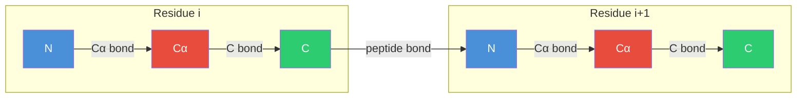
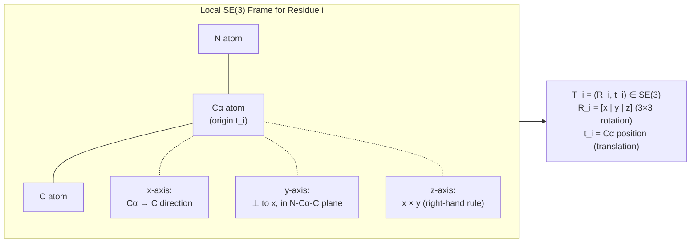
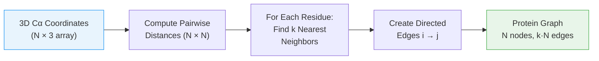

<p style="color: #666; font-size: 0.9em; margin-bottom: 1.5em;"><em>This is a preliminary self-study note for the Protein &amp; Artificial Intelligence course (Spring 2026), co-taught by Prof. Sungsoo Ahn and Prof. Homin Kim at KAIST. Students with a biology background are encouraged to work through this material before the in-class lectures begin. The note is self-contained: no prior machine learning knowledge is assumed beyond basic Python and linear algebra.</em></p>

## Introduction

Consider the protein hemoglobin.
Its amino acid sequence begins `MVLSPADKTNVKAAWGKVGAHAGEYGAEALERMFLSFPTTK...` and continues for 141 residues.
A trained biochemist can glance at this string and notice patterns: a stretch of hydrophobic residues here might anchor into a membrane, a conserved motif there might signal oxygen-binding activity.
A computer, however, sees none of this.
To a machine learning algorithm, that sequence is an arbitrary string of characters with no inherent meaning.

The same problem applies to three-dimensional structures.
X-ray crystallographers determine the spatial coordinates of thousands of atoms, producing lists of $$(x, y, z)$$ numbers for each atom.
These coordinates reveal that two residues separated by 80 positions in the sequence fold back to form a binding pocket — but no algorithm can "see" this from raw numbers alone.

A **representation** bridges this gap.
It is a mapping from biological data (sequences, structures) into numerical arrays that machine learning models can process.
The choice of representation is one of the most consequential decisions in any protein ML project: a good representation makes learning easy, while a poor one can make even simple tasks intractable.

An analogy helps.
If you wanted to teach someone about a piece of music who had never heard a song, you might write out notes on a staff, plot sound waves as amplitude over time, or describe chord progressions as integer intervals.
Each encoding emphasizes different aspects and suits different tasks.
The same is true for proteins.

This note covers the major approaches to representing proteins for machine learning — from sequence encodings through structural descriptors to graph-based formats.
We examine not just *how* to build each representation, but *why* it captures the right information and *when* to use it.

### Roadmap

The table below maps each section to the question it answers.

| Section | What You Will Learn | Why It Is Needed |
|---|---|---|
| [Sequence Representations](#sequence-representations-from-letters-to-numbers) | One-hot, BLOSUM, physicochemical, and learned embeddings | Sequences are the most abundant protein data; every downstream model needs a numerical input |
| [Structure Representations](#structure-representations-capturing-three-dimensions) | Distance matrices, contact maps, dihedral angles, SE(3) frames | 3D arrangement determines protein function; structure-aware models need spatial inputs |
| [Graph Representations](#graph-representations-the-best-of-both-worlds) | k-NN graphs, contact graphs, node/edge features, PyTorch Geometric | Graphs unify sequence and structure in a memory-efficient format suited to GNNs |
| [Choosing the Right Representation](#choosing-the-right-representation) | Decision guide and rules of thumb | Matching representation to task avoids wasted effort |
| [Practical Considerations](#practical-considerations) | Memory scaling, variable-length batching, normalization | Real-world training requires handling these engineering details |

---

## Sequence Representations: From Letters to Numbers

<div class="col-sm-10 mt-3 mb-3 mx-auto">
    
    <div class="caption mt-1"><strong>The 20 standard amino acids.</strong> Amino acids are grouped by their side-chain chemistry: nonpolar/hydrophobic (red), polar uncharged (blue), positively charged (green), and negatively charged (orange). Bar heights show approximate molecular weights. These chemical differences determine how each amino acid contributes to protein folding and function.</div>
</div>

The amino acid sequence is the primary structure of a protein — the linear chain of residues encoded by the gene.
Because sequencing is cheap and fast, sequence data is far more abundant than structure data: the UniProt database contains over 200 million sequences, while the Protein Data Bank has roughly 200,000 experimentally determined structures.
Any representation that works on sequences alone has access to a thousand-fold more training data.

### One-Hot Encoding

The most straightforward encoding is **one-hot encoding**[^onehot].
Each amino acid at position $$i$$ in the sequence becomes a binary vector of length 20 (one entry per standard amino acid), with a single 1 indicating which residue is present and zeros everywhere else.

[^onehot]: One-hot encoding is also called "dummy encoding" or "indicator encoding" in the statistics literature.

Formally, let $$\mathbf{x}_i$$ denote the encoding of position $$i$$.
Then:

$$
\mathbf{x}_i \in \{0, 1\}^{20}, \quad \sum_{j=1}^{20} x_{ij} = 1
$$

Here $$x_{ij}$$ is the $$j$$-th component of $$\mathbf{x}_i$$, and the constraint says exactly one component is nonzero.
If we order the amino acid alphabet as `ACDEFGHIKLMNPQRSTVWY`, then Alanine (A) maps to `[1, 0, 0, ..., 0]` and Cysteine (C) maps to `[0, 1, 0, ..., 0]`.

A full protein of length $$L$$ becomes a matrix of shape $$(L, 20)$$.

```python
import numpy as np

# Standard 20 amino acids in alphabetical order
AMINO_ACIDS = "ACDEFGHIKLMNPQRSTVWY"
aa_to_idx = {aa: i for i, aa in enumerate(AMINO_ACIDS)}

def one_hot_encode(sequence: str) -> np.ndarray:
    """
    One-hot encode a protein sequence.

    Args:
        sequence: string of single-letter amino acid codes,
                  e.g. "MVLSPADKTN" (first 10 residues of hemoglobin alpha)

    Returns:
        encoding: (L, 20) array where L = len(sequence).
                  Row i has a 1 in the column for the amino acid at position i.
    """
    encoding = np.zeros((len(sequence), 20))
    for i, aa in enumerate(sequence):
        if aa in aa_to_idx:
            encoding[i, aa_to_idx[aa]] = 1.0
    return encoding

# Example: encode the first 5 residues of hemoglobin alpha
hba_fragment = "MVLSP"
enc = one_hot_encode(hba_fragment)
print(enc.shape)  # (5, 20)
```

One-hot encoding is simple and fully interpretable.

The figure below contrasts one-hot encoding (left) with the BLOSUM62 substitution matrix (right). While one-hot treats every amino acid as equally different (identity matrix), BLOSUM62 captures evolutionary similarity — biochemically similar residues have positive scores (warm colors), while dissimilar substitutions have negative scores (cool colors).

<div class="col-sm-10 mt-3 mb-3 mx-auto">
    
    <div class="caption mt-1">Comparison of one-hot encoding (left) and BLOSUM62 substitution matrix (right). One-hot encoding is a 20×20 identity matrix — every amino acid is equally different from every other. BLOSUM62 encodes evolutionary substitution patterns: high scores (red) indicate frequently interchangeable residues (e.g., I↔L, D↔E), while negative scores (blue) mark pairs rarely observed at aligned positions.</div>
</div>

Its limitation is that it treats every amino acid as equally different from every other.
Alanine appears just as distant from Glycine (both small and hydrophobic) as from Tryptophan (large and aromatic).
Biologically, this is wrong: some substitutions preserve function while others destroy it.
One-hot encoding discards all of this biochemical knowledge.

### BLOSUM Encoding: Learning from Evolution

Evolution provides a natural measure of amino acid similarity.
Over millions of years, proteins accumulate mutations.
Some substitutions — say, Leucine to Isoleucine — are tolerated because the two residues have similar size and hydrophobicity.
Others — say, Glycine to Tryptophan — are rarely observed because they disrupt folding or function.

The **BLOSUM** (BLOcks SUbstitution Matrix)[^blosum] quantifies these patterns.
It was constructed by aligning conserved regions of related protein families and counting how often each pair of amino acids appears at the same position.

[^blosum]: The number after BLOSUM (e.g., BLOSUM62) indicates the sequence identity threshold used to cluster the training sequences. BLOSUM62, the most widely used variant, was built from blocks with at least 62% identity.

The score for amino acids $$a$$ and $$b$$ is defined as:

$$
\text{BLOSUM}(a, b) = \log_2 \!\left(\frac{p_{ab}}{p_a \cdot p_b}\right)
$$

Here $$p_{ab}$$ is the observed frequency of the pair $$(a, b)$$ at aligned positions, and $$p_a$$, $$p_b$$ are the background frequencies of $$a$$ and $$b$$ individually.
A positive score means the pair co-occurs more than expected by chance — the amino acids are evolutionarily interchangeable.
A negative score means they rarely substitute for each other.

To use BLOSUM as a representation, we replace each amino acid with its entire row from the BLOSUM matrix.
Now Alanine is no longer a sparse binary vector; it is a 20-dimensional profile of its evolutionary relationships with every other amino acid.

```python
def blosum_encode(sequence: str, blosum_matrix: np.ndarray) -> np.ndarray:
    """
    Encode a protein sequence using BLOSUM62 substitution scores.

    Args:
        sequence: single-letter amino acid string
        blosum_matrix: (20, 20) BLOSUM62 matrix indexed by AMINO_ACIDS order

    Returns:
        encoding: (L, 20) array. Row i is the BLOSUM62 row for the amino
                  acid at position i, normalized to roughly [-1, 1].
    """
    encoding = np.zeros((len(sequence), 20))
    for i, aa in enumerate(sequence):
        if aa in aa_to_idx:
            encoding[i] = blosum_matrix[aa_to_idx[aa]]
    return encoding / 9.0  # Divide by max absolute value to normalize
```

Why does this help?
Consider a model predicting protein stability.
A mutation from Lysine (K, positively charged) to Arginine (R, also positively charged) is usually tolerated, while a mutation to Glutamate (E, negatively charged) is often destabilizing.
BLOSUM captures this: K and R have a high positive score, while K and E have a negative score.
When a model receives BLOSUM-encoded sequences, biochemically similar residues have similar vector representations, making functional patterns easier to learn.

> **Note:** Modern protein AI models (ESM, AlphaFold, ProteinMPNN) use learned embeddings rather than fixed encodings like BLOSUM. This section provides useful background on evolutionary substitution patterns.

### Physicochemical Properties: Encoding What Amino Acids Do

Rather than relying on evolutionary statistics, we can describe each amino acid by its measured physical and chemical properties.
Five properties capture the most important variation:

| Property | Description | Example |
|---|---|---|
| Hydrophobicity | Tendency to avoid water | High for Leucine (buried in protein cores), low for Aspartate (surface-exposed) |
| Volume | Side-chain size in cubic Angstroms | Small for Glycine (no side chain), large for Tryptophan (bulky aromatic ring) |
| Charge | Net electrostatic charge at pH 7 | +1 for Lysine/Arginine, −1 for Aspartate/Glutamate, 0 for uncharged residues |
| Polarity | Capacity for hydrogen bonding | High for Serine (hydroxyl group), low for Valine (hydrocarbon side chain) |
| Aromaticity | Presence of an aromatic ring | 1 for Phenylalanine, Tyrosine, Tryptophan; 0 for all others |

Each amino acid becomes a compact 5-dimensional vector:

```python
# Physicochemical property vectors: [hydrophobicity, volume, charge, polarity, aromaticity]
PROPERTIES = {
    'A': [ 0.62, 0.11,  0.0, 0.0, 0.0],  # Alanine: small, mildly hydrophobic
    'C': [ 0.29, 0.15,  0.0, 0.0, 0.0],  # Cysteine: can form disulfide bonds
    'D': [-0.90, 0.17, -1.0, 1.0, 0.0],  # Aspartate: negative charge, polar
    'E': [-0.74, 0.22, -1.0, 1.0, 0.0],  # Glutamate: negative charge, polar
    'F': [ 1.19, 0.29,  0.0, 0.0, 1.0],  # Phenylalanine: aromatic, hydrophobic
    'G': [ 0.48, 0.00,  0.0, 0.0, 0.0],  # Glycine: smallest amino acid
    'H': [-0.40, 0.23,  0.0, 1.0, 1.0],  # Histidine: aromatic, can be charged
    'I': [ 1.38, 0.24,  0.0, 0.0, 0.0],  # Isoleucine: hydrophobic, branched
    'K': [-1.50, 0.53,  1.0, 1.0, 0.0],  # Lysine: positive charge, long chain
    'L': [ 1.06, 0.24,  0.0, 0.0, 0.0],  # Leucine: hydrophobic, branched
    'M': [ 0.64, 0.23,  0.0, 0.0, 0.0],  # Methionine: contains sulfur
    'N': [-0.78, 0.18,  0.0, 1.0, 0.0],  # Asparagine: polar, amide group
    'P': [ 0.12, 0.16,  0.0, 0.0, 0.0],  # Proline: rigid, helix-breaker
    'Q': [-0.85, 0.22,  0.0, 1.0, 0.0],  # Glutamine: polar, amide group
    'R': [-2.53, 0.34,  1.0, 1.0, 0.0],  # Arginine: positive charge, bulky
    'S': [-0.18, 0.12,  0.0, 1.0, 0.0],  # Serine: small, hydroxyl group
    'T': [-0.05, 0.16,  0.0, 1.0, 0.0],  # Threonine: hydroxyl group, branched
    'V': [ 1.08, 0.20,  0.0, 0.0, 0.0],  # Valine: hydrophobic, branched
    'W': [ 0.81, 0.74,  0.0, 0.0, 1.0],  # Tryptophan: largest, aromatic
    'Y': [ 0.26, 0.31,  0.0, 1.0, 1.0],  # Tyrosine: aromatic, hydroxyl group
}

def physicochemical_encode(sequence: str) -> np.ndarray:
    """
    Encode a protein sequence using 5 physicochemical properties.

    Returns:
        (L, 5) array where columns are
        [hydrophobicity, volume, charge, polarity, aromaticity].
    """
    encoding = np.zeros((len(sequence), 5))
    for i, aa in enumerate(sequence):
        if aa in PROPERTIES:
            encoding[i] = PROPERTIES[aa]
    return encoding
```

The strength of physicochemical encoding is interpretability.
When a model makes a prediction, you can inspect which properties drove the decision: was hydrophobicity important (suggesting a membrane interaction) or charge (suggesting an electrostatic interface)?
This transparency is valuable for scientific discovery.
The trade-off is dimensionality: five features per residue is much less expressive than 20 or 1280.

> **Note:** While physicochemical properties are valuable for interpretability and classical ML, the deep learning models covered in the main lectures learn these features implicitly.

### Learned Embeddings: Letting the Data Decide

The encodings above are all **hand-crafted** — designed by humans using biological knowledge.
An alternative philosophy is to let the data itself determine the optimal representation.

In **learned embeddings**, each amino acid starts as a random vector of some chosen dimension $$d$$.
During training, the neural network adjusts these vectors through backpropagation so that they best serve the prediction task.

```python
import torch
import torch.nn as nn

class AminoAcidEmbedding(nn.Module):
    """
    Trainable embedding layer for protein sequences.

    Each of the 21 tokens (20 standard amino acids + 1 unknown/gap token)
    maps to a d-dimensional vector that is updated during training.
    """
    def __init__(self, embed_dim: int = 64):
        super().__init__()
        # 21 entries: 20 amino acids + 1 for unknown residues
        self.embedding = nn.Embedding(num_embeddings=21, embedding_dim=embed_dim)

    def forward(self, sequence_indices: torch.Tensor) -> torch.Tensor:
        """
        Args:
            sequence_indices: (batch, L) tensor of integer-encoded residues
        Returns:
            (batch, L, embed_dim) tensor of embedding vectors
        """
        return self.embedding(sequence_indices)
```

The `nn.Embedding` layer maintains a trainable lookup table of shape $$(21, d)$$.
Initially, each amino acid maps to a random $$d$$-dimensional vector.
After training on many proteins, the embeddings often reveal biologically meaningful structure: hydrophobic residues cluster together, charged residues form their own group, and aromatic residues occupy a distinct region — all without any explicit biochemical supervision.

This is the strategy behind **protein language models** such as ESM (Evolutionary Scale Modeling)[^esm] from Meta AI.
ESM is trained on hundreds of millions of protein sequences using a masked language modeling objective: randomly hide some amino acids and train the model to predict them from context.
The resulting per-residue embeddings are 1280-dimensional and encode evolutionary relationships, structural preferences, and functional properties, all learned from raw sequence data.
ESM embeddings currently represent the state-of-the-art for sequence-only protein representations.

[^esm]: ESM stands for Evolutionary Scale Modeling. The model family includes ESM-1b (2021), ESM-2 (2022), and ESM-3 (2024), each trained on increasingly large sequence databases with improved architectures.

---

## Structure Representations: Capturing Three Dimensions

Sequence tells us *what* amino acids are present.
Structure tells us *where* they are in space.
A protein's three-dimensional arrangement determines its function — how it binds substrates, catalyzes reactions, and interacts with partners.
For structure-aware models, we need representations that faithfully capture spatial relationships.

<div class="col-sm-10 mt-3 mb-3 mx-auto">
    
    <div class="caption mt-1"><strong>Four levels of protein structure.</strong> Primary: the linear sequence of amino acids. Secondary: local folding motifs (alpha-helices, beta-sheets). Tertiary: the complete 3D arrangement of a single chain. Quaternary: assembly of multiple chains into a functional complex.</div>
</div>

### Distance Matrices: Who Is Near Whom?

The simplest structural representation is the **distance matrix**.
Given a protein with $$L$$ residues, the distance matrix $$D \in \mathbb{R}^{L \times L}$$ has entry $$(i, j)$$ equal to the Euclidean distance between the C$$\alpha$$ (alpha-carbon) atoms[^calpha] of residues $$i$$ and $$j$$:

$$
D_{ij} = \lVert \mathbf{r}_i - \mathbf{r}_j \rVert_2
$$

where $$\mathbf{r}_i \in \mathbb{R}^3$$ is the coordinate vector of the $$i$$-th C$$\alpha$$ atom and $$\lVert \cdot \rVert_2$$ denotes the Euclidean norm.

[^calpha]: The C$$\alpha$$ atom sits at the junction of the backbone and side chain. It provides a single representative coordinate per residue, reducing a protein with thousands of atoms to a manageable $$(L, 3)$$ array.

```python
def compute_distance_matrix(coords: np.ndarray) -> np.ndarray:
    """
    Compute the pairwise C-alpha distance matrix.

    Args:
        coords: (L, 3) array of C-alpha coordinates, one row per residue.
                For hemoglobin alpha (141 residues), shape would be (141, 3).

    Returns:
        dist_matrix: (L, L) symmetric matrix where entry (i, j) is the
                     Euclidean distance in Angstroms between residues i and j.
    """
    # Broadcasting trick: (L, 1, 3) - (1, L, 3) -> (L, L, 3) difference vectors
    diff = coords[:, None, :] - coords[None, :, :]
    # Euclidean norm along the xyz axis -> (L, L) distances
    return np.sqrt(np.sum(diff ** 2, axis=-1))
```

Distance matrices have three elegant mathematical properties:

1. **Symmetry**: $$D_{ij} = D_{ji}$$ (distance from $$i$$ to $$j$$ equals distance from $$j$$ to $$i$$).
2. **Zero diagonal**: $$D_{ii} = 0$$ (every residue is zero distance from itself).
3. **Rotation and translation invariance**: rotating or shifting the protein in space leaves the distance matrix unchanged.

The third property is critical.
A protein's function depends on its internal geometry, not on where it sits in the laboratory coordinate system.
If we used raw $$(x, y, z)$$ coordinates as input, a model might memorize that "proteins at position (10, 20, 30) have function X" — a meaningless artifact.
Distance matrices avoid this entirely.

### Contact Maps: Simplifying to Binary

A **contact map** is a binarized distance matrix.
Two residues are declared "in contact" if their C$$\alpha$$ distance falls below a threshold, typically 8 Angstroms[^angstrom]:

$$
C_{ij} = \begin{cases} 1 & \text{if } D_{ij} < d_{\text{threshold}} \\ 0 & \text{otherwise} \end{cases}
$$

where $$d_{\text{threshold}}$$ is the contact threshold (commonly 8.0 Angstroms).

[^angstrom]: One Angstrom (1 A) equals $$10^{-10}$$ meters, or 0.1 nanometers. A typical covalent bond is about 1.5 A long, and the diameter of a small protein is 30-50 A.

```python
def compute_contact_map(coords: np.ndarray, threshold: float = 8.0) -> np.ndarray:
    """
    Compute the binary contact map from C-alpha coordinates.

    Args:
        coords: (L, 3) array of C-alpha positions
        threshold: distance cutoff in Angstroms (default 8.0)

    Returns:
        contact_map: (L, L) binary array where 1 indicates a contact
    """
    dist_matrix = compute_distance_matrix(coords)
    return (dist_matrix < threshold).astype(np.float32)
```

Contact maps discard exact distance information, but they highlight the most functionally relevant signal: which residues physically interact.
They are also easier to predict than full distance matrices, which made them a popular target for early structure prediction methods.

Contacts are often categorized by **sequence separation** — the distance $$\lvert i - j \rvert$$ between residue indices:

- **Local contacts** ($$\lvert i - j \rvert < 6$$): These arise from secondary structure. In an alpha helix, residue $$i$$ contacts residue $$i+4$$ because of the helical pitch.
- **Medium-range contacts** ($$6 \leq \lvert i - j \rvert < 12$$): Super-secondary motifs such as helix-turn-helix or beta hairpins.
- **Long-range contacts** ($$\lvert i - j \rvert \geq 12$$): These reveal tertiary structure — how distant parts of the chain fold back to meet in three dimensions. Predicting long-range contacts was the key breakthrough that enabled AlphaFold's success.

### Dihedral Angles: The Backbone's Degrees of Freedom

Distance matrices describe *pairwise* relationships between residues.
Sometimes we need a *local* description of backbone geometry instead.

The protein backbone consists of three bonds per residue: N--C$$\alpha$$, C$$\alpha$$--C, and C--N (the peptide bond to the next residue).
Each bond has a **dihedral angle**[^torsion] describing the rotation around that bond.
The figure below shows the three backbone dihedral angles on a protein backbone.


<div class="caption mt-1"><strong>Backbone dihedral angles.</strong> φ (phi) measures rotation around the N–Cα bond, ψ (psi) around the Cα–C bond, and ω (omega) around the C–N peptide bond connecting consecutive residues. The omega angle is nearly always ~180° due to the partial double-bond character of the peptide bond.</div>

- **Phi ($$\phi$$)**: rotation around the N--C$$\alpha$$ bond
- **Psi ($$\psi$$)**: rotation around the C$$\alpha$$--C bond
- **Omega ($$\omega$$)**: rotation around the C--N peptide bond (nearly always close to 180 degrees because the peptide bond is planar)

[^torsion]: Dihedral angles are also called torsion angles. They measure the angle between two planes defined by four consecutive atoms.

Bond lengths and bond angles in protein backbones are nearly constant across all proteins.
Given these fixed geometric parameters, specifying the $$\phi$$ and $$\psi$$ values at every residue completely determines the backbone structure.
This means dihedral angles are the true degrees of freedom of the backbone.

There is a technical subtlety: angles are **periodic**.
An angle of $$+180°$$ and $$-180°$$ describe the same conformation, but their numerical values are far apart.
If we feed raw angle values to a neural network, it would incorrectly treat these identical conformations as maximally different.

The solution is to encode each angle using its sine and cosine:

```python
def encode_dihedrals(phi: np.ndarray, psi: np.ndarray) -> np.ndarray:
    """
    Encode backbone dihedral angles using sin/cos to handle periodicity.

    Args:
        phi: (L,) array of phi angles in radians
        psi: (L,) array of psi angles in radians

    Returns:
        (L, 4) array with columns [sin(phi), cos(phi), sin(psi), cos(psi)]
    """
    return np.stack([
        np.sin(phi), np.cos(phi),
        np.sin(psi), np.cos(psi)
    ], axis=-1)

# Verify: +180 degrees and -180 degrees produce identical encodings
import math
angle_pos = math.radians(180)
angle_neg = math.radians(-180)
print(np.sin(angle_pos), np.cos(angle_pos))  # ~0, -1
print(np.sin(angle_neg), np.cos(angle_neg))  # ~0, -1  (same!)
```

Now $$+180°$$ and $$-180°$$ both map to $$(0, -1)$$, and the periodicity is handled gracefully.

The classical **Ramachandran plot** shows the distribution of $$\phi$$ and $$\psi$$ angles observed in protein structures. Different secondary structure types cluster in distinct regions of this plot.

<div class="col-sm-8 mt-3 mb-3 mx-auto">
    
    <div class="caption mt-1">A Ramachandran plot showing the distribution of backbone dihedral angles (φ, ψ) across protein residues. α-helical residues cluster near (−60°, −45°), β-sheet residues near (−120°, +130°), and left-handed helices near (+60°, +45°). Coil residues are scattered throughout the allowed regions.</div>
</div>

Dihedral angles are especially important for **protein generation and design**.
Models that generate backbone structures often work in dihedral space because producing angles directly guarantees valid bond lengths and bond angles.
In contrast, generating raw $$(x, y, z)$$ coordinates can produce distorted, physically impossible geometries.

### SE(3) Frames: The Language of Modern Structure Prediction

The most sophisticated structural representation is the **SE(3) frame**, the approach used by AlphaFold2 and its successors.

The name comes from mathematics: **SE(3)** is the Special Euclidean group in three dimensions[^se3] — the set of all rigid-body transformations (rotations plus translations) in 3D space.
An SE(3) frame attaches a local coordinate system to each residue, consisting of two components:

- A **rotation matrix** $$\mathbf{R}_i \in \text{SO}(3)$$: a $$3 \times 3$$ orthogonal matrix describing how the local coordinate axes of residue $$i$$ are oriented relative to the global frame
- A **translation vector** $$\mathbf{t}_i \in \mathbb{R}^3$$: the position of the residue, typically the C$$\alpha$$ atom

[^se3]: SO(3) is the Special Orthogonal group — all $$3 \times 3$$ rotation matrices (orthogonal matrices with determinant +1). SE(3) extends SO(3) by adding translations: each element is a pair (rotation, translation). Together they describe every possible rigid-body motion in 3D.

Together, these form a transformation:

$$
T_i = (\mathbf{R}_i, \mathbf{t}_i) \in \text{SE}(3)
$$



The key insight is that each residue's backbone atoms (N, C$$\alpha$$, C) form a nearly rigid triangle.
By treating each residue as a rigid body with its own coordinate frame, we can describe local geometry (the orientation of one residue relative to its neighbors) and global geometry (the overall fold) in a unified mathematical framework.

```python
def compute_local_frame(
    n: np.ndarray, ca: np.ndarray, c: np.ndarray
) -> tuple[np.ndarray, np.ndarray]:
    """
    Compute the local SE(3) frame for one residue from its backbone atoms.

    The frame is built using the Gram-Schmidt process:
      - x-axis: along the CA -> C bond direction
      - y-axis: perpendicular to x, within the N-CA-C plane
      - z-axis: cross product of x and y (right-hand rule)

    Args:
        n:  (3,) coordinates of the nitrogen atom
        ca: (3,) coordinates of the alpha-carbon atom
        c:  (3,) coordinates of the carbonyl carbon atom

    Returns:
        R: (3, 3) rotation matrix (columns are local x, y, z axes)
        t: (3,) translation vector (the CA position)
    """
    # x-axis: unit vector from CA toward C
    x = c - ca
    x = x / np.linalg.norm(x)

    # Intermediate: vector from C toward N
    nc = n - c

    # y-axis: component of NC perpendicular to x (Gram-Schmidt)
    y = nc - np.dot(nc, x) * x
    y = y / np.linalg.norm(y)

    # z-axis: right-hand cross product
    z = np.cross(x, y)

    R = np.column_stack([x, y, z])  # (3, 3) rotation matrix
    t = ca                           # Translation = CA position

    return R, t
```

AlphaFold2's structure module maintains a frame for each residue and iteratively refines these frames to build the 3D structure.
Modern structure prediction models operate directly on SE(3) frames, allowing them to reason about protein geometry in a physically grounded way.

---

## Multiple Sequence Alignments and Co-evolution

A single protein sequence tells us about one molecule.
But comparing a protein to its evolutionary relatives — homologous sequences from other species — reveals much more.

A **multiple sequence alignment** (MSA) arranges homologous sequences row by row, with positions aligned so that columns correspond to equivalent sites across species.
Conserved columns indicate positions under evolutionary constraint: mutations there are selected against because they would disrupt the protein's structure or function.

MSAs also reveal **co-evolution**: when two positions mutate in a correlated way across the alignment, it often signals that they are in physical contact in the 3D structure.
If one position changes (say, from a small residue to a large one), its spatial neighbor must compensate (say, from a large residue to a small one) to maintain the structural fit.
These co-evolutionary signals were among the first successful features for predicting protein contact maps, and they remain central to modern structure prediction models like AlphaFold2.

We will revisit MSAs and co-evolution in greater depth in Lecture 4 (Transformers & GNNs), where co-evolutionary patterns motivate the attention mechanism, and in Lecture 7 (AlphaFold), where MSAs serve as a primary input.

---

## Graph Representations: The Best of Both Worlds

We have now seen 1D representations (sequences) and 2D/3D representations (distance matrices, coordinates, frames).
Is there a unified framework that handles both?
**Graph representations** provide exactly this.

A **graph** consists of **nodes** (vertices) connected by **edges**.
For proteins, the mapping is natural:

- Each residue becomes a **node**
- Interactions between residues become **edges**

This framework can simultaneously encode sequence information (through edges connecting consecutive residues along the chain) and structural information (through edges connecting residues that are close in 3D space).
Graphs can also handle proteins of any length without the quadratic memory cost of full distance matrices.

### Building a K-Nearest Neighbor Graph

The following diagram illustrates how a k-NN graph is constructed from 3D protein coordinates.



A common construction connects each residue to its $$k$$ nearest neighbors in 3D space.
The parameter $$k$$ (typically 10-30) controls the density of the graph.

```python
def build_knn_graph(
    coords: np.ndarray, k: int = 10
) -> tuple[np.ndarray, np.ndarray]:
    """
    Build a k-nearest-neighbor graph from C-alpha coordinates.

    Each residue is connected to its k closest neighbors by 3D distance.
    Edges are directed: if j is a neighbor of i, the edge goes from i to j.

    Args:
        coords: (L, 3) array of C-alpha coordinates
        k: number of nearest neighbors per residue (default 10)

    Returns:
        edge_index: (2, E) array where E = L * k.
                    Row 0 = source nodes, Row 1 = destination nodes.
        edge_attr:  (E,) array of Euclidean distances for each edge.
    """
    dist_matrix = compute_distance_matrix(coords)

    edges_src, edges_dst, distances = [], [], []
    for i in range(len(coords)):
        dists = dist_matrix[i].copy()
        dists[i] = np.inf  # Exclude self-loops

        # Find the k closest residues
        neighbors = np.argsort(dists)[:k]
        for j in neighbors:
            edges_src.append(i)
            edges_dst.append(j)
            distances.append(dist_matrix[i, j])

    edge_index = np.array([edges_src, edges_dst])
    edge_attr = np.array(distances)
    return edge_index, edge_attr
```

The k-NN graph contains exactly $$k \times L$$ directed edges, giving **linear scaling** with protein length.
Compare this with the $$L^2$$ entries in a distance matrix: for a 1,000-residue protein, a distance matrix has 1,000,000 entries, while a k-NN graph with $$k = 10$$ has only 10,000 edges.

### Contact Graphs: Edges from Proximity

An alternative construction creates edges between all residue pairs within a distance threshold:

```python
def build_contact_graph(
    coords: np.ndarray, threshold: float = 8.0
) -> tuple[np.ndarray, np.ndarray]:
    """
    Build a graph where edges connect residues within a distance threshold.

    Unlike k-NN, the number of edges per node varies:
    surface residues have fewer contacts than buried residues.

    Args:
        coords: (L, 3) C-alpha coordinates
        threshold: distance cutoff in Angstroms

    Returns:
        edge_index: (2, E) edge list
        edge_attr:  (E,) distances
    """
    dist_matrix = compute_distance_matrix(coords)
    contacts = (dist_matrix < threshold) & (dist_matrix > 0)  # Exclude self

    src, dst = np.where(contacts)
    edge_index = np.array([src, dst])
    edge_attr = dist_matrix[src, dst]
    return edge_index, edge_attr
```

Contact graphs reflect the physical reality that buried residues in the protein core have many neighbors while surface residues have few.
The trade-off is that the number of edges is data-dependent, making batch processing slightly more complex.

### Enriching Nodes and Edges with Features

The power of graph representations comes from attaching rich descriptors to nodes and edges.

**Node features** describe individual residues.
A typical feature vector concatenates several sources:

| Feature | Dimension | Source |
|---|---|---|
| One-hot amino acid identity | 20 | Sequence |
| Physicochemical properties | 5 | Biochemistry tables |
| Secondary structure class[^dssp] | 8 | DSSP assignment (helix, sheet, coil subtypes) |
| Solvent accessibility | 1 | Computed from structure (buried vs. exposed) |

[^dssp]: DSSP (Dictionary of Secondary Structure of Proteins) is the standard algorithm for assigning secondary structure from 3D coordinates. It classifies each residue into one of 8 categories based on hydrogen bonding patterns.

**Edge features** describe pairwise relationships:

| Feature | Dimension | What It Captures |
|---|---|---|
| Euclidean distance | 1 | How far apart in 3D space |
| Sequence separation | 1 | How far apart along the chain ($$\lvert i - j \rvert$$) |
| Relative orientation | 9 | Rotation between local frames ($$\mathbf{R}_i^T \mathbf{R}_j$$) |
| Contact type | 4 | Backbone-backbone, backbone-sidechain, sidechain-sidechain, disulfide |

Together, node and edge features provide a rich encoding of protein chemistry and geometry.

### Putting It Together: PyTorch Geometric

For practical deep learning on graphs, **PyTorch Geometric** (PyG) provides a `Data` object that bundles nodes, edges, and features into a single structure that graph neural networks can consume directly:

```python
import torch
from torch_geometric.data import Data

def protein_to_graph(
    coords: np.ndarray, sequence: str, k: int = 10
) -> Data:
    """
    Convert a protein into a PyTorch Geometric graph.

    Args:
        coords: (L, 3) C-alpha coordinates
        sequence: amino acid string of length L
        k: number of nearest neighbors for edge construction

    Returns:
        PyG Data object with:
          - x: (L, 20) node feature matrix (one-hot encoded residues)
          - edge_index: (2, E) edge connectivity
          - edge_attr: (E, 1) edge distances
          - pos: (L, 3) node positions (for visualization / geometric layers)
    """
    # Node features: one-hot amino acid encoding
    x = torch.tensor(one_hot_encode(sequence), dtype=torch.float)

    # Edge construction: k-nearest neighbors by 3D distance
    edge_index_np, edge_attr_np = build_knn_graph(coords, k=k)
    edge_index = torch.tensor(edge_index_np, dtype=torch.long)
    edge_attr = torch.tensor(edge_attr_np, dtype=torch.float).unsqueeze(-1)

    # Store coordinates for geometric operations
    pos = torch.tensor(coords, dtype=torch.float)

    return Data(x=x, edge_index=edge_index, edge_attr=edge_attr, pos=pos)
```

This `Data` object feeds directly into **Graph Neural Networks** (GNNs).
GNNs operate by **neighborhood aggregation**: in each layer, every node collects information from its neighbors along edges, then updates its own representation. (This process is formalized as *message passing* in Lecture 4.)
After several message-passing rounds, each node's representation reflects not just its own features but the features of its extended structural neighborhood.
This is precisely the inductive bias we want for proteins: a residue's function depends on its local chemical identity *and* its spatial context.

---

## Choosing the Right Representation

With many options available, how do you select the right representation for a given task?
The table below summarizes the key trade-offs.

| Representation | Shape | What It Captures | Best Use Case |
|---|---|---|---|
| One-hot encoding | $$L \times 20$$ | Amino acid identity only | Simple baselines, input to learned embeddings |
| BLOSUM encoding | $$L \times 20$$ | Evolutionary substitution similarity | Homology detection, remote sequence comparison |
| Physicochemical | $$L \times 5$$ | Biochemical properties | Interpretable models, feature engineering |
| ESM embedding | $$L \times 1280$$ | Evolutionary, structural, and functional signals | State-of-the-art sequence-only tasks |
| Distance matrix | $$L \times L$$ | Pairwise spatial relationships | Structure prediction targets |
| Contact map | $$L \times L$$ | Binary interaction topology | Fold classification, coarse structure prediction |
| Dihedral angles | $$L \times 4$$ | Local backbone geometry (sin/cos encoded) | Structure generation, protein design |
| SE(3) frames | $$L \times 12$$ | Rigid-body orientation and position | AlphaFold-style structure prediction |
| Graph (k-NN) | $$L$$ nodes + $$kL$$ edges | Flexible sequence + structure | GNN-based tasks (function prediction, design) |

### Rules of Thumb

**1. Sequence-only tasks (no structure available).**
Start with ESM embeddings.
They encode evolutionary and structural signals learned from billions of sequences and consistently outperform hand-crafted features.
If you need interpretability or have limited compute, physicochemical or BLOSUM encodings are reasonable alternatives.

**2. Structure prediction.**
Distance matrices or contact maps are natural prediction targets.
Many successful methods first predict a distance matrix from sequence, then reconstruct 3D coordinates using optimization or deep learning.

**3. Structure-based tasks (structure is input).**
Graph representations are the default choice.
They are memory-efficient, handle variable-length proteins naturally, and pair well with GNN architectures.

**4. Generative models.**
Use dihedral angles or SE(3) frames.
These representations respect the physical constraints of protein geometry, ensuring that generated structures have valid bond lengths and angles.

---

## Practical Considerations

### Memory Scaling

For a protein of length $$L$$, different representations impose different memory costs:

| Representation | Memory | Scaling |
|---|---|---|
| One-hot encoding | $$L \times 20$$ | Linear |
| Distance matrix | $$L \times L$$ | Quadratic |
| k-NN graph | $$L \times k$$ edges | Linear |

This matters for large proteins.
A 1,000-residue protein produces a distance matrix with $$10^6$$ entries.
A 2,000-residue protein produces $$4 \times 10^6$$ entries.
Graph representations with fixed $$k$$ scale linearly, making them essential for long proteins or large batch sizes during training.

### Handling Variable-Length Proteins

Proteins range from tens to thousands of residues.
When batching multiple proteins for GPU-based training, you have two main strategies:

```python
def collate_proteins_padded(batch: list) -> dict:
    """
    Strategy 1: Pad all sequences to the maximum length in the batch.

    Simple but wastes memory on padding tokens. Requires attention masks
    to prevent the model from attending to padding positions.
    """
    max_len = max(p['length'] for p in batch)
    # Pad sequences, distance matrices, and create boolean masks ...
    return padded_batch

def collate_proteins_graph(batch: list):
    """
    Strategy 2: Use PyG's graph batching.

    Combines multiple graphs into one large disconnected graph.
    No padding needed — each protein's subgraph remains intact.
    """
    from torch_geometric.data import Batch
    return Batch.from_data_list([p['graph'] for p in batch])
```

PyG's graph batching is elegant: it merges multiple small graphs into a single large graph with disconnected components, avoiding padding entirely.
This approach is both memory-efficient and simple to implement.

### Normalization

Neural networks train more effectively when input features have similar magnitudes.
Three normalization strategies are commonly used:

- **Z-score normalization**: subtract the mean and divide by the standard deviation, yielding features centered at zero with unit variance: $$(x - \mu) / \sigma$$.
- **Min-max normalization**: scale features to the interval $$[0, 1]$$: $$(x - x_{\min}) / (x_{\max} - x_{\min})$$.
- **Trigonometric encoding for angles**: always use $$(\sin\theta, \cos\theta)$$ rather than raw angles to handle periodicity, as discussed in the dihedral angles section.

Applying appropriate normalization to each feature type (distances, angles, physicochemical properties) before feeding data to a model can significantly improve training stability and convergence speed.

---

## Key Takeaways

1. **Representations are the foundation of protein ML.** The choice of representation determines what information a model can access and how easily it can learn.

2. **There is no single best representation.** One-hot encoding is simple and universal. BLOSUM encodes evolutionary knowledge. Physicochemical properties enable interpretability. Learned embeddings (ESM) achieve the best performance on most benchmarks.

3. **Structure representations must handle geometry carefully.** Distance matrices provide rotation invariance. Dihedral angles encode local backbone geometry compactly. SE(3) frames provide the rigorous mathematical foundation used by AlphaFold2.

4. **Graphs unify sequence and structure.** They encode both sequential connectivity and spatial proximity, are memory-efficient, and pair naturally with GNN architectures.

5. **Practical engineering matters.** Memory scaling, variable-length batching, and feature normalization are not glamorous topics, but they determine whether a model trains successfully on real data.

---

## Exercises

**Exercise 1: Comparing Sequence Encodings.**
Implement one-hot, BLOSUM, and physicochemical encodings for the first 30 residues of hemoglobin alpha (`MVLSPADKTNVKAAWGKVGAHAGEYGAEALR`).
Plot each encoding as a heatmap using `matplotlib.pyplot.imshow`.
In the BLOSUM heatmap, can you identify pairs of positions with similar encoding vectors?
What do those positions have in common biochemically?

**Exercise 2: Building and Visualizing a Protein Graph.**
Download the structure of ubiquitin from the Protein Data Bank (PDB ID: 1UBQ).
Extract C$$\alpha$$ coordinates using BioPython or a PDB parser.
Build a k-NN graph with $$k = 10$$ and visualize it using NetworkX or PyG's built-in visualization.
Do the edges correspond to contacts you would expect from the 3D structure (e.g., residues in the same helix or adjacent beta strands)?

**Exercise 3: Ramachandran Plot from Dihedral Angles.**
Extract $$\phi$$ and $$\psi$$ angles from ubiquitin (1UBQ) using BioPython's `PDB.Polypeptide` module.
Create a Ramachandran plot ($$\phi$$ on the x-axis, $$\psi$$ on the y-axis).
Color each point by its secondary structure assignment (helix, sheet, or coil).
Verify that helical residues cluster near $$(\phi, \psi) \approx (-60°, -45°)$$ and sheet residues near $$(-120°, +130°)$$.

**Exercise 4: End-to-End GNN Pipeline.**
Using PyTorch Geometric, build a dataset of protein graphs from 10 PDB files of your choice.
Implement a 2-layer Graph Convolutional Network (GCN) that takes one-hot node features and predicts the secondary structure class (3-class: helix, sheet, coil) at each residue.
Train the model and report per-class accuracy.
How does performance change if you add physicochemical properties to the node features?

---

## References

1. Henikoff, S. and Henikoff, J.G. (1992). "Amino acid substitution matrices from protein blocks." *Proceedings of the National Academy of Sciences*, 89(22), 10915-10919. The original BLOSUM paper deriving substitution matrices from conserved protein blocks.

2. AlQuraishi, M. (2019). "End-to-End Differentiable Learning of Protein Structure." *Cell Systems*, 8(4), 292-301. Pioneering work using dihedral angle representations for differentiable structure prediction.

3. Jumper, J. et al. (2021). "Highly accurate protein structure prediction with AlphaFold." *Nature*, 596, 583-589. Introduced SE(3) frames and Invariant Point Attention for protein structure prediction.

4. Rives, A. et al. (2021). "Biological structure and function emerge from scaling unsupervised learning to 250 million protein sequences." *Proceedings of the National Academy of Sciences*, 118(15), e2016239118. The ESM protein language model and its learned embeddings.

5. Ingraham, J. et al. (2019). "Generative Models for Graph-Based Protein Design." *Advances in Neural Information Processing Systems*, 32. Graph representations and message-passing networks for protein design.

6. Kabsch, W. and Sander, C. (1983). "Dictionary of protein secondary structure: Pattern recognition of hydrogen-bonded and geometrical features." *Biopolymers*, 22(12), 2577-2637. The DSSP algorithm for secondary structure assignment.
