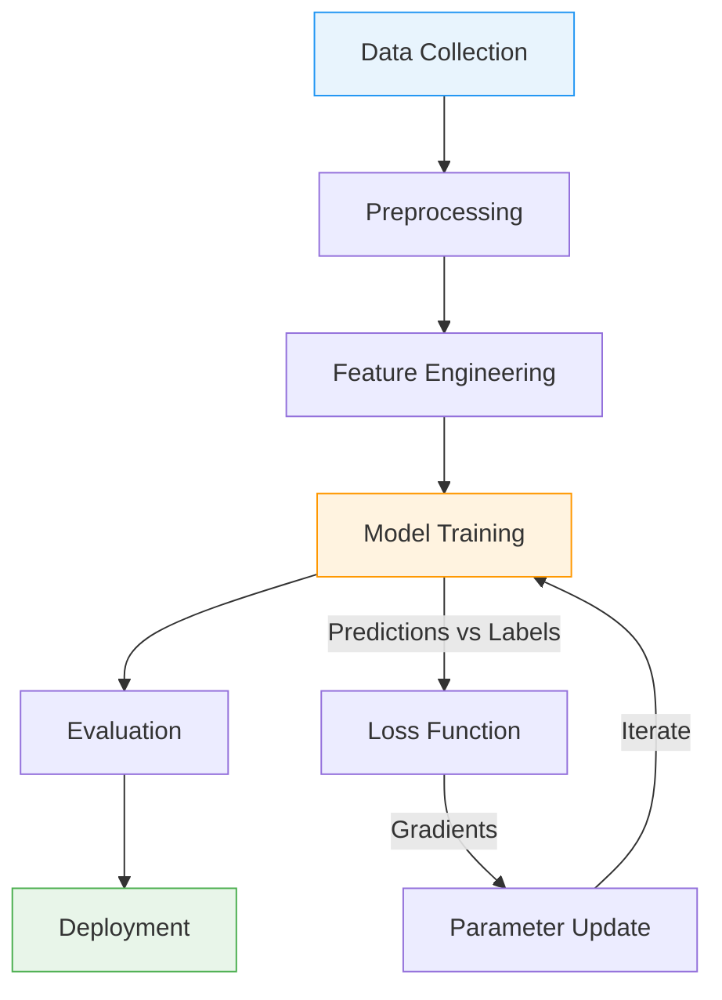
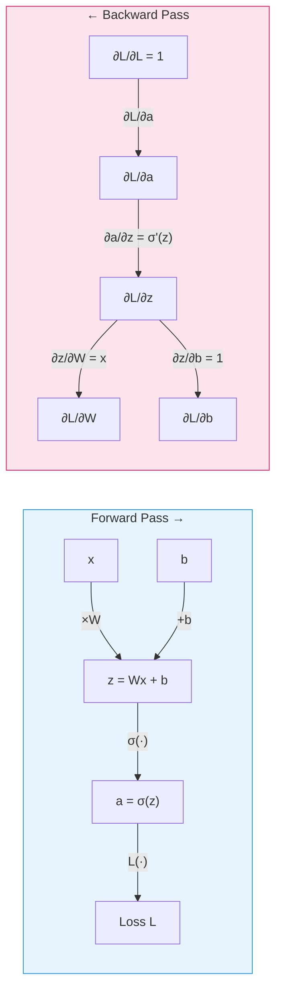
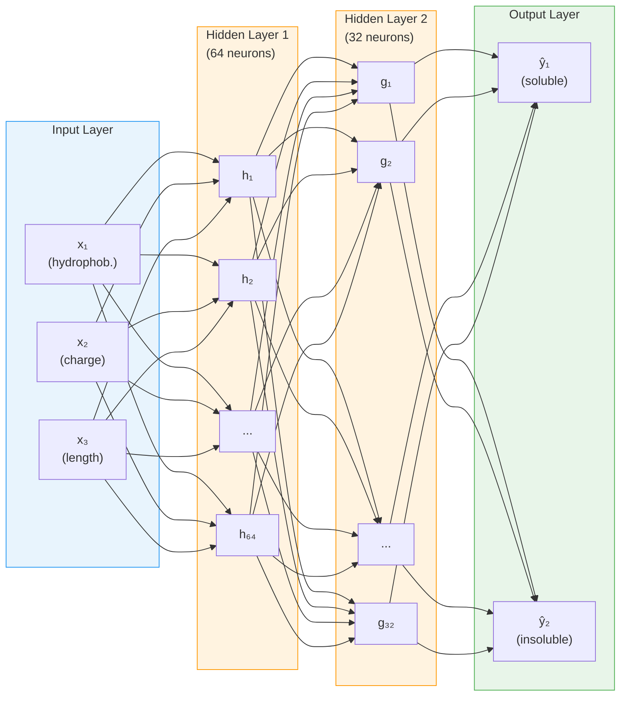

<p style="color: #666; font-size: 0.9em; margin-bottom: 1.5em;"><em>This is Preliminary Note 2 for the Protein &amp; Artificial Intelligence course (Spring 2026), co-taught by Prof. Sungsoo Ahn and Prof. Homin Kim at KAIST. It is designed as a self-study resource: biology-background students should be able to work through it independently before the first in-class lecture. No prior machine learning experience is assumed beyond the material in Preliminary Notes 0 and 1.</em></p>

## Introduction

Imagine you have cloned a gene, designed a construct, and transformed *E. coli* cells.
After overnight expression you lyse the cells, spin down the debris, and pipette off the soluble fraction --- only to find that your target protein is trapped in insoluble inclusion bodies.
You have just wasted days of bench time.
Now imagine a computer program that, given nothing but the amino acid sequence of your construct, predicts with high accuracy whether the protein will be soluble.
Building that program is a machine learning problem, and understanding how to solve it is the goal of this note and the next.

This note focuses on the **conceptual foundations**: what machine learning is, how neural networks are structured, and the PyTorch tools you need to build them.
The next note (Preliminary Note 3) picks up where we leave off and covers how to *train* these networks --- loss functions, optimizers, the training loop, and a complete solubility prediction case study.

### Roadmap

| Section | Topic | Why You Need It |
|---|---|---|
| 1 | What Is Machine Learning? | The foundational concepts: function approximation, generalization, and the tradeoffs every model faces |
| 2 | The Machine Learning Pipeline | The big picture: how raw protein data becomes a trained model |
| 3 | Flavors of ML and Task Types | Different biological questions call for different learning strategies and mathematical formulations |
| 4 | PyTorch Tensors | Tensors are the data structure that stores every protein feature, every weight, and every gradient |
| 5 | From Data to Learning | Building a first model, measuring its mistakes, and using gradients to improve it |
| 6 | Building Neural Networks | How to assemble layers into architectures suited to protein tasks |

### Prerequisites

This note builds on two earlier preliminary notes:

- **Preliminary Note 0** (Python & Data Basics): NumPy arrays, Pandas DataFrames, FASTA and PDB file parsing.
- **Preliminary Note 1** (Protein Representations): One-hot encoding, physicochemical features, distance matrices, and graph representations.

You should also be comfortable with basic linear algebra: vectors, matrices, and matrix multiplication.
If the expression $$\mathbf{y} = \mathbf{W}\mathbf{x} + \mathbf{b}$$ looks unfamiliar, review the linear algebra appendix in Goodfellow et al. [1] before continuing.

---

## 1. What Is Machine Learning?

### Learning as Function Approximation

When a biochemist gains experience, they develop intuitions --- perhaps that highly charged proteins tend to be soluble, or that long hydrophobic stretches spell trouble.
These intuitions are patterns extracted from years of experimental observation.
Machine learning does the same thing, but with numbers instead of intuition.

At its core, machine learning is about **function approximation**.
There exists some unknown function $$f^*$$ that maps inputs to outputs.
In protein science, this might mean mapping an amino acid sequence to a solubility label (soluble or insoluble).
In a general setting, it might mean mapping a photograph of a person's face to their age, or mapping a house's features (square footage, location, number of rooms) to its sale price.
In both cases, we cannot write down $$f^*$$ explicitly because the relationship is too complex for any simple formula.
Instead, we define a family of candidate functions $$f_\theta$$, parameterized by adjustable numbers $$\theta$$ (called **parameters** or **weights**), and we search for the particular values of $$\theta$$ that make $$f_\theta$$ approximate $$f^*$$ as closely as possible.

This search is what "training" means.
We show the model thousands of proteins with known properties, and an optimization algorithm gradually adjusts $$\theta$$ to reduce the gap between the model's predictions and the true labels.
The result is a function that captures the statistical regularities in the data --- amino acid composition biases, charge distributions, hydrophobicity patterns --- as numerical weights.

### Generalization: The Real Goal

A model that perfectly reproduces the answers for proteins it has already seen is not necessarily useful.
What matters is **generalization**: the ability to make accurate predictions on *new* proteins that were not part of the training data.

Consider an analogy.
A student who memorizes every exam answer from past years may score perfectly on those specific exams, but fails when given a new question they have never seen.
A student who understands the underlying principles can solve new problems.
Machine learning models face the same tension: they must learn general patterns from specific examples, not just memorize the examples themselves.

The gap between training performance and performance on new data is the central challenge of machine learning.
Every technique we discuss in this course --- from choosing the right model size to regularization strategies --- is ultimately about improving generalization.

### The Bias-Variance Tradeoff

Why not simply use the most powerful model available?
If a bigger model can represent more complex functions, should we always prefer it?

The answer involves a fundamental tradeoff.

**Bias** refers to error caused by a model being too simple to capture the true patterns in the data.
A linear model predicting solubility from just the protein's length has high bias: it systematically misses the real relationship because the true function is far more complex than a straight line.
Similarly, predicting a house's price from its square footage alone ignores location, condition, and market trends --- a systematic error that no amount of data can fix.

**Variance** refers to error caused by a model being too sensitive to the specific training data.
A very complex model might fit the training data perfectly, including its noise and idiosyncrasies, but produce wildly different predictions when trained on a different random sample.
In protein science, this means a model trained on one random subset of proteins gives very different solubility predictions than the same architecture trained on another subset.
In image recognition, this means a face-age model might memorize specific faces rather than learning general aging patterns like wrinkles and skin texture.
This is the memorization problem.

The sweet spot lies between these extremes.
We want a model complex enough to capture the true patterns (low bias) but constrained enough to avoid fitting noise (low variance).
In practice, this means:

- **Too simple** (high bias): the model underfits --- training performance is already poor.
- **Too complex** (high variance): the model overfits --- training performance is excellent, but validation performance is much worse.
- **Just right**: both training and validation performance are good, and they are close to each other.

We will return to this tradeoff repeatedly throughout the course.
For now, keep it in mind as the reason why model design involves careful choices, not simply "use the biggest model."

---

## 2. The Machine Learning Pipeline

Every machine learning project follows a structured pipeline.



Each stage presents challenges specific to protein data.

**Stage 1: Data Collection.**
Gather proteins and their associated labels.
For solubility prediction, this might mean mining databases like UniProt[^uniprot] for experimentally validated soluble proteins, or analyzing high-throughput expression studies.
The quality of the data fundamentally limits what any model can learn.

[^uniprot]: UniProt (Universal Protein Resource) is the most comprehensive database of protein sequences and functional annotations, containing over 200 million entries as of 2025.

**Stage 2: Preprocessing.**
Transform raw data into a clean, consistent format.
Protein sequences may contain ambiguous amino acid codes (B for Asp or Asn, X for unknown) or unusual characters that need removal.
Structure data from the PDB requires validation for missing atoms, alternate conformations, and resolution quality.

**Stage 3: Feature Engineering.**
This is where domain knowledge meets machine learning.
As we explored in Preliminary Note 1, proteins can be represented as one-hot encodings, physicochemical feature vectors, learned embeddings, or graphs.
The choice of representation profoundly affects what patterns a model can discover.

**Stage 4: Model Training.**
The model sees thousands of proteins with known labels and gradually adjusts its internal parameters to minimize prediction errors.
This stage involves critical choices about model architecture, optimization algorithm, and regularization strategy.
We cover the tools for building models in this note (Sections 4--6) and the training process itself in Preliminary Note 3.

**Stage 5: Evaluation.**
Measure how well the model generalizes to new proteins.
This is trickier than it sounds.
Related sequences often have similar properties, so a naive random train/test split might let the model "cheat" by memorizing similar proteins.
Proper evaluation requires sequence-identity-aware splitting[^seqid] to ensure the test set contains truly novel proteins.

[^seqid]: Sequence-identity-aware splitting clusters proteins by sequence similarity (e.g., using CD-HIT at 30% identity) and assigns entire clusters to either train or test, preventing information leakage from homologous sequences.

**Stage 6: Deployment.**
Bring the model into production where it makes predictions on new proteins.
Practical constraints around inference speed, memory usage, and integration with existing laboratory workflows become important here.

---

## 3. Flavors of Machine Learning and Task Types

### Learning Strategies

Different biological questions call for different learning strategies.

**Supervised learning** is the most straightforward flavor.
You have input-output pairs --- protein sequences and their solubility labels, structures and their stability measurements --- and you want to learn the mapping between them.
The key requirement is labeled data, which in biology often comes from expensive experiments.

**Unsupervised learning** works without labels.
Instead, it discovers structure in the data itself: clustering similar protein sequences, learning low-dimensional embeddings that capture evolutionary relationships, or identifying protein families.
Unsupervised learning can leverage the vast quantities of unlabeled sequence data in databases like UniProt.

**Self-supervised learning** has revolutionized protein machine learning in recent years.
The idea is to create supervision signals from the data itself.
For example, mask out 15% of amino acids in a protein sequence and train the model to predict the missing residues.
This task, borrowed from natural language processing[^bert], forces the model to learn deep representations of protein sequence-structure-function relationships.
Models like ESM [4] and ProtTrans [5], trained on hundreds of millions of protein sequences with this approach, have become foundational tools in computational biology.

[^bert]: The masked prediction task was popularized by BERT (Bidirectional Encoder Representations from Transformers) in natural language processing. The protein versions of this idea are sometimes called "protein language models."

### Matching Problems to Formulations

Different biological questions map to different mathematical formulations.
Getting this mapping right is the first step in any project.
The table below summarizes the main formulations with concrete protein examples.

| Formulation | Output | Protein Example | General Example |
|---|---|---|---|
| **Regression** | A continuous number | Sequence → melting temperature (62.5 °C) | Photo → person's age (34 years) |
| **Binary classification** | One of two categories | Sequence → soluble / insoluble | Email → spam / not spam |
| **Multi-class classification** | One of $$C$$ categories | Sequence → enzyme class (oxidoreductase) | Handwritten digit → 0--9 |
| **Multi-label classification** | Multiple labels per protein | Sequence → {kinase, membrane, signaling} | Photo → {outdoor, sunny, beach} |
| **Sequence-to-sequence** | One output per position | Sequence → secondary structure (H/E/C) per residue | Sentence → part-of-speech tag per word |

#### Regression

Regression tasks have continuous outputs.
Predicting a protein's melting temperature ($$T_m$$) or dissociation constant ($$K_d$$) are regression tasks; predicting a house's sale price from its features, or a person's age from a photograph, are general examples.
The model outputs a real number, and we measure error as the difference between prediction and ground truth.

#### Binary Classification

Binary classification distinguishes two categories.
In protein science: is this protein an enzyme or not? Will it be soluble when expressed in *E. coli*?
In everyday applications: is this email spam or not? Does this medical image show a tumor or not?
The model outputs a probability between 0 and 1, and we apply a threshold (typically 0.5) to make a decision.

#### Multi-Class Classification

Multi-class classification extends binary classification to more than two categories.
In protein science, this includes predicting which of several secondary structure states each residue adopts, or classifying proteins into major functional categories.
In computer vision, recognizing which of 10 digits appears in a handwritten image is a classic multi-class task.
The model outputs a probability distribution over all classes.

#### Multi-Label Classification

Multi-label classification handles cases where multiple labels can apply to the same protein simultaneously.
A protein might be both an enzyme *and* membrane-bound; a photograph might depict both "outdoor" *and* "sunny" *and* "beach."
Each label is predicted independently --- the model outputs one probability per label, and each is thresholded separately.

#### Sequence-to-Sequence

Sequence-to-sequence tasks produce one output per input position.
In protein science, secondary structure prediction assigns one of three states (helix, sheet, coil) to every residue, and disorder prediction identifies which residues lack fixed three-dimensional structure.
In natural language processing, part-of-speech tagging assigns a grammatical label (noun, verb, adjective) to every word in a sentence.
These tasks require models that can process entire sequences and produce position-wise outputs.

---

## 4. PyTorch: Your Laboratory for Neural Networks

If machine learning is the science, PyTorch is the laboratory equipment.
Just as a biochemist needs pipettes, centrifuges, and spectrophotometers, a computational biologist needs tools for constructing and training neural networks.
PyTorch, developed by Meta AI Research [2], has become the dominant framework for deep learning research, including the models that have transformed protein science.

Three properties make PyTorch the standard choice.
First, its "eager execution" model means code runs line by line, making debugging straightforward.
Second, its design closely mirrors how researchers think about computation, so translating mathematical ideas into working code is natural.
Third, the entire ecosystem of protein AI --- from ESM to OpenFold --- builds on PyTorch.

### Tensors: The Atoms of Deep Learning

At the heart of PyTorch lies the **tensor**, a multi-dimensional array of numbers.
If you have used NumPy arrays (Preliminary Note 0), tensors will feel familiar.

A single number is a 0-dimensional tensor, called a **scalar**.
A list of numbers is a 1-dimensional tensor, called a **vector**.
A table of numbers is a 2-dimensional tensor, called a **matrix**.
Higher dimensions are common in practice: a batch of protein sequences might be stored as a 3-dimensional tensor with shape `(batch_size, sequence_length, features)`.

```python
import torch

# --- Creating tensors ---
# A 3x4 matrix of zeros (e.g., placeholder for 3 proteins with 4 features)
x = torch.zeros(3, 4)

# A 3x4 matrix of ones
x = torch.ones(3, 4)

# Random values from a standard normal distribution (mean=0, std=1)
x = torch.randn(3, 4)

# From a Python list (e.g., hydrophobicity values for three amino acids)
x = torch.tensor([1.8, -4.5, 2.5])

# From a NumPy array (bridge between NumPy and PyTorch)
import numpy as np
np_array = np.array([[1.0, 2.0], [3.0, 4.0]])
x = torch.from_numpy(np_array)

# --- Inspecting tensor properties ---
x = torch.randn(3, 4)
print(x.shape)   # torch.Size([3, 4]) — the dimensions
print(x.dtype)   # torch.float32 — the numerical precision
print(x.device)  # cpu — where the tensor lives (cpu or cuda:0)
```

What makes tensors special compared to NumPy arrays?
Two things: **GPU acceleration** and **automatic differentiation**.

### Worked Example: Encoding a Protein Sequence as a Tensor

Let us trace the encoding of a short protein sequence through each stage, watching the tensor shape evolve.

```python
import torch

# Our protein: the first 7 residues of human hemoglobin alpha chain
sequence = "MVLSPAD"

# Step 1: Map each amino acid to an integer index
# 20 standard amino acids → indices 1-20; 0 is reserved for padding
AA_TO_IDX = {aa: i + 1 for i, aa in enumerate("ACDEFGHIKLMNPQRSTVWY")}

indices = [AA_TO_IDX[aa] for aa in sequence]
print(f"Character sequence: {list(sequence)}")
print(f"Integer indices:    {indices}")
# Character sequence: ['M', 'V', 'L', 'S', 'P', 'A', 'D']
# Integer indices:    [11, 19, 10, 16, 14, 1, 3]

# As a tensor: shape (7,) — one integer per residue
seq_tensor = torch.tensor(indices)
print(f"Shape after integer encoding: {seq_tensor.shape}")  # torch.Size([7])

# Step 2: One-hot encode — each integer becomes a 20-dimensional binary vector
one_hot = torch.zeros(len(sequence), 20)
for i, idx in enumerate(indices):
    one_hot[i, idx - 1] = 1.0   # idx is 1-based, tensor indexing is 0-based

print(f"Shape after one-hot encoding: {one_hot.shape}")  # torch.Size([7, 20])
# Each row is all zeros except for a single 1 at the amino acid's position

# Step 3: Add a batch dimension (neural networks process batches of proteins)
batched = one_hot.unsqueeze(0)   # Add dim at position 0
print(f"Shape with batch dimension:   {batched.shape}")  # torch.Size([1, 7, 20])
# (batch_size=1, sequence_length=7, features=20)
```

The final shape `(1, 7, 20)` is the standard format for feeding protein sequences into neural networks: batch size, sequence length, and feature dimension.
When processing 32 proteins at once, the shape becomes `(32, max_len, 20)` --- and we will see later (Preliminary Note 3) how padding and masking handle the fact that different proteins have different lengths.

### The GPU Advantage

Modern GPUs (Graphics Processing Units) contain thousands of simple processors that perform arithmetic operations in parallel.
A single NVIDIA GPU can execute trillions of floating-point operations per second.
But why are GPUs so effective for neural networks specifically?

The answer lies in the nature of the computation.
Neural networks are built from **matrix multiplications**: an input vector is multiplied by a weight matrix, then by another, and another.
Each entry of the output matrix is an independent dot product --- it depends only on one row of the left matrix and one column of the right matrix, not on any other output entry.
This means thousands of output entries can be computed *simultaneously*.

A CPU has a handful of powerful cores (typically 8--16) optimized for complex sequential tasks.
A GPU has thousands of simpler cores (an NVIDIA A100 has 6,912 CUDA cores) designed for exactly this kind of embarrassingly parallel arithmetic.
The matrix multiplications that dominate neural network computation map perfectly onto GPU hardware.

Moving computation to the GPU requires just one line in PyTorch:

```python
# Check whether a GPU is available on this machine
device = torch.device('cuda' if torch.cuda.is_available() else 'cpu')
print(f"Using device: {device}")

# Create a tensor on the CPU, then move it to the GPU
x = torch.randn(1000, 1000)
x_gpu = x.to(device)

# Matrix multiplication now runs on the GPU
y_gpu = x_gpu @ x_gpu.T
```

For a 1000-by-1000 matrix multiplication, a GPU can be 50--100 times faster than a CPU.
When training neural networks that involve millions of such operations per second, this speedup is the difference between experiments taking hours versus weeks.

One critical rule: **all tensors involved in an operation must be on the same device.**
Attempting to multiply a GPU tensor with a CPU tensor will raise an error.
Always move both the model and the data to the same device before computation.

### Tensor Operations

Tensors support all the arithmetic you would expect, with the same broadcasting rules[^broadcasting] as NumPy.

[^broadcasting]: Broadcasting is a set of rules that allow operations between tensors of different shapes. When two tensors have different numbers of dimensions or different sizes along a dimension, the smaller tensor is "stretched" (conceptually, not in memory) to match the larger one. For example, adding a vector of shape `(4,)` to a matrix of shape `(3, 4)` adds the vector to each row.

```python
a = torch.randn(3, 4)
b = torch.randn(3, 4)

# Element-wise operations (applied independently to each pair of elements)
c = a + b          # Addition
c = a * b          # Multiplication (element-wise, NOT matrix multiplication)
c = a ** 2         # Square each element

# Matrix multiplication (the workhorse of neural networks)
# A 3x4 matrix times a 4x3 matrix produces a 3x3 matrix
c = a @ b.T                   # @ is the matrix multiplication operator
c = torch.matmul(a, b.T)     # Equivalent, more explicit

# Broadcasting: a smaller tensor is "stretched" to match
a = torch.randn(3, 4)   # Shape: (3, 4)
b = torch.randn(4)      # Shape: (4,)
c = a + b               # b is broadcast across all 3 rows → shape (3, 4)

# Reductions: summarize a tensor along one or more dimensions
x = torch.randn(3, 4)
x.sum()           # Sum of all 12 elements → a scalar
x.sum(dim=0)      # Sum along rows → shape (4,)
x.mean(dim=-1)    # Mean along the last dimension → shape (3,)
x.max(dim=1)      # Maximum along columns → returns (values, indices)
```

### Reshaping: The Art of Tensor Origami

Neural networks constantly reshape data as it flows through layers.
A batch of protein sequences might start as shape `(batch, length, 20)` for one-hot encodings, then become `(batch, 128, length)` after an embedding layer with 128 features.
Mastering reshaping is essential.

```python
x = torch.randn(2, 3, 4)  # 2 batches, 3 positions, 4 features

# view / reshape: change dimensions while preserving the total number of elements
# 2*3 = 6 rows, 4 columns
x.view(6, 4)
x.reshape(2, 12)     # Flatten the last two dims: 3*4 = 12

# transpose: swap two specific dimensions
x.transpose(0, 1)    # Swap dim 0 and dim 1 → shape (3, 2, 4)

# permute: reorder all dimensions at once
x.permute(2, 0, 1)   # New order: features, batch, positions → shape (4, 2, 3)

# unsqueeze / squeeze: add or remove dimensions of size 1
x.unsqueeze(0)        # Add a dimension at position 0 → shape (1, 2, 3, 4)
x.squeeze()           # Remove all size-1 dimensions
```

A common use case: PyTorch's 1D convolution layers (`nn.Conv1d`) expect input of shape `(batch, channels, length)`, but protein sequence data is often stored as `(batch, length, channels)`.
A single `.transpose(1, 2)` fixes this mismatch.

---

## 5. From Data to Learning: Models, Losses, and Gradients

The previous sections introduced what machine learning is, the pipeline for building models, and the PyTorch tensors that store all our data.
Now we tackle the central question: **how does a model actually learn from data?**

The answer has four steps, and we will build them up one at a time using a concrete protein example:

1. Define a **model** that makes predictions.
2. Measure how wrong the predictions are with a **loss function**.
3. Compute **gradients** that tell us how to adjust the model's parameters to reduce the loss.
4. **Update** the parameters and repeat.

### A First Model: Linear Regression

Let us start with something concrete.
Suppose we have measured 10 physicochemical features for a single protein --- molecular weight, isoelectric point, GRAVY score, instability index, and so on (the kinds of features from Preliminary Note 1).
We want to predict that protein's melting temperature.
We will call the true melting temperature $$y$$ and our prediction $$\hat{y}$$.

The simplest model is a **weighted sum** of the features plus a bias:

$$
\hat{y} = w_1 \cdot x_{\text{MW}} + w_2 \cdot x_{\text{pI}} + w_3 \cdot x_{\text{GRAVY}} + \cdots + w_{10} \cdot x_{10} + b
$$

Here $$x_{\text{MW}}$$ is the molecular weight, $$x_{\text{pI}}$$ is the isoelectric point, and $$x_{\text{GRAVY}}$$ is the hydrophobicity score.
Each weight $$w_i$$ controls how much one feature contributes to the prediction.
A large positive $$w_3$$ (the weight on GRAVY score) would mean more hydrophobic proteins are predicted to have higher melting temperatures.
The bias $$b$$ shifts the overall prediction up or down.

Using vector notation, we can write this more compactly.
Let $$\mathbf{x} = [x_1, x_2, \ldots, x_{10}]$$ be the feature vector for one protein, and $$\mathbf{w} = [w_1, w_2, \ldots, w_{10}]$$ be the weight vector.
Then:

$$
\hat{y} = \mathbf{x} \cdot \mathbf{w} + b = \sum_{j=1}^{10} x_j w_j + b
$$

Now suppose we have not one protein but 100.
We stack their feature vectors into a matrix $$\mathbf{X}$$ of shape (100 $$\times$$ 10), where each **row** is one protein's features.
A single matrix multiplication $$\mathbf{X}\mathbf{W}$$ computes the weighted sum for all 100 proteins at once:

$$
\hat{\mathbf{y}} = \mathbf{X}\mathbf{W} + b
$$

Here $$\mathbf{W}$$ is the weight vector reshaped as a (10 $$\times$$ 1) column, and the result $$\hat{\mathbf{y}}$$ is a (100 $$\times$$ 1) column of predictions --- one per protein.

```python
import torch

# Simulated data: 100 proteins, 10 physicochemical features each
# Each row of X is one protein's features: [mol. weight, pI, GRAVY, ...]
X = torch.randn(100, 10)   # 100 proteins × 10 features
y = torch.randn(100, 1) * 10 + 60   # True melting temperatures (centered ~60°C)

# Learnable parameters — requires_grad=True tells PyTorch to track gradients
W = torch.randn(10, 1, requires_grad=True)   # One weight per feature
b = torch.zeros(1, requires_grad=True)        # Bias term

# Forward pass: predict melting temperature for ALL 100 proteins at once
# X @ W computes the dot product of each protein's features with W
y_pred = X @ W + b              # Shape: (100, 1) — one prediction per protein
print(f"Predictions shape: {y_pred.shape}")  # torch.Size([100, 1])
```

$$\mathbf{W}$$ and $$b$$ are the **learnable parameters**, which we collectively denote as $$\theta = \{\mathbf{W}, b\}$$.
Different values of $$\theta$$ give different predictions --- and right now, with random weights, the predictions are terrible.
The question is: how do we find better values?

The same model structure could predict house prices from features like square footage, location, and number of rooms, or predict a patient's blood pressure from clinical measurements.
The math is identical; only the data changes.

### Measuring Mistakes: The Loss Function

Our model makes predictions.
How do we know how wrong they are?

We need a single number that summarizes the gap between predictions and reality.
This number is called a **loss function** (sometimes called a cost function or objective function).
For regression tasks like predicting melting temperature, a natural choice is the **mean squared error** (MSE):

$$
L_{\text{MSE}}(\theta) = \frac{1}{n}\sum_{i=1}^{n}(\hat{y}_i(\theta) - y_i)^2
$$

The predictions $$\hat{y}_i(\theta)$$ depend on the current parameter values $$\theta$$, so the loss itself is a function of $$\theta$$.
This computes the average squared difference between each prediction and the true value $$y_i$$.
Squaring serves two purposes: it makes all errors positive (an overestimate of +5°C and an underestimate of −5°C are equally bad), and it penalizes large errors disproportionately (an error of 10°C contributes 100 to the sum, while an error of 1°C contributes only 1).

```python
# Loss: mean squared error (in units of °C²)
loss = ((y_pred - y) ** 2).mean()
print(f"Loss: {loss.item():.2f}")  # A single number measuring total prediction error
```

If predicting house prices, an error of 100,000 dollars contributes 10,000 times more to the MSE than an error of 1,000 dollars --- the quadratic penalty strongly discourages large mistakes.

With a model and a loss function in hand, learning becomes an optimization problem: **find the values of $$\theta$$ that minimize $$L(\theta)$$.**
But how?

> **Note:** $$L_{\text{MSE}}$$ is one of many possible loss functions.
> Preliminary Note 3 covers other choices suited to classification tasks (binary cross-entropy, cross-entropy), and explains when to use which.

### Learning from Mistakes: Gradients and Optimization

<div class="col-sm-8 mt-3 mb-3 mx-auto">
    
    <div class="caption mt-1">Gradient descent on a 2D loss landscape. Starting from an initial point (red dot), the optimizer follows the direction of steepest descent at each step, tracing a path (red line) toward the minimum (red star). The contours represent level sets of the loss function.</div>
</div>

We want to adjust $$\mathbf{W}$$ and $$b$$ to reduce the loss.
The tool for this is the **gradient**.

The gradient of the loss with respect to a weight tells us: "if I increase this weight by a tiny amount, how does the loss change?"

- If increasing a weight would *increase* the loss, we should *decrease* that weight.
- If increasing a weight would *decrease* the loss, we should *increase* it.

This strategy --- adjusting each weight in the direction that reduces the loss --- is called **gradient descent**[^gd].
The update rule is:

$$
\theta_{t+1} = \theta_t - \eta \nabla_\theta L(\theta_t)
$$

where $$\theta_t$$ are the current parameter values, $$\eta$$ is the **learning rate** (how big a step to take), and $$\nabla_\theta L(\theta_t)$$ is the gradient of the loss evaluated at $$\theta_t$$.
Preliminary Note 3 covers optimization in much more detail, including adaptive learning rates and momentum.

[^gd]: The term "stochastic gradient descent" (SGD) refers to gradient descent applied to a random subset (mini-batch) of the training data at each step, rather than the entire dataset. In practice, almost all gradient descent in deep learning is stochastic.

#### The Optimization Landscape

It helps to think geometrically.
Imagine the loss as a surface over the space of all possible weight values.
For a model with two weights, this surface is like a mountain landscape --- some regions are high (bad predictions, high loss) and some are low (good predictions, low loss).
Training means navigating this landscape to find a valley (a minimum of the loss).

In reality, neural networks have millions of weights, so the landscape exists in millions of dimensions.
We cannot visualize it, but the intuition still holds: the loss defines a surface, and gradient descent navigates that surface by always stepping in the direction of steepest descent.

This perspective explains several phenomena we will encounter later:

- **Local minima**: the landscape may have many valleys, and the optimizer might settle into a shallow one instead of the deepest.
- **Saddle points**: in high-dimensional spaces, flat regions where the gradient is near zero are common and can slow training.
- **Learning rate sensitivity**: too large a step overshoots valleys; too small a step gets stuck on gentle slopes.

### The Chain Rule and Backpropagation

For our simple linear model, computing gradients is straightforward.
But what about deeper networks with many layers, where the output of one layer feeds into the next?
To compute how a weight in an early layer affects the final loss, we need the **chain rule** from calculus.

We need $$\nabla_\theta L(\theta)$$ --- the derivative of the loss with respect to every parameter in $$\theta$$.
But a parameter in an early layer does not appear directly in the loss formula; it influences the loss through a chain of intermediate computations: $$\theta_k \to z \to a \to \cdots \to L$$.
The chain rule lets us decompose this dependency.
For a parameter $$\theta_k$$ that affects the loss through an intermediate variable $$z$$:

$$
\frac{\partial L}{\partial \theta_k} = \frac{\partial L}{\partial z} \cdot \frac{\partial z}{\partial \theta_k}
$$

In words: to find how $$\theta_k$$ affects $$L$$, multiply how $$z$$ affects $$L$$ by how $$\theta_k$$ affects $$z$$.
Applied recursively backward through the network --- from the loss, through each layer, all the way to the first parameter --- this gives us $$\nabla_\theta L(\theta)$$.
This recursive backward application of the chain rule is the **backpropagation** algorithm[^backprop].

[^backprop]: Backpropagation was popularized for neural network training by Rumelhart, Hinton, and Williams in 1986, though the mathematical idea of reverse-mode automatic differentiation predates it.

The following diagram shows a simple computation graph and how gradients flow backward through it during backpropagation.



### PyTorch Autograd in Action

The remarkable thing about PyTorch is that you never need to implement backpropagation yourself.
You define only the forward computation --- how inputs become outputs.
PyTorch automatically builds a **computational graph** that tracks every operation.
When you call `.backward()`, it traverses this graph in reverse, computing all gradients.

Here is a simple example to see autograd at work:

```python
# Create a tensor and tell PyTorch to track operations on it
x = torch.tensor([2.0, 3.0], requires_grad=True)

# Forward computation: y_i = x_i^2 + 3*x_i
y = x ** 2 + 3 * x

# The loss must be a scalar (single number) for .backward()
z = y.sum()

# Backward pass: compute dz/dx for each element of x
z.backward()

# Gradients are stored in the .grad attribute
print(x.grad)  # tensor([7., 9.])
```

Let us verify this by hand.
We have $$z = \sum_i (x_i^2 + 3x_i)$$, so the partial derivative is $$\frac{\partial z}{\partial x_i} = 2x_i + 3$$.
For $$x_1 = 2$$: $$2(2) + 3 = 7$$.
For $$x_2 = 3$$: $$2(3) + 3 = 9$$.
PyTorch computed exactly these values --- automatically.

#### Back to Our Protein Model

Let us return to our melting temperature model and let PyTorch compute the gradients automatically.
We repeat the model setup, compute the loss, and call `.backward()`:

```python
# Simulated data (same as before)
X = torch.randn(100, 10)
y = torch.randn(100, 1) * 10 + 60

# Learnable parameters
W = torch.randn(10, 1, requires_grad=True)
b = torch.zeros(1, requires_grad=True)

# Forward pass: predict melting temperature
y_pred = X @ W + b

# Loss: mean squared error
loss = ((y_pred - y) ** 2).mean()

# Backward pass: compute gradients of loss w.r.t. W and b
loss.backward()

# W.grad now contains dL/dW — the direction to adjust each weight
print(f"Weight gradient shape: {W.grad.shape}")  # torch.Size([10, 1])
print(f"Bias gradient shape:   {b.grad.shape}")   # torch.Size([1])
```

The gradient `W.grad` tells us how to nudge each weight to reduce the prediction error.
Now we can close the loop with one step of gradient descent:

```python
# One gradient descent step (learning rate = 0.01)
lr = 0.01
W.data -= lr * W.grad    # Adjust weights in the direction that reduces loss
b.data -= lr * b.grad    # Adjust bias similarly

# Verify: the loss should be lower with the updated parameters
y_pred_new = X @ W + b
loss_new = ((y_pred_new - y) ** 2).mean()
print(f"Loss before update: {loss.item():.2f}")
print(f"Loss after update:  {loss_new.item():.2f}")  # Should be lower!
```

This is the complete learning cycle: **model → loss → gradients → update**.
Repeat this cycle thousands of times, and the model converges to good parameter values.
In practice, PyTorch provides optimizers (like `torch.optim.SGD` and `torch.optim.Adam`) that handle the update step and more --- we cover these in Preliminary Note 3.

### Turning Off Gradient Tracking

Computing gradients consumes memory (to store the computational graph) and time.
During **inference** --- when you just want predictions, not training --- you should disable gradient tracking:

```python
# Context manager: temporarily disable gradient tracking
with torch.no_grad():
    T_m_pred = model(x)
    # No computational graph is built — faster and more memory-efficient

# Decorator: permanently disable gradients inside a function
@torch.no_grad()
def predict(model, x):
    return model(x)
```

---

## 6. Building Neural Networks: From Neurons to Architectures

With tensors for data and autograd for gradients, we can now build neural networks.
Let us construct them from the ground up, using protein examples throughout.

### The Single Neuron

The fundamental unit is the **artificial neuron**.
It takes multiple inputs, computes a weighted sum, adds a bias, and applies a nonlinear function:

$$
\text{output} = \sigma(w_1 x_1 + w_2 x_2 + \cdots + w_n x_n + b)
$$

Here $$x_1, x_2, \ldots, x_n$$ are the input values (for example, the hydrophobicity, charge, and length of a protein).
The weights $$w_1, w_2, \ldots, w_n$$ determine how much each input contributes.
The bias $$b$$ shifts the decision boundary.
The function $$\sigma$$ is called an **activation function**; it introduces nonlinearity, allowing the neuron to model relationships that are not straight lines.

### Activation Functions: Why Nonlinearity Matters

Without activation functions, stacking layers would be pointless.
A linear transformation followed by another linear transformation is just... a single linear transformation (their product is still a matrix).
Activation functions break this linearity, and the choice of activation function matters more than it might first appear.

**Sigmoid:** $$\sigma(z) = \frac{1}{1 + e^{-z}}$$

Squashes input to $$(0, 1)$$; used at the output layer for binary probabilities, but causes vanishing gradients in deep hidden layers.

**ReLU:** $$\text{ReLU}(z) = \max(0, z)$$

Zero for negative inputs, identity for positive; the default activation for feedforward networks and CNNs.

**GELU:** $$\text{GELU}(z) = z \cdot \Phi(z)$$

A smooth approximation of ReLU ($$\Phi$$ is the Gaussian CDF) used in transformer architectures, including protein language models like ESM-2.

**Swish (SiLU):** $$\text{Swish}(z) = z \cdot \sigma(z)$$

Similar smoothness properties to GELU; used in ESM-2 and other recent protein models.

**Softmax:** $$\text{softmax}(z_i) = e^{z_i} / \sum_j e^{z_j}$$

Normalizes a vector into a probability distribution summing to 1; used at the output for multi-class classification and inside attention mechanisms.

#### When to Use Which?

| Activation | Best For | Avoid When |
|---|---|---|
| **ReLU** | Default for feedforward networks, CNNs | Very deep networks where dying neurons are a concern |
| **GELU** | Transformers, protein language models | When computational cost matters (slightly more expensive than ReLU) |
| **Sigmoid** | Output layer for binary classification (probability) | Hidden layers of deep networks (vanishing gradients) |
| **Softmax** | Output layer for multi-class classification | Hidden layers (it's a normalization, not an activation) |

### Layers: Many Neurons in Parallel

A single neuron is limited.
But arrange many neurons in parallel --- each receiving the same inputs but with *different* weights --- and you get a **layer**.
With 64 neurons, you get 64 different weighted combinations of the input features.
This can be written compactly as a matrix equation:

$$
\mathbf{h} = \sigma(\mathbf{W}\mathbf{x} + \mathbf{b})
$$

where $$\mathbf{W}$$ is a weight matrix of shape `(64, n_inputs)`, $$\mathbf{x}$$ is the input vector, $$\mathbf{b}$$ is a bias vector, and $$\mathbf{h}$$ is the output vector of 64 values.
This is a **fully connected layer** (also called a **dense layer** or **linear layer**).

### Why Depth Matters: The Power of Composition



The power of neural networks comes from stacking multiple layers, and this is not merely a practical observation --- it has a deep theoretical basis.

The **universal approximation theorem** states that a neural network with even a single hidden layer containing sufficiently many neurons can approximate *any* continuous function to arbitrary precision.
This sounds like great news: a single wide layer can, in principle, learn any input-output mapping we care about.

But there is a catch.
While a single wide layer *can* represent any function, it may need an astronomically large number of neurons to do so.
Deep networks --- those with many layers --- can represent the same functions far more efficiently.
The reason is **compositionality**: complex functions are built from simpler sub-functions, and each layer learns one level of this hierarchy.

For a protein property classifier, this compositional hierarchy might look like:

- **Layer 1** detects individual amino acid properties (charge, size, hydrophobicity).
- **Layer 2** recognizes local motifs (charge clusters, hydrophobic patches).
- **Layer 3** identifies higher-order patterns (domain boundaries, structural elements).
- **Output layer** combines these abstract representations into a final prediction.

An image recognition network learns a strikingly similar hierarchy:

- **Layer 1** detects edges and color gradients.
- **Layer 2** combines edges into textures and simple shapes.
- **Layer 3** recognizes object parts (eyes, wheels, petals).
- **Output layer** identifies the object (face, car, flower).

In both domains, depth allows the network to mirror the hierarchical nature of the patterns it needs to learn --- primary sequence → secondary structure → tertiary fold for proteins, and edges → textures → parts → objects for images.

In practice, deeper networks are not always better.
Very deep networks can be harder to train (gradients may vanish or explode as they propagate through many layers).
Techniques like residual connections, normalization layers, and careful initialization --- covered in the optional Preliminary Note 4 --- have made training deep networks practical.

### `nn.Module`: PyTorch's Building Block

In PyTorch, every neural network component inherits from `nn.Module`.
This base class provides machinery for tracking parameters, moving to GPU, saving and loading models, and more.
Building a custom network means writing a class with two methods:

- `__init__`: define what layers exist.
- `forward`: define how data flows through them.

```python
import torch.nn as nn

class ProteinPropertyPredictor(nn.Module):
    """A feedforward network for protein property prediction.

    Takes per-protein feature vectors and predicts a property class.
    """

    def __init__(self, input_dim, hidden_dim, output_dim):
        super().__init__()
        # First fully connected layer: input features → hidden representation
        self.fc1 = nn.Linear(input_dim, hidden_dim)
        # Activation function
        self.relu = nn.ReLU()
        # Second fully connected layer: hidden representation → prediction
        self.fc2 = nn.Linear(hidden_dim, output_dim)

    def forward(self, x):
        # x shape: (batch_size, input_dim)
        x = self.fc1(x)    # Linear transformation
        x = self.relu(x)   # Nonlinear activation
        x = self.fc2(x)    # Map to output
        return x

# Create the model: 20 amino acid features → 64 hidden units → 2 classes
model = ProteinPropertyPredictor(input_dim=20, hidden_dim=64, output_dim=2)

# Use the model: pass a batch of 32 proteins, each with 20 features
x = torch.randn(32, 20)
output = model(x)         # Shape: (32, 2)
print(output.shape)
```

PyTorch handles the backward pass automatically.
You never write backpropagation code --- you only specify the forward computation.

### A Richer Example: Processing Sequence and Scalar Features Together

Many protein prediction tasks benefit from combining per-residue sequence information with global scalar properties (molecular weight, isoelectric point, etc.).
Here is a model that processes both:

```python
class DualInputProteinModel(nn.Module):
    """A model that combines sequence-level and global protein features.

    The sequence branch uses an embedding + 1D convolution to capture
    local amino acid patterns. The global branch processes scalar features.
    Both are concatenated before the final classification layer.
    """

    def __init__(self, vocab_size=21, embed_dim=64, num_global_features=5,
                 hidden_dim=128, num_classes=2):
        super().__init__()

        # Sequence branch: embedding → Conv1D → global average pool
        self.embedding = nn.Embedding(vocab_size, embed_dim, padding_idx=0)
        self.conv = nn.Conv1d(embed_dim, hidden_dim, kernel_size=5, padding=2)
        self.relu = nn.ReLU()

        # Global features branch: a small feedforward network
        self.global_fc = nn.Linear(num_global_features, 32)

        # Classification head: takes both branches as input
        self.classifier = nn.Linear(hidden_dim + 32, num_classes)

    def forward(self, sequence, global_features, mask=None):
        # sequence shape:        (batch, seq_len) — integer-encoded amino acids
        # global_features shape: (batch, num_global_features) — scalar properties
        # mask shape:            (batch, seq_len) — 1 for real, 0 for padding

        # --- Sequence branch ---
        x = self.embedding(sequence)           # (batch, seq_len, embed_dim)
        x = x.transpose(1, 2)                  # (batch, embed_dim, seq_len) for Conv1d
        x = self.relu(self.conv(x))            # (batch, hidden_dim, seq_len)

        # Masked global average pooling
        if mask is not None:
            mask_expanded = mask.unsqueeze(1)   # (batch, 1, seq_len)
            x = (x * mask_expanded).sum(dim=2) / mask_expanded.sum(dim=2).clamp(min=1)
        else:
            x = x.mean(dim=2)                  # (batch, hidden_dim)

        # --- Global features branch ---
        g = self.relu(self.global_fc(global_features))  # (batch, 32)

        # --- Combine and classify ---
        combined = torch.cat([x, g], dim=1)    # (batch, hidden_dim + 32)
        output = self.classifier(combined)      # (batch, num_classes)
        return output
```

This architecture illustrates two important design patterns: **multi-input models** (combining different data modalities) and **masked pooling** (handling variable-length sequences by ignoring padding positions).

### Common Layer Types

PyTorch provides a library of pre-built layers for common operations.
Here are the ones you will encounter most often in protein AI.

```python
# --- Linear layer ---
# Computes y = Wx + b. The fundamental building block.
nn.Linear(in_features=20, out_features=64)

# --- Activation functions ---
nn.ReLU()        # max(0, x) — simple, effective, the default choice
nn.GELU()        # Smooth approximation of ReLU, used in transformer models
nn.Sigmoid()     # Squashes output to (0, 1), useful for binary probabilities
nn.Softmax(dim=-1)  # Normalizes a vector to sum to 1 (probability distribution)

# --- Normalization layers ---
# Stabilize training by normalizing intermediate activations
nn.LayerNorm(normalized_shape=64)    # Normalizes across features (used in transformers)
nn.BatchNorm1d(num_features=64)      # Normalizes across the batch dimension

# --- Dropout ---
# Randomly zeros out neurons during training to prevent overfitting
nn.Dropout(p=0.1)  # Each neuron has a 10% chance of being turned off per forward pass

# --- Embedding layer ---
# Maps discrete tokens (like amino acid indices) to continuous vectors
# 21 possible tokens (20 amino acids + 1 padding), each mapped to a 64-dim vector
nn.Embedding(num_embeddings=21, embedding_dim=64)
```

### `nn.Sequential`: Quick Model Definition

For simple architectures where data flows straight through one layer after another with no branching, `nn.Sequential` offers a compact shortcut:

```python
model = nn.Sequential(
    nn.Linear(20, 64),     # 20 input features → 64 hidden units
    nn.ReLU(),
    nn.Dropout(0.1),       # Regularization
    nn.Linear(64, 64),     # Second hidden layer
    nn.ReLU(),
    nn.Dropout(0.1),
    nn.Linear(64, 2)       # Output: 2 classes (soluble vs. insoluble)
)
```

This builds the same network as a custom `nn.Module` class but with less boilerplate.
Use `nn.Sequential` for quick experiments; switch to a full class when you need branching, skip connections, or conditional logic.

### Managing Parameters

Neural networks can have millions of parameters.
PyTorch provides tools to inspect and manage them.

```python
# List all named parameters and their shapes
for name, param in model.named_parameters():
    print(f"{name}: shape={param.shape}, requires_grad={param.requires_grad}")

# Count total and trainable parameters
total_params = sum(p.numel() for p in model.parameters())
trainable_params = sum(p.numel() for p in model.parameters() if p.requires_grad)
print(f"Total parameters:     {total_params:,}")
print(f"Trainable parameters: {trainable_params:,}")

# Save a trained model's weights to disk
torch.save(model.state_dict(), 'protein_model.pt')

# Load weights back into a model (the architecture must match)
model.load_state_dict(torch.load('protein_model.pt'))
```

---

## Key Takeaways

1. **Machine learning is function approximation.** We search for a function $$f_\theta$$ that maps protein inputs to property predictions. The challenge is finding parameters $$\theta$$ that generalize to proteins the model has never seen.

2. **Generalization is the real goal**, not training accuracy. The bias-variance tradeoff governs model design: too simple models underfit, too complex models overfit.

3. **Tensors** are the universal data structure of deep learning. They combine NumPy-like operations with GPU acceleration and automatic differentiation. Protein sequences are encoded as tensors of shape `(batch, length, features)`.

4. **The learning cycle is model → loss → gradients → update.** We define a model (even a simple linear one), measure its mistakes with a loss function, compute gradients via autograd, and update the weights. PyTorch automates the gradient computation through backpropagation.

5. **Neural networks** are compositions of simple layers: linear transformations followed by nonlinear activations. The choice of activation function matters --- ReLU for general use, GELU for transformers, sigmoid only at the output for probabilities.

6. **Depth enables hierarchical learning.** The universal approximation theorem guarantees that neural networks *can* represent arbitrary functions, and depth makes this representation efficient by building complex features from simpler ones --- mirroring the hierarchical nature of protein structure.

7. **Next up**: Preliminary Note 3 covers how to train these networks --- loss functions, optimizers, the training loop, data loading, and a complete solubility prediction case study.

---

## Exercises

These exercises reinforce the concepts from this note.
Each one can be completed in a single Python script or Jupyter notebook.

### Exercise 1: Protein Feature Tensors

Encode a batch of 5 protein sequences of varying lengths as tensors suitable for neural network input.
Start from raw amino acid strings, convert to integer indices, pad to the length of the longest sequence, and create the corresponding mask tensor.
Print the shape at each step and verify that padding positions have mask value 0.

*Extension:* Also compute 5 global features per protein (molecular weight, isoelectric point, GRAVY, instability index, sequence length) and store them as a separate `(5, 5)` tensor.

### Exercise 2: Building and Inspecting a Network

Build a 4-layer feedforward network using `nn.Module` that takes 20-dimensional amino acid composition vectors as input and predicts one of 4 enzyme classes.
The hidden dimensions should be 128 → 64 → 32.
Use ReLU activations between layers.

Count the total number of trainable parameters.
Then replace all ReLU activations with GELU and verify that the parameter count does not change (why?).

### Exercise 3: Autograd Exploration

Create a simple linear model $$y = Wx + b$$ with `requires_grad=True` on both $$W$$ and $$b$$.
Compute the MSE loss for a small batch of 10 data points.
Call `.backward()` and inspect the gradients.

Then manually compute $$\partial L / \partial W$$ and $$\partial L / \partial b$$ using the chain rule and verify they match the PyTorch gradients.

*Hint:* For MSE loss $$L = \frac{1}{n}\sum_i (Wx_i + b - y_i)^2$$, the gradients are $$\frac{\partial L}{\partial W} = \frac{2}{n}\sum_i x_i(Wx_i + b - y_i)$$ and $$\frac{\partial L}{\partial b} = \frac{2}{n}\sum_i (Wx_i + b - y_i)$$.

---

## References

1. Goodfellow, I., Bengio, Y., & Courville, A. (2016). *Deep Learning*. MIT Press. Chapters 6--8. Available at [https://www.deeplearningbook.org/](https://www.deeplearningbook.org/).

2. Paszke, A., Gross, S., Massa, F., Lerer, A., Bradbury, J., Chanan, G., ... & Chintala, S. (2019). "PyTorch: An Imperative Style, High-Performance Deep Learning Library." *Advances in Neural Information Processing Systems*, 32.

3. Kingma, D. P. & Ba, J. (2015). "Adam: A Method for Stochastic Optimization." *Proceedings of the 3rd International Conference on Learning Representations (ICLR)*.

4. Rives, A., Meier, J., Sercu, T., Goyal, S., Lin, Z., Liu, J., ... & Fergus, R. (2021). "Biological Structure and Function Emerge from Scaling Unsupervised Learning to 250 Million Protein Sequences." *Proceedings of the National Academy of Sciences*, 118(15), e2016239118.

5. Elnaggar, A., Heinzinger, M., Dallago, C., Rehawi, G., Wang, Y., Jones, L., ... & Rost, B. (2022). "ProtTrans: Toward Understanding the Language of Life Through Self-Supervised Learning." *IEEE Transactions on Pattern Analysis and Machine Intelligence*, 44(10), 7112--7127.

6. Rumelhart, D. E., Hinton, G. E., & Williams, R. J. (1986). "Learning Representations by Back-Propagating Errors." *Nature*, 323(6088), 533--536.

7. Cybenko, G. (1989). "Approximation by Superpositions of a Sigmoidal Function." *Mathematics of Control, Signals and Systems*, 2(4), 303--314.

8. Hornik, K. (1991). "Approximation Capabilities of Multilayer Feedforward Networks." *Neural Networks*, 4(2), 251--257.

9. PyTorch Documentation. [https://pytorch.org/docs/stable/](https://pytorch.org/docs/stable/).

10. PyTorch Tutorials. [https://pytorch.org/tutorials/](https://pytorch.org/tutorials/).
