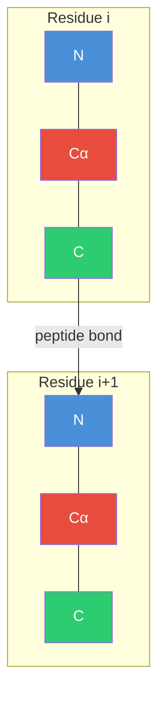
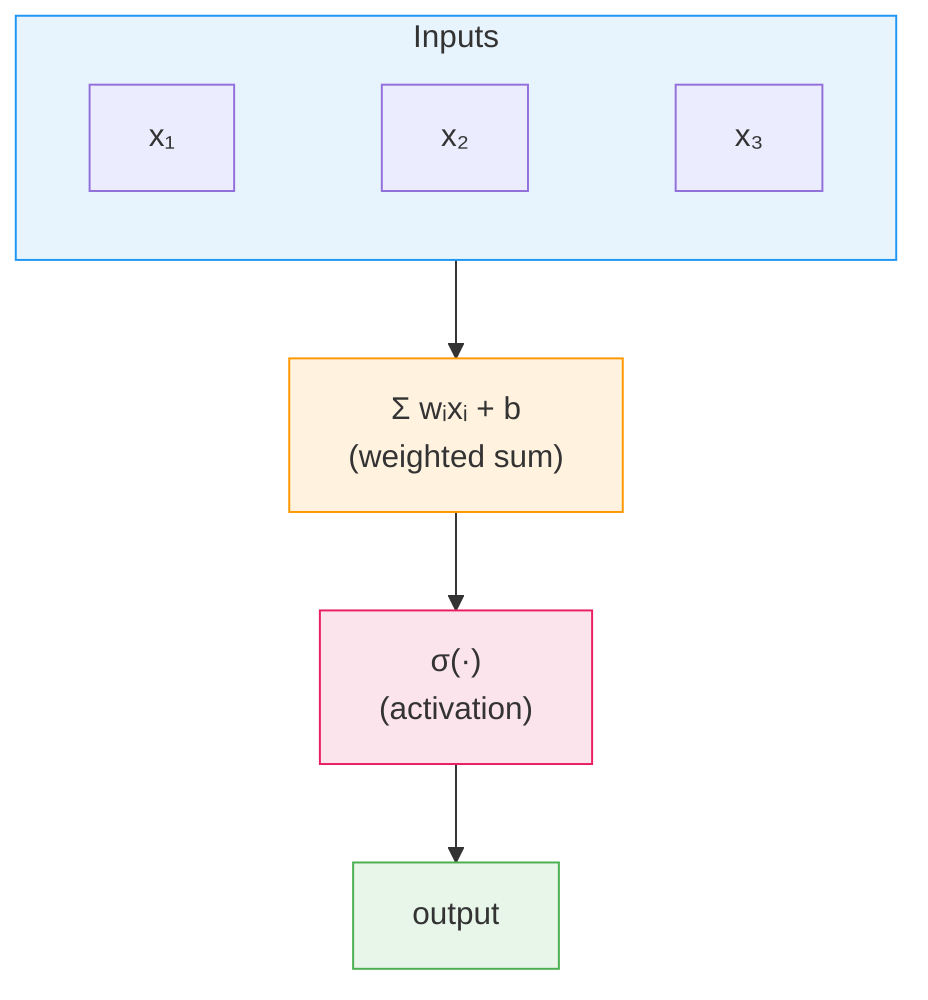
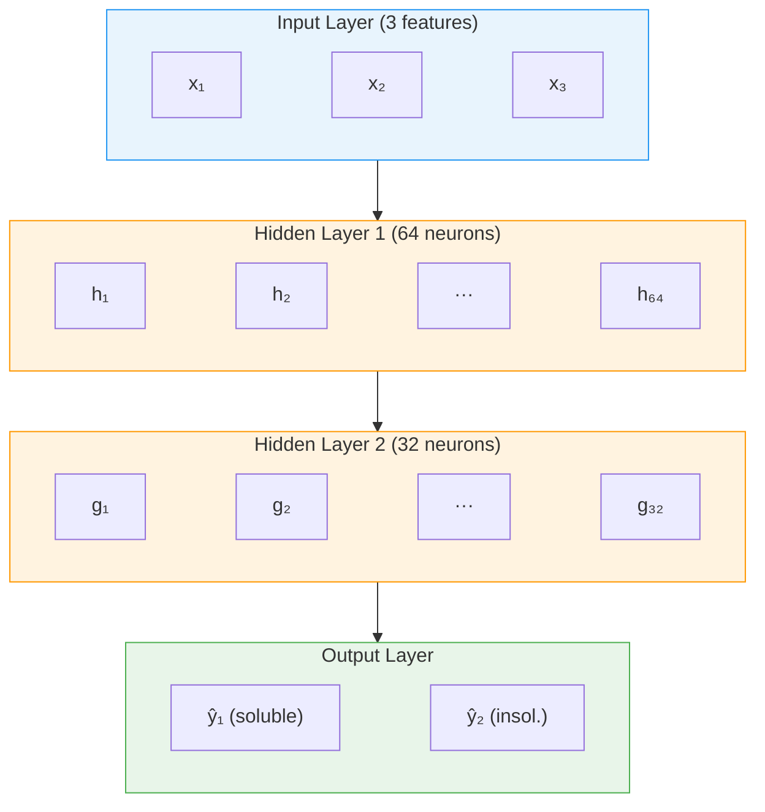

<p style="color: #666; font-size: 0.9em; margin-bottom: 1.5em;">
<em>This is Preliminary Note 2 for the Protein &amp; Artificial Intelligence course (Spring 2026), co-taught by <a href="https://sungsoo-ahn.github.io">Prof. Sungsoo Ahn</a> and Prof. Homin Kim at KAIST. It builds on Preliminary Note 1 (Introduction to Machine Learning with Linear Regression). Now that you know what tensors and gradients are, this note answers two questions: how do you get protein data into tensors, and what neural network architectures process them?</em>
</p>

## Introduction

You now know that machine learning models take tensors as input and produce tensors as output, and that learning adjusts the weights to reduce a loss function.
But proteins are not tensors.
They are amino acid sequences stored in text files and three-dimensional structures stored in coordinate files.
Before any model can learn from protein data, you must solve a translation problem: convert biological data into numerical arrays that a neural network can process.

This note covers that translation and the architectures that operate on the results.
First, we learn to read the two standard file formats --- FASTA for sequences and PDB for structures.
Second, we encode sequences as numerical tensors using one-hot vectors and learned embeddings.
Third, we encode structures using distance matrices, contact maps, and dihedral angles.
Fourth, we introduce neural network architectures --- from single neurons to multi-layer networks --- that transform these representations into predictions.
Finally, we map different biological questions to their corresponding mathematical formulations.

### Roadmap

| Section | What You Will Learn | Why It Is Needed |
|---------|---------------------|------------------|
| [Protein File Formats](#1-protein-file-formats) | FASTA and PDB parsing with Biopython and Biotite | Raw biological data must be loaded before it can be encoded |
| [Sequence Representations](#2-sequence-representations) | One-hot encoding, learned embeddings | Every downstream model needs a numerical input for amino acid sequences |
| [Structure Representations](#3-structure-representations) | Distance matrices, contact maps, dihedral angles | 3D arrangement determines protein function; structure-aware models need spatial inputs |
| [Neural Network Architectures](#4-neural-network-architectures) | Neurons, activations, layers, depth, `nn.Module` | The function families that transform protein representations into predictions |
| [Task Formulations](#5-task-formulations) | Regression, classification, sequence-to-sequence | Different biological questions require different output formats |

### Prerequisites

This note assumes familiarity with Preliminary Note 1: tensors, gradient descent, and the learning cycle (model → loss → gradients → update).

---

## 1. Protein File Formats

The computational biology community has developed standardized file formats for storing protein data.
Understanding these formats is essential: they are the raw materials from which you build datasets.

<div class="col-sm-8 mt-3 mb-3 mx-auto">
    
    <div class="caption mt-1"><strong>Protein 3D structure.</strong> A simplified ribbon representation showing the three main secondary structure elements: alpha-helices (red), beta-strands (blue), and loops/coils (gray). Real structures from the Protein Data Bank encode the precise 3D coordinates of every atom.</div>
</div>

### 1.1 FASTA: The Universal Sequence Format

FASTA is the simplest bioinformatics file format.
Each entry consists of a header line starting with `>`, followed by one or more lines of amino acid sequence:

```
>sp|P0A6Y8|DNAK_ECOLI Chaperone protein DnaK
MGKIIGIDLGTTNSCVAIMDGTTPRVLENAEGDRTTPSIIAYTQDGETLVGQPAKRQAVT
NPQNTLFAIKRLIGRRFQDEEVQRDVSIMPFKIIAADNGDAWVEVKGQKMAPPQISAEVL
```

The header in this example follows UniProt[^uniprot] conventions.
`sp` indicates Swiss-Prot (the manually curated portion of UniProt).
`P0A6Y8` is the accession number --- a unique identifier for this protein.
`DNAK_ECOLI` is the entry name.
Different databases use different header conventions, so always check the source before writing a parser.

[^uniprot]: UniProt (Universal Protein Resource) is the most comprehensive protein sequence database, containing over 200 million entries. Swiss-Prot is its curated subset with roughly 570,000 entries.

### 1.2 Parsing FASTA with Biopython

Biopython is the standard library for biological file parsing in Python.
Its `SeqIO` module provides a consistent interface across many sequence formats:

```python
from Bio import SeqIO

def load_fasta(filepath):
    """Load all sequences from a FASTA file into a dictionary."""
    sequences = {}
    for record in SeqIO.parse(filepath, "fasta"):
        sequences[record.id] = str(record.seq)
    return sequences

# Example usage
seqs = load_fasta("proteins.fasta")
for name, seq in list(seqs.items())[:3]:
    print(f"{name}: {len(seq)} residues, starts with {seq[:10]}...")
```

`SeqIO.parse()` returns an iterator of `SeqRecord` objects, each containing the sequence and metadata.
The iterator design is important: it reads one record at a time rather than loading the entire file into memory, which matters when processing databases with millions of entries.

### 1.3 PDB: The Format for 3D Structures

While FASTA captures the *sequence* of a protein, the **PDB format** captures its *structure*: the three-dimensional positions of every atom.
PDB files use a fixed-width text format[^pdb-history] with a specific column layout:

[^pdb-history]: The PDB file format dates back to 1971, when data was stored on 80-column punch cards. The fixed-width layout reflects this heritage. A newer format, mmCIF, is gradually replacing PDB for large structures, but PDB remains the most widely used format for single-chain proteins.

```
PDB ATOM Record Format (80-column fixed-width):
┌──────┬───────┬──────┬─────┬───┬─────┬────────────────────────────┬──────┬──────┬───┐
│Record│ Atom# │ Name │ Res │Chn│Res# │     X        Y        Z    │ Occ. │B-fac │Elm│
│ Type │       │      │     │ ID│     │                            │      │      │   │
├──────┼───────┼──────┼─────┼───┼─────┼────────────────────────────┼──────┼──────┼───┤
│ATOM  │     1 │  N   │ MET │ A │   1 │  27.340  24.430   2.614   │ 1.00 │ 9.67 │ N │
│ATOM  │     2 │  CA  │ MET │ A │   1 │  26.266  25.413   2.842   │ 1.00 │10.38 │ C │
│ATOM  │     3 │  C   │ MET │ A │   1 │  26.913  26.639   3.531   │ 1.00 │ 9.62 │ C │
└──────┴───────┴──────┴─────┴───┴─────┴────────────────────────────┴──────┴──────┴───┘
 Col:  1-6    7-11   13-16  18-20  22  23-26       31-38  39-46  47-54  55-60 61-66 77-78
```
<div class="caption mt-1">The fixed-width column layout of a PDB ATOM record. Each line contains the atom serial number, atom name, residue name, chain identifier, residue sequence number, (x, y, z) Cartesian coordinates in Ångströms, occupancy, temperature factor, and element symbol.</div>

The key columns are:

| Columns | Content | Example |
|---------|---------|---------|
| 1--6 | Record type | `ATOM` |
| 13--16 | Atom name | `N`, `CA`, `C`, `O` |
| 18--20 | Residue name (3-letter code) | `MET`, `ALA`, `GLY` |
| 22 | Chain identifier | `A` |
| 31--54 | X, Y, Z coordinates (Angstroms) | `27.340  24.430   2.614` |

The **$$\text{C}_\alpha$$** (alpha-carbon) atom is central to protein machine learning.
Every standard amino acid has exactly one $$\text{C}_\alpha$$, located at the backbone's central carbon.
The $$\text{C}_\alpha$$ trace --- one point per residue --- provides a simplified yet informative representation of protein structure.

### 1.4 Parsing PDB with Biotite

Biotite[^biotite] is a modern Python library for structural biology.
Here is how to load a PDB file and extract $$\text{C}_\alpha$$ coordinates:

[^biotite]: Biotite is an alternative to Biopython's `Bio.PDB` module, offering a more Pythonic API and better integration with NumPy arrays.

```python
import biotite.structure.io.pdb as pdb
import biotite.structure as struc

def load_pdb(filepath, chain='A'):
    """Load a protein structure from a PDB file."""
    pdb_file = pdb.PDBFile.read(filepath)
    structure = pdb_file.get_structure(model=1)
    structure = structure[struc.filter_amino_acids(structure)]
    if chain:
        structure = structure[structure.chain_id == chain]
    return structure

# Load Ubiquitin (PDB ID: 1UBQ) and extract Calpha coordinates
structure = load_pdb("1ubq.pdb")
ca_mask = structure.atom_name == "CA"
ca_coords = structure.coord[ca_mask]
print(f"Calpha coordinates shape: {ca_coords.shape}")  # (76, 3)
```

After extraction, `ca_coords` is a standard NumPy array of shape `(76, 3)` --- ready to be converted into distance matrices, contact maps, or other structural representations (Section 3).

### 1.5 Bridging Sequence and Structure

Sometimes you need to extract the amino acid sequence from a structure file --- to verify consistency or because only the PDB is available.
This requires mapping three-letter residue codes (used in PDB files) to single-letter codes (used in FASTA files and sequence models):

```python
import biotite.structure as struc

AA_3TO1 = {
    'ALA': 'A', 'CYS': 'C', 'ASP': 'D', 'GLU': 'E', 'PHE': 'F',
    'GLY': 'G', 'HIS': 'H', 'ILE': 'I', 'LYS': 'K', 'LEU': 'L',
    'MET': 'M', 'ASN': 'N', 'PRO': 'P', 'GLN': 'Q', 'ARG': 'R',
    'SER': 'S', 'THR': 'T', 'VAL': 'V', 'TRP': 'W', 'TYR': 'Y'
}

def get_sequence_from_structure(structure):
    """Extract the amino acid sequence from a Biotite AtomArray."""
    residue_ids, residue_names = struc.get_residues(structure)
    return ''.join(AA_3TO1.get(name, 'X') for name in residue_names)

seq = get_sequence_from_structure(structure)
print(f"Ubiquitin sequence ({len(seq)} residues): {seq[:20]}...")
```

The fallback to `'X'` handles non-standard amino acids --- modified residues, selenomethionine (used in X-ray crystallography), and other variants that frequently appear in real-world PDB files.

---

## 2. Sequence Representations

<div class="col-sm-10 mt-3 mb-3 mx-auto">
    
    <div class="caption mt-1"><strong>The 20 standard amino acids.</strong> Amino acids are grouped by their side-chain chemistry: nonpolar/hydrophobic (red), polar uncharged (blue), positively charged (green), and negatively charged (orange). Bar heights show approximate molecular weights. These chemical differences determine how each amino acid contributes to protein folding and function.</div>
</div>

The amino acid sequence is the primary structure of a protein --- the linear chain of residues encoded by the gene.
Because sequencing is cheap and fast, sequence data is far more abundant than structure data: UniProt contains over 200 million sequences, while the Protein Data Bank has roughly 200,000 experimentally determined structures.

### 2.1 One-Hot Encoding

The most straightforward encoding is **one-hot encoding**[^onehot].
Each amino acid at position $$i$$ becomes a binary vector of length 20, with a single 1 indicating which residue is present:

[^onehot]: One-hot encoding is also called "dummy encoding" or "indicator encoding" in the statistics literature.

$$
\mathbf{x}_i \in \{0, 1\}^{20}, \quad \sum_{j=1}^{20} x_{ij} = 1
$$

A full protein of length $$L$$ becomes a tensor of shape $$(L, 20)$$.

```python
import torch

AMINO_ACIDS = "ACDEFGHIKLMNPQRSTVWY"
aa_to_idx = {aa: i for i, aa in enumerate(AMINO_ACIDS)}

def one_hot_encode(sequence: str) -> torch.Tensor:
    """One-hot encode a protein sequence as a PyTorch tensor."""
    encoding = torch.zeros(len(sequence), 20)
    for i, aa in enumerate(sequence):
        if aa in aa_to_idx:
            encoding[i, aa_to_idx[aa]] = 1.0
    return encoding

# Example: encode the first 5 residues of hemoglobin alpha
enc = one_hot_encode("MVLSP")
print(enc.shape)  # torch.Size([5, 20])
```

One-hot encoding is simple and fully interpretable.
Its limitation is that it treats every amino acid as equally different from every other.
Alanine appears just as distant from Glycine (both small and hydrophobic) as from Tryptophan (large and aromatic).
Biologically, this is wrong: some substitutions preserve function while others destroy it.

The figure below contrasts one-hot encoding with the BLOSUM62 substitution matrix, which captures evolutionary similarity --- biochemically similar residues have positive scores, while dissimilar substitutions have negative scores.

<div class="col-sm-10 mt-3 mb-3 mx-auto">
    
    <div class="caption mt-1">Comparison of one-hot encoding (left) and BLOSUM62 substitution matrix (right). One-hot encoding is a 20×20 identity matrix — every amino acid is equally different from every other. BLOSUM62 encodes evolutionary substitution patterns: high scores (red) indicate frequently interchangeable residues (e.g., I↔L, D↔E), while negative scores (blue) mark pairs rarely observed at aligned positions.</div>
</div>

The BLOSUM (BLOcks SUbstitution Matrix)[^blosum] quantifies evolutionary substitution patterns by counting how often each pair of amino acids appears at the same position in alignments of related proteins.
While BLOSUM provides a richer encoding than one-hot, modern protein AI models typically use learned embeddings instead.

[^blosum]: BLOSUM62, the most widely used variant, was built from conserved blocks of aligned protein sequences with at least 62% identity.

### 2.2 Learned Embeddings

Rather than hand-crafting encodings, we can let the data determine the optimal representation.
In **learned embeddings**, each amino acid starts as a random vector of dimension $$d$$.
During training, the neural network adjusts these vectors through backpropagation so that they best serve the prediction task.

```python
import torch
import torch.nn as nn

class AminoAcidEmbedding(nn.Module):
    """Trainable embedding layer for protein sequences."""
    def __init__(self, embed_dim: int = 64):
        super().__init__()
        # 21 entries: 20 amino acids + 1 for unknown residues
        self.embedding = nn.Embedding(num_embeddings=21, embedding_dim=embed_dim)

    def forward(self, sequence_indices: torch.Tensor) -> torch.Tensor:
        """
        Args:
            sequence_indices: (batch, L) tensor of integer-encoded residues
        Returns:
            (batch, L, embed_dim) tensor of embedding vectors
        """
        return self.embedding(sequence_indices)
```

The `nn.Embedding` layer maintains a trainable lookup table of shape $$(21, d)$$.
After training on many proteins, the embeddings often reveal biologically meaningful structure: hydrophobic residues cluster together, charged residues form their own group, and aromatic residues occupy a distinct region --- all without any explicit biochemical supervision.

This is the strategy behind **protein language models** such as ESM from Meta AI, which we cover in detail in Lecture 6.

---

## 3. Structure Representations

Sequence tells us *what* amino acids are present.
Structure tells us *where* they are in space.
A protein's three-dimensional arrangement determines its function --- how it binds substrates, catalyzes reactions, and interacts with partners.

<div class="col-sm-10 mt-3 mb-3 mx-auto">
    
    <div class="caption mt-1"><strong>Four levels of protein structure.</strong> Primary: the linear sequence of amino acids. Secondary: local folding motifs (alpha-helices, beta-sheets). Tertiary: the complete 3D arrangement of a single chain. Quaternary: assembly of multiple chains into a functional complex.</div>
</div>

### 3.1 Distance Matrices

The simplest structural representation is the **distance matrix**.
Given a protein with $$L$$ residues, the distance matrix $$D \in \mathbb{R}^{L \times L}$$ records the Euclidean distance between the C$$\alpha$$ atoms of every pair of residues:

$$
D_{ij} = \lVert \mathbf{r}_i - \mathbf{r}_j \rVert_2
$$

where $$\mathbf{r}_i \in \mathbb{R}^3$$ is the coordinate vector of the $$i$$-th C$$\alpha$$ atom.

```python
import numpy as np

def compute_distance_matrix(coords: np.ndarray) -> np.ndarray:
    """
    Compute the pairwise C-alpha distance matrix.

    Args:
        coords: (L, 3) array of C-alpha coordinates

    Returns:
        (L, L) symmetric distance matrix in Angstroms
    """
    diff = coords[:, None, :] - coords[None, :, :]
    return np.sqrt(np.sum(diff ** 2, axis=-1))
```

<div class="col-sm mt-3 mb-3 mx-auto">
    
    <div class="caption mt-1">Left: a 20-residue Cα backbone in 3D with two pairwise distances highlighted. Right: the corresponding distance matrix. Entry \(D_{3,18}\) (red) records the distance between residues 3 and 18; entry \(D_{8,14}\) (green) records the distance between residues 8 and 14. The dark diagonal band reflects that sequential neighbors are always close in space.</div>
</div>

Distance matrices have three important properties:

1. **Symmetry**: $$D_{ij} = D_{ji}$$.
2. **Zero diagonal**: $$D_{ii} = 0$$.
3. **Rotation and translation invariance**: rotating or shifting the protein in space leaves the distance matrix unchanged.

The third property is critical.
A protein's function depends on its internal geometry, not on where it sits in the laboratory coordinate system.
If we used raw $$(x, y, z)$$ coordinates as input, a model might memorize arbitrary orientations.
Distance matrices avoid this entirely.

### 3.2 Contact Maps

A **contact map** is a binarized distance matrix.
Two residues are declared "in contact" if their C$$\alpha$$ distance falls below a threshold, typically 8 Angstroms[^angstrom]:

$$
C_{ij} = \begin{cases} 1 & \text{if } D_{ij} < d_{\text{threshold}} \\ 0 & \text{otherwise} \end{cases}
$$

[^angstrom]: One Angstrom (1 Å) equals $$10^{-10}$$ meters. A typical covalent bond is about 1.5 Å long, and the diameter of a small protein is 30--50 Å.

```python
def compute_contact_map(coords: np.ndarray, threshold: float = 8.0) -> np.ndarray:
    """Compute the binary contact map from C-alpha coordinates."""
    dist_matrix = compute_distance_matrix(coords)
    return (dist_matrix < threshold).astype(np.float32)
```

<div class="col-sm-8 mt-3 mb-3 mx-auto">
    
    <div class="caption mt-1">A contact map for a 76-residue protein. The diagonal band represents sequential neighbors. Off-diagonal features indicate residues brought into proximity by the 3D fold — the hallmark of tertiary structure.</div>
</div>

Contact maps reveal secondary structure patterns.
**Alpha helices** appear as thick bands along the main diagonal, because consecutive residues in a helix are spatially close.
**Beta sheets** create off-diagonal stripes, reflecting distant residues brought together by hydrogen bonding.

Contacts are categorized by **sequence separation** $$\lvert i - j \rvert$$:

- **Local** ($$\lvert i - j \rvert < 6$$): secondary structure (e.g., helical $$i \to i+4$$ contacts).
- **Medium-range** ($$6 \leq \lvert i - j \rvert < 12$$): super-secondary motifs like helix-turn-helix.
- **Long-range** ($$\lvert i - j \rvert \geq 12$$): tertiary structure. Predicting long-range contacts was a key breakthrough that enabled AlphaFold's success.

### 3.3 Dihedral Angles

Distance matrices describe *pairwise* relationships.
Sometimes we need a *local* description of backbone geometry instead.

The protein backbone consists of three bonds per residue: N--C$$\alpha$$, C$$\alpha$$--C, and C--N (the peptide bond to the next residue).
The **dihedral angles**[^torsion] describe rotations around these bonds:

[^torsion]: Dihedral angles are also called torsion angles. They measure the angle between two planes defined by four consecutive atoms.


<div class="caption mt-1"><strong>Backbone dihedral angles.</strong> φ (phi) measures rotation around the N–Cα bond, ψ (psi) around the Cα–C bond, and ω (omega) around the C–N peptide bond. The omega angle is nearly always ~180° due to the partial double-bond character of the peptide bond.</div>

- **Phi ($$\phi$$)**: rotation around the N--C$$\alpha$$ bond
- **Psi ($$\psi$$)**: rotation around the C$$\alpha$$--C bond
- **Omega ($$\omega$$)**: rotation around the C--N peptide bond (nearly always ~180°)

Bond lengths and bond angles are nearly constant across all proteins.
Specifying the $$\phi$$ and $$\psi$$ values at every residue completely determines the backbone structure --- these are the true degrees of freedom.

There is a technical subtlety: angles are **periodic**.
An angle of $$+180°$$ and $$-180°$$ describe the same conformation, but their numerical values are far apart.
The solution is to encode each angle using its sine and cosine:

```python
def encode_dihedrals(phi: np.ndarray, psi: np.ndarray) -> np.ndarray:
    """
    Encode backbone dihedral angles using sin/cos to handle periodicity.

    Args:
        phi: (L,) array of phi angles in radians
        psi: (L,) array of psi angles in radians

    Returns:
        (L, 4) array with columns [sin(phi), cos(phi), sin(psi), cos(psi)]
    """
    return np.stack([
        np.sin(phi), np.cos(phi),
        np.sin(psi), np.cos(psi)
    ], axis=-1)
```

Now $$+180°$$ and $$-180°$$ both map to $$(0, -1)$$, and the periodicity is handled gracefully.

The classical **Ramachandran plot** shows the distribution of $$\phi$$ and $$\psi$$ angles observed in protein structures.
Different secondary structure types cluster in distinct regions.

<div class="col-sm-8 mt-3 mb-3 mx-auto">
    
    <div class="caption mt-1">A Ramachandran plot showing the distribution of backbone dihedral angles (φ, ψ) across protein residues. α-helical residues cluster near (−60°, −45°), β-sheet residues near (−120°, +130°), and left-handed helices near (+60°, +45°).</div>
</div>

Dihedral angles are especially important for **protein generation and design**.
Models that generate backbone structures often work in dihedral space because producing angles directly guarantees valid bond lengths and angles.
In contrast, generating raw $$(x, y, z)$$ coordinates can produce distorted, physically impossible geometries.

---

## 4. Neural Network Architectures

In Preliminary Note 1, we saw that a linear model $$\hat{y} = \mathbf{W}\mathbf{x} + b$$ is limited --- it can only represent straight-line relationships.
Neural networks overcome this limitation by composing simple operations into powerful function approximators.
Let us build them from the ground up.

### 4.1 The Single Neuron

The fundamental unit is the **artificial neuron**.
It takes multiple inputs, computes a weighted sum, adds a bias, and applies a nonlinear function:

$$
\text{output} = \sigma(w_1 x_1 + w_2 x_2 + \cdots + w_n x_n + b)
$$

Here $$x_1, x_2, \ldots, x_n$$ are the input values (for example, the hydrophobicity, charge, and length of a protein).
The weights $$w_1, w_2, \ldots, w_n$$ determine how much each input contributes.
The bias $$b$$ shifts the decision boundary.
The function $$\sigma$$ is called an **activation function**; it introduces nonlinearity, allowing the neuron to model relationships that are not straight lines.



### 4.2 Activation Functions: Why Nonlinearity Matters

Without activation functions, stacking layers would be pointless.
A linear transformation followed by another linear transformation is just... a single linear transformation (their product is still a matrix).
Activation functions break this linearity.

**Sigmoid:** $$\sigma(z) = \frac{1}{1 + e^{-z}}$$

Squashes input to $$(0, 1)$$; used at the output layer for binary probabilities, but causes vanishing gradients in deep hidden layers.

**ReLU:** $$\text{ReLU}(z) = \max(0, z)$$

Zero for negative inputs, identity for positive; the default activation for feedforward networks and CNNs.

**GELU:** $$\text{GELU}(z) = z \cdot \Phi(z)$$

A smooth approximation of ReLU ($$\Phi$$ is the Gaussian CDF) used in transformer architectures.

**Softmax:** $$\text{softmax}(z_i) = e^{z_i} / \sum_j e^{z_j}$$

Normalizes a vector into a probability distribution summing to 1; used at the output for multi-class classification and inside attention mechanisms.

#### When to Use Which?

| Activation | Best For | Avoid When |
|---|---|---|
| **ReLU** | Default for feedforward networks, CNNs | Very deep networks where dying neurons are a concern |
| **GELU** | Transformers, protein language models | When computational cost matters (slightly more expensive than ReLU) |
| **Sigmoid** | Output layer for binary classification (probability) | Hidden layers of deep networks (vanishing gradients) |
| **Softmax** | Output layer for multi-class classification | Hidden layers (it's a normalization, not an activation) |

### 4.3 Layers: Many Neurons in Parallel

A single neuron is limited.
But arrange many neurons in parallel --- each receiving the same inputs but with *different* weights --- and you get a **layer**.
With 64 neurons, you get 64 different weighted combinations of the input features.
This can be written compactly as a matrix equation:

$$
\mathbf{h} = \sigma(\mathbf{W}\mathbf{x} + \mathbf{b})
$$

where $$\mathbf{W}$$ is a weight matrix of shape `(64, n_inputs)`, $$\mathbf{x}$$ is the input vector, $$\mathbf{b}$$ is a bias vector, and $$\mathbf{h}$$ is the output vector of 64 values.
This is a **fully connected layer** (also called a **dense layer** or **linear layer**).

### 4.4 Why Depth Matters: The Power of Composition



The power of neural networks comes from stacking multiple layers, and this has a deep theoretical basis.

The **universal approximation theorem** states that a neural network with even a single hidden layer containing sufficiently many neurons can approximate *any* continuous function to arbitrary precision.
But there is a catch: a single wide layer may need an astronomically large number of neurons.
Deep networks --- those with many layers --- can represent the same functions far more efficiently.
The reason is **compositionality**: complex functions are built from simpler sub-functions, and each layer learns one level of this hierarchy.

For a protein property classifier, this compositional hierarchy might look like:

- **Layer 1** detects individual amino acid properties (charge, size, hydrophobicity).
- **Layer 2** recognizes local motifs (charge clusters, hydrophobic patches).
- **Layer 3** identifies higher-order patterns (domain boundaries, structural elements).
- **Output layer** combines these abstract representations into a final prediction.

In practice, deeper networks are not always better.
Very deep networks can be harder to train (gradients may vanish or explode as they propagate through many layers).
Techniques like residual connections, normalization layers, and careful initialization have made training deep networks practical.

### 4.5 `nn.Module`: PyTorch's Building Block

In PyTorch, every neural network component inherits from `nn.Module`.
This base class provides machinery for tracking parameters, moving to GPU, saving and loading models, and more.
Building a custom network means writing a class with two methods:

- `__init__`: define what layers exist.
- `forward`: define how data flows through them.

```python
import torch
import torch.nn as nn

class ProteinPropertyPredictor(nn.Module):
    """A feedforward network for protein property prediction.

    Takes per-protein feature vectors and predicts a property class.
    """

    def __init__(self, input_dim, hidden_dim, output_dim):
        super().__init__()
        # First fully connected layer: input features → hidden representation
        self.fc1 = nn.Linear(input_dim, hidden_dim)
        # Activation function
        self.relu = nn.ReLU()
        # Second fully connected layer: hidden representation → prediction
        self.fc2 = nn.Linear(hidden_dim, output_dim)

    def forward(self, x):
        # x shape: (batch_size, input_dim)
        x = self.fc1(x)    # Linear transformation
        x = self.relu(x)   # Nonlinear activation
        x = self.fc2(x)    # Map to output
        return x

# Create the model: 20 amino acid features → 64 hidden units → 2 classes
model = ProteinPropertyPredictor(input_dim=20, hidden_dim=64, output_dim=2)

# Use the model: pass a batch of 32 proteins, each with 20 features
x = torch.randn(32, 20)
output = model(x)         # Shape: (32, 2)
print(output.shape)
```

PyTorch handles the backward pass automatically.
You never write backpropagation code --- you only specify the forward computation.

### 4.6 Common Layer Types

PyTorch provides a library of pre-built layers for common operations.
Here are the ones you will encounter most often in protein AI.

```python
# --- Linear layer ---
# Computes y = Wx + b. The fundamental building block.
nn.Linear(in_features=20, out_features=64)

# --- Activation functions ---
nn.ReLU()        # max(0, x) — simple, effective, the default choice
nn.GELU()        # Smooth approximation of ReLU, used in transformer models
nn.Sigmoid()     # Squashes output to (0, 1), useful for binary probabilities
nn.Softmax(dim=-1)  # Normalizes a vector to sum to 1 (probability distribution)

# --- Normalization layers ---
# Stabilize training by normalizing intermediate activations
nn.LayerNorm(normalized_shape=64)    # Normalizes across features (used in transformers)
nn.BatchNorm1d(num_features=64)      # Normalizes across the batch dimension

# --- Dropout ---
# Randomly zeros out neurons during training to prevent overfitting
nn.Dropout(p=0.1)  # Each neuron has a 10% chance of being turned off per forward pass

# --- Embedding layer ---
# Maps discrete tokens (like amino acid indices) to continuous vectors
# 21 possible tokens (20 amino acids + 1 padding), each mapped to a 64-dim vector
nn.Embedding(num_embeddings=21, embedding_dim=64)
```

### 4.7 `nn.Sequential`: Quick Model Definition

For simple architectures where data flows straight through one layer after another with no branching, `nn.Sequential` offers a compact shortcut:

```python
model = nn.Sequential(
    nn.Linear(20, 64),     # 20 input features → 64 hidden units
    nn.ReLU(),
    nn.Dropout(0.1),       # Regularization
    nn.Linear(64, 64),     # Second hidden layer
    nn.ReLU(),
    nn.Dropout(0.1),
    nn.Linear(64, 2)       # Output: 2 classes (soluble vs. insoluble)
)
```

This builds the same network as a custom `nn.Module` class but with less boilerplate.
Use `nn.Sequential` for quick experiments; switch to a full class when you need branching, skip connections, or conditional logic.

### 4.8 Managing Parameters

Neural networks can have millions of parameters.
PyTorch provides tools to inspect and manage them.

```python
# List all named parameters and their shapes
for name, param in model.named_parameters():
    print(f"{name}: shape={param.shape}, requires_grad={param.requires_grad}")

# Count total and trainable parameters
total_params = sum(p.numel() for p in model.parameters())
trainable_params = sum(p.numel() for p in model.parameters() if p.requires_grad)
print(f"Total parameters:     {total_params:,}")
print(f"Trainable parameters: {trainable_params:,}")

# Save a trained model's weights to disk
torch.save(model.state_dict(), 'protein_model.pt')

# Load weights back into a model (the architecture must match)
model.load_state_dict(torch.load('protein_model.pt'))
```

---

## 5. Task Formulations

Different biological questions map to different mathematical formulations.
Getting this mapping right is the first step in any project.
The table below summarizes the main formulations with concrete protein examples.

| Formulation | Output | Protein Example | General Example |
|---|---|---|---|
| **Regression** | A continuous number | Sequence → melting temperature (62.5 °C) | Photo → person's age (34 years) |
| **Binary classification** | One of two categories | Sequence → soluble / insoluble | Email → spam / not spam |
| **Multi-class classification** | One of $$C$$ categories | Sequence → enzyme class (oxidoreductase) | Handwritten digit → 0--9 |
| **Multi-label classification** | Multiple labels per protein | Sequence → {kinase, membrane, signaling} | Photo → {outdoor, sunny, beach} |
| **Sequence-to-sequence** | One output per position | Sequence → secondary structure (H/E/C) per residue | Sentence → part-of-speech tag per word |

**Regression** tasks have continuous outputs.
Predicting a protein's melting temperature ($$T_m$$) or dissociation constant ($$K_d$$) are regression tasks.
The model outputs a real number, and we measure error as the difference between prediction and ground truth.

**Binary classification** distinguishes two categories.
In protein science: is this protein an enzyme or not? Will it be soluble when expressed in *E. coli*?
The model outputs a probability between 0 and 1, and we apply a threshold (typically 0.5) to make a decision.

**Multi-class classification** extends binary classification to more than two categories.
Predicting which of several secondary structure states each residue adopts, or classifying proteins into major functional categories.
The model outputs a probability distribution over all classes.

**Multi-label classification** handles cases where multiple labels can apply to the same protein simultaneously.
A protein might be both an enzyme *and* membrane-bound.
Each label is predicted independently --- the model outputs one probability per label, and each is thresholded separately.

**Sequence-to-sequence** tasks produce one output per input position.
Secondary structure prediction assigns one of three states (helix, sheet, coil) to every residue, and disorder prediction identifies which residues lack fixed three-dimensional structure.

---

## Key Takeaways

1. **FASTA** stores sequences; **PDB** stores 3D structures. Biopython handles sequence parsing; Biotite handles structure parsing. These are the entry points to any protein ML pipeline.

2. **One-hot encoding** is simple and universal but treats all amino acids as equally different. **Learned embeddings** let the neural network discover its own representation, and protein language models produce state-of-the-art embeddings.

3. **Distance matrices** capture pairwise spatial relationships with rotation invariance. **Contact maps** binarize these distances to highlight physically interacting residues. **Dihedral angles** compactly encode local backbone geometry using sin/cos to handle periodicity.

4. **Neural networks** are compositions of simple layers: linear transformations followed by nonlinear activations. The choice of activation function matters --- ReLU for general use, GELU for transformers, sigmoid only at the output for probabilities. Depth enables hierarchical feature learning.

5. **Task formulations** map biological questions to mathematical outputs: regression for continuous values, classification for categories, sequence-to-sequence for per-residue predictions.

6. **Next up**: Preliminary Note 3 puts these representations and architectures to work in a complete training pipeline --- loss functions, optimizers, data loading, and validation.

---

## Exercises

**Exercise 1: Distance matrix and contact analysis.**
Obtain the PDB file for ubiquitin (1UBQ) from the RCSB Protein Data Bank.
Parse the structure, extract $$\text{C}_\alpha$$ coordinates, and compute the full distance matrix.
(a) Using a threshold of 8 Angstroms, compute the contact map and visualize it as a heatmap.
(b) For each residue, count the number of contacts it makes. What is the average number of contacts per residue?
(c) Which residue has the most contacts? Look up its location in the 3D structure --- is it buried in the core or exposed on the surface?

**Exercise 2: Ramachandran plot.**
Extract $$\phi$$ and $$\psi$$ angles from ubiquitin (1UBQ) using BioPython's `PDB.Polypeptide` module.
Create a Ramachandran plot ($$\phi$$ on the x-axis, $$\psi$$ on the y-axis).
Color each point by its secondary structure assignment (helix, sheet, or coil).
Verify that helical residues cluster near $$(\phi, \psi) \approx (-60°, -45°)$$ and sheet residues near $$(-120°, +130°)$$.

**Exercise 3: Building and inspecting a network.**
Build a 4-layer feedforward network using `nn.Module` that takes 20-dimensional amino acid composition vectors as input and predicts one of 4 enzyme classes.
The hidden dimensions should be 128 → 64 → 32.
Use ReLU activations between layers.

Count the total number of trainable parameters.
Then replace all ReLU activations with GELU and verify that the parameter count does not change (why?).

---

## References

1. Cock, P.J., Antao, T., Chang, J.T., et al. (2009). Biopython: freely available Python tools for computational molecular biology and bioinformatics. *Bioinformatics*, 25(11), 1422--1423.

2. Kunzmann, P. and Hamacher, K. (2018). Biotite: a unifying open source computational biology framework in Python. *BMC Bioinformatics*, 19, 346.

3. Berman, H.M., Westbrook, J., Feng, Z., et al. (2000). The Protein Data Bank. *Nucleic Acids Research*, 28(1), 235--242.

4. Henikoff, S. and Henikoff, J.G. (1992). Amino acid substitution matrices from protein blocks. *Proceedings of the National Academy of Sciences*, 89(22), 10915--10919.

5. Rives, A., Meier, J., Sercu, T., et al. (2021). Biological structure and function emerge from scaling unsupervised learning to 250 million protein sequences. *Proceedings of the National Academy of Sciences*, 118(15), e2016239118.

6. Jumper, J., Evans, R., Pritzel, A., et al. (2021). Highly accurate protein structure prediction with AlphaFold. *Nature*, 596, 583--589.

7. Cybenko, G. (1989). "Approximation by Superpositions of a Sigmoidal Function." *Mathematics of Control, Signals and Systems*, 2(4), 303--314.
