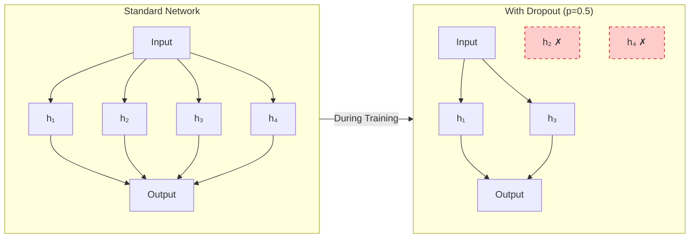
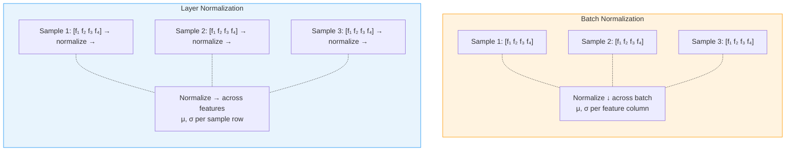

<p style="color: #666; font-size: 0.9em; margin-bottom: 1.5em;"><em>This is a preliminary self-study note for the Protein &amp; Artificial Intelligence course (Spring 2026), co-taught by Prof. Sungsoo Ahn and Prof. Homin Kim at KAIST. It is intended to be read before lecture and is self-contained: a biology student with no prior deep learning experience should be able to follow every section. Code examples use PyTorch and are specific to protein prediction tasks.</em></p>

## Introduction

Students of deep learning tend to spend most of their energy on architecture design: choosing between transformers and graph neural networks, tuning the number of layers and attention heads, reading the latest papers on novel activation functions. That focus is understandable---architectures are intellectually satisfying. But practitioners who have trained hundreds of models know an uncomfortable truth: getting a neural network to train properly is usually harder than designing the network itself.

Consider a concrete scenario. You have just implemented a model that predicts secondary structure (helix, sheet, or coil) for each residue in a protein. You encoded your amino acid sequences as one-hot vectors, built a three-layer feedforward network, chose cross-entropy loss, and wrote a training loop. You click run. The loss barely moves for 50 epochs. You increase the learning rate. The loss explodes to `NaN` on epoch 3. You try a learning rate in between. The training loss decreases nicely, but the validation loss starts climbing after epoch 20, and your test accuracy is no better than a coin flip.

What went wrong? The answer could be almost anything. The learning rate may still be wrong. The model may be memorizing the training data rather than learning generalizable patterns. The gradients may be vanishing inside your deep network. There may be a subtle bug in your data pipeline. The batch normalization layers may be behaving unexpectedly during evaluation. And if your training and test proteins share high sequence similarity, even a "good" test accuracy may be a mirage caused by data leakage.

This note is about developing the intuition and practical toolkit to navigate these challenges. We focus especially on proteins, where the unique properties of biological data---variable-length sequences, extreme class imbalance, and the risk of homology-driven leakage---create their own training difficulties. The principles, however, apply broadly to any deep learning project.

Training neural networks is fundamentally an empirical science. Unlike traditional algorithm design where correctness can be proven, deep learning requires running experiments, observing behaviors, and iterating. The goal of this note is to make you a better experimentalist.

### Prerequisites

This note assumes familiarity with the material from Preliminary Notes 1 and 2: protein representations (amino acid encodings, one-hot vectors) and basic deep learning concepts (tensors, `nn.Module`, training loops, gradient descent, and backpropagation).

### Roadmap

| Section | Why It Is Needed |
|---------|------------------|
| **Overfitting and Regularization** | Protein datasets are small relative to model capacity; without regularization, models memorize training data instead of learning generalizable patterns. |
| **Dropout** | Prevents neurons from co-adapting; acts as an implicit ensemble that improves generalization. |
| **Weight Decay** | Penalizes large weights to encourage simpler, more robust solutions. |
| **Batch Normalization vs. Layer Normalization** | Stabilizes training in deep networks; the choice between the two matters for variable-length protein sequences. |
| **Early Stopping** | Halts training at the point of best generalization, preventing wasted compute and overfitting. |
| **Learning Rate Schedules** | The learning rate is the most impactful hyperparameter; schedules adapt it over training for stability and convergence. |
| **Hyperparameter Tuning** | Systematic search over hyperparameters avoids wasted experiments and finds high-performing configurations. |
| **Debugging Training Failures** | Knowing common failure signatures saves hours of trial and error. |
| **Protein-Specific Challenges** | Variable-length sequences, sequence-identity splits, class imbalance, and memory constraints require domain-specific solutions. |

---

## Overfitting and Regularization

### The Overfitting Problem

<div class="col-sm-9 mt-3 mb-3 mx-auto">
    
    <div class="caption mt-1">Training and validation loss curves illustrating overfitting. Training loss decreases steadily, but validation loss begins increasing after ~40 epochs — the model is memorizing the training data rather than learning generalizable patterns. Early stopping (dashed line) would save the best model before overfitting begins.</div>
</div>

Overfitting occurs when a model learns patterns specific to the training data that do not generalize to new examples. In protein prediction, this problem is particularly insidious because proteins have complex, correlated features. A model might memorize that the short sequence motif `GAVL` always appears in alpha helices in the training set, even if that association is a coincidence of the particular proteins sampled.

How do we detect overfitting? The classic signature is a growing gap between training and validation performance. If the training loss keeps decreasing while the validation loss plateaus or increases, the model is overfitting. But this is a trailing indicator---by the time the gap is visible, the model has already wasted training steps on memorization. We want to prevent overfitting proactively through **regularization**: modifications to the model or training procedure that constrain the model's capacity to memorize.

The rest of this section covers four regularization techniques, each attacking the problem from a different angle.

---

## Dropout



Dropout is one of the most widely used regularization techniques, and its intuition is elegant.[^dropout-origin] During training, we randomly "drop" (zero out) each neuron's output with probability $$p$$, where $$p$$ is typically between 0.1 and 0.5. This has two complementary effects.

First, dropout prevents **co-adaptation**. Without dropout, neurons can develop fragile interdependencies: neuron A only fires when neuron B fires, which only happens when neuron C fires. These chains break down on new data. Dropout forces each neuron to be independently useful.

Second, dropout implicitly trains an **exponential ensemble** of sub-networks. Each training step uses a different random subset of neurons, effectively training a different architecture. At test time, all neurons are active (with outputs scaled by $$1 - p$$ to compensate for the increased capacity), which approximates averaging predictions from all these sub-networks.

Here is a secondary structure predictor with dropout applied after each activation:

```python
import torch
import torch.nn as nn

class SecondaryStructurePredictor(nn.Module):
    """Predict helix (H), sheet (E), or coil (C) for each residue.

    Args:
        input_dim: Number of input features per residue (20 for one-hot amino acids).
        hidden_dim: Width of each hidden layer.
        num_classes: Number of output classes (3 for H/E/C).
        dropout_rate: Fraction of neurons zeroed during training.
    """
    def __init__(self, input_dim=20, hidden_dim=256, num_classes=3, dropout_rate=0.3):
        super().__init__()
        self.encoder = nn.Sequential(
            nn.Linear(input_dim, hidden_dim),
            nn.ReLU(),
            nn.Dropout(dropout_rate),   # Drop 30% of neurons after activation
            nn.Linear(hidden_dim, hidden_dim),
            nn.ReLU(),
            nn.Dropout(dropout_rate),   # Apply dropout consistently through the network
            nn.Linear(hidden_dim, num_classes)
        )

    def forward(self, x):
        # x shape: (batch_size, seq_len, input_dim)
        return self.encoder(x)
```

### The Train/Eval Switch

A critical detail: dropout behaves differently during training and evaluation. During training, neurons are randomly zeroed. During evaluation, all neurons are active and outputs are scaled. PyTorch handles this automatically, but you must explicitly switch modes by calling `model.train()` before training and `model.eval()` before evaluation. Forgetting this switch is a common source of bugs where validation performance looks artificially poor.

```python
# Training phase: dropout is active
model.train()
for batch in train_loader:
    outputs = model(batch)      # Random neurons are zeroed
    loss = criterion(outputs, labels)
    loss.backward()
    optimizer.step()

# Evaluation phase: dropout is disabled, outputs are scaled
model.eval()
with torch.no_grad():           # No need to track gradients during evaluation
    for batch in val_loader:
        outputs = model(batch)  # All neurons active, scaled by (1 - dropout_rate)
```

### Choosing a Dropout Rate

For protein models, a dropout rate between 0.1 and 0.3 is a reasonable starting point. Higher rates (0.4--0.5) can help when working with very small datasets but risk underfitting if set too aggressively. The dropout rate is a hyperparameter worth tuning (we discuss systematic tuning in a later section).

[^dropout-origin]: Dropout was introduced by Srivastava et al. (2014). The name comes from the idea of "dropping out" units from the neural network during training.

---

## Weight Decay

Weight decay is L2 regularization applied to the model parameters.[^wd-vs-l2] Instead of minimizing just the task loss $$L_{\text{task}}$$, we minimize a combined objective:

$$
L_{\text{total}} = L_{\text{task}} + \lambda \sum_{i} w_i^2
$$

Here $$w_i$$ denotes each learnable weight in the model, and $$\lambda$$ (a positive scalar called the **regularization strength**) controls how strongly we penalize large weights. Common values for $$\lambda$$ range from 0.001 to 0.1.

The intuition: large weights often indicate the model is fitting noise rather than signal. A weight of magnitude 100 means the model is relying heavily on a single feature or feature combination, which is fragile. By penalizing large weights, we encourage the model to distribute its representation across many small contributions---a simpler, more robust solution.

In PyTorch, weight decay is built into the optimizer:

```python
# AdamW applies weight decay correctly (decoupled from the adaptive learning rate)
optimizer = torch.optim.AdamW(
    model.parameters(),
    lr=1e-4,
    weight_decay=0.01  # Regularization strength lambda
)
```

A subtle but important point: **AdamW** handles weight decay correctly by decoupling it from the adaptive learning rate scaling. The older `Adam` optimizer with the `weight_decay` parameter implements L2 regularization in a way that couples the penalty with the per-parameter scaling, which changes its effective strength. For most purposes, prefer `AdamW`.

Weight decay is particularly useful when fine-tuning a pre-trained protein language model (such as ESM[^esm]) on a small labeled dataset. Without weight decay, the model's parameters can drift far from their well-regularized pre-trained values, destroying the general knowledge learned during pre-training. A moderate weight decay keeps the parameters close to their starting point, preserving the benefits of transfer learning.

[^wd-vs-l2]: Technically, "weight decay" and "L2 regularization" are equivalent only for vanilla SGD. For adaptive optimizers like Adam, they differ. The AdamW optimizer implements true weight decay, which is generally preferred.

[^esm]: ESM (Evolutionary Scale Modeling) is a family of protein language models developed by Meta AI. We cover protein language models in detail in a later lecture.

---

## Batch Normalization vs. Layer Normalization

Normalization layers stabilize training by ensuring that layer inputs maintain reasonable distributions. Without normalization, small changes in early layers can cascade into large changes in later layers---a phenomenon called **internal covariate shift**---making optimization difficult.

Both batch normalization (BatchNorm) and layer normalization (LayerNorm) normalize activations, but they compute their statistics along different dimensions, as illustrated below.



### Batch Normalization

BatchNorm normalizes across the **batch dimension**. For each feature, it computes the mean and variance across all samples in the current mini-batch:

$$
\hat{x}_{\text{BN}} = \frac{x - \mu_{\text{batch}}}{\sqrt{\sigma^2_{\text{batch}} + \epsilon}}
$$

Here $$\mu_{\text{batch}}$$ and $$\sigma^2_{\text{batch}}$$ are the mean and variance of that feature computed over the mini-batch, and $$\epsilon$$ is a small constant (typically $$10^{-5}$$) that prevents division by zero.

### Layer Normalization

LayerNorm normalizes across the **feature dimension**. For each sample independently, it computes the mean and variance across all features:

$$
\hat{x}_{\text{LN}} = \frac{x - \mu_{\text{features}}}{\sqrt{\sigma^2_{\text{features}} + \epsilon}}
$$

Here $$\mu_{\text{features}}$$ and $$\sigma^2_{\text{features}}$$ are computed for each sample separately, using all feature values within that sample.

### Which to Use for Proteins?

For sequence data and proteins, **Layer Normalization is almost always preferred**. BatchNorm has two problems in this setting.

First, with variable-length protein sequences, batches often contain a mix of short and long proteins. The batch statistics become noisy because they average over proteins with very different lengths and padding amounts.

Second, BatchNorm behaves differently during training (uses mini-batch statistics) and evaluation (uses running-average statistics accumulated during training). This train/eval discrepancy can cause unexpected behavior, especially when batch sizes are small or data distributions shift.

LayerNorm avoids both issues because it normalizes each sequence independently---it never looks across the batch. Here is a protein encoder block using LayerNorm with the "pre-norm" pattern[^prenorm]:

```python
class ProteinBlock(nn.Module):
    """A single encoder block with pre-norm, feedforward, and residual connection.

    Args:
        hidden_dim: Dimensionality of the input and output features.
    """
    def __init__(self, hidden_dim):
        super().__init__()
        self.linear1 = nn.Linear(hidden_dim, hidden_dim * 4)  # Expand
        self.linear2 = nn.Linear(hidden_dim * 4, hidden_dim)  # Project back
        self.layernorm = nn.LayerNorm(hidden_dim)
        self.dropout = nn.Dropout(0.1)

    def forward(self, x):
        # x shape: (batch_size, seq_len, hidden_dim)
        residual = x
        x = self.layernorm(x)          # Normalize before transformation
        x = self.linear1(x)
        x = nn.functional.gelu(x)      # GELU activation (smooth variant of ReLU)
        x = self.dropout(x)
        x = self.linear2(x)
        return residual + x            # Residual connection preserves gradient flow
```

The placement of normalization matters. In the code above, we use "pre-norm": normalize **before** the transformation. This is more stable for deep networks because the residual path is an unobstructed identity mapping. The alternative, "post-norm" (normalize after the residual addition), was the original formulation in the transformer paper but can be unstable without careful learning-rate warmup and initialization.

[^prenorm]: Pre-norm places the normalization before the sublayer (feedforward or attention), while post-norm places it after the residual addition. Pre-norm has become the default in most modern architectures due to better training stability.

---

## Early Stopping

Early stopping is a form of regularization based on **time** rather than architecture. The idea is straightforward: monitor validation performance during training and stop when it stops improving.

Why does this work as regularization? In the early phases of training, the model learns general, transferable patterns. As training continues, it gradually begins to memorize training-specific noise. The point at which validation performance peaks is the sweet spot between underfitting and overfitting. By stopping there, we capture the most generalizable model state.

Here is a reusable early stopping implementation:

```python
class EarlyStopping:
    """Stop training when validation loss stops improving.

    Args:
        patience: Number of epochs to wait for improvement before stopping.
        min_delta: Minimum decrease in loss to qualify as an improvement.
    """
    def __init__(self, patience=10, min_delta=1e-4):
        self.patience = patience
        self.min_delta = min_delta
        self.best_loss = float('inf')
        self.counter = 0
        self.should_stop = False

    def step(self, val_loss):
        """Call once per epoch with the current validation loss.

        Returns True if this is a new best model (save a checkpoint).
        """
        if val_loss < self.best_loss - self.min_delta:
            self.best_loss = val_loss
            self.counter = 0
            return True   # New best --- save checkpoint
        else:
            self.counter += 1
            if self.counter >= self.patience:
                self.should_stop = True
            return False  # No improvement
```

In the training loop:

```python
early_stopping = EarlyStopping(patience=15)

for epoch in range(max_epochs):
    train_loss = train_one_epoch(model, train_loader, optimizer)
    val_loss = evaluate(model, val_loader)

    if early_stopping.step(val_loss):
        # Save the best model so far
        torch.save(model.state_dict(), 'best_model.pt')

    if early_stopping.should_stop:
        print(f"Early stopping at epoch {epoch}")
        break

# After training, load the best model for final evaluation
model.load_state_dict(torch.load('best_model.pt'))
```

The **patience** parameter controls how long to wait for improvement. For protein models, where training can be noisy (especially with small datasets or high-variance mini-batches), a patience of 10 to 20 epochs is common. Too little patience risks stopping during a temporary plateau; too much patience wastes compute and risks overfitting.

---

## Learning Rate Schedules

### Why the Learning Rate Matters So Much

If there is one hyperparameter that matters more than all others, it is the learning rate $$\eta$$.[^lr-symbol] The learning rate controls the step size of each gradient descent update: at each step, we adjust the model's weights by $$-\eta \cdot \nabla L$$, where $$\nabla L$$ is the gradient of the loss with respect to the weights.

If $$\eta$$ is too high, the optimization diverges or oscillates wildly---the steps overshoot the minimum and the loss may explode to infinity. If $$\eta$$ is too low, training takes impractically long and may get stuck in a poor local minimum.

The optimal learning rate is not constant throughout training. Early on, we can take large steps because we are far from any minimum. Later, we need smaller steps to fine-tune and avoid overshooting. This motivates **learning rate schedules**: functions that adjust $$\eta$$ over the course of training.

<div class="col-sm-9 mt-3 mb-3 mx-auto">
    
    <div class="caption mt-1">Three common learning rate schedules. Step decay makes abrupt reductions at fixed intervals. Cosine annealing provides smooth decay that gradually slows exploration. Warmup + cosine starts low to stabilize early training, ramps up, then decays — the default choice for transformer-based protein models.</div>
</div>

[^lr-symbol]: The symbol $$\eta$$ (lowercase Greek letter "eta") is the conventional notation for the learning rate in optimization literature.

### Learning Rate Warmup

Warmup is the practice of starting with a very small learning rate and gradually increasing it over the first few hundred or thousand steps. This sounds counterintuitive---why start slow?---but it is crucial for stable training of large models.

The reason relates to the statistics of gradients. At the start of training, the model's weights are essentially random, so gradients can be unusually large or point in misleading directions. Taking large steps based on these unreliable gradients can push the model into bad regions of parameter space from which recovery is difficult.

Warmup is especially important when using adaptive optimizers like Adam. The optimizer maintains running estimates of gradient statistics (mean and variance) to scale learning rates per parameter. At the start of training, these estimates are unreliable because they have seen too few gradients. Starting with small updates gives the optimizer time to accumulate accurate statistics before taking full-sized steps.

```python
import math

def get_linear_warmup_scheduler(optimizer, warmup_steps, total_steps):
    """Create a scheduler that linearly increases the LR during warmup.

    Args:
        optimizer: The PyTorch optimizer.
        warmup_steps: Number of steps over which to ramp up the LR.
        total_steps: Total number of training steps (used for reference).
    """
    def lr_lambda(current_step):
        if current_step < warmup_steps:
            # Linearly increase from 0 to 1 over warmup_steps
            return float(current_step) / float(max(1, warmup_steps))
        return 1.0  # After warmup, use the base learning rate

    return torch.optim.lr_scheduler.LambdaLR(optimizer, lr_lambda)

# Example usage
optimizer = torch.optim.AdamW(model.parameters(), lr=1e-4)
scheduler = get_linear_warmup_scheduler(optimizer, warmup_steps=1000, total_steps=100000)

for step, batch in enumerate(train_loader):
    loss = compute_loss(model, batch)
    loss.backward()
    optimizer.step()
    scheduler.step()    # Update the learning rate after each step
    optimizer.zero_grad()
```

A common rule of thumb: warm up for about 5--10% of total training steps. For a protein model trained for 20,000 steps, this means 1,000 to 2,000 warmup steps.

### Cosine Annealing

After warmup, we want the learning rate to decrease gradually. Cosine annealing is an elegant schedule that follows a cosine curve:

$$
\eta_t = \eta_{\min} + \frac{1}{2}(\eta_{\max} - \eta_{\min})\left(1 + \cos\left(\frac{t}{T}\pi\right)\right)
$$

Here $$\eta_t$$ is the learning rate at step $$t$$, $$\eta_{\max}$$ is the peak learning rate (reached at the end of warmup), $$\eta_{\min}$$ is the minimum learning rate at the end of training, and $$T$$ is the total number of training steps. The cosine shape gives a smooth decay that starts slowly, accelerates through the middle of training, and slows again as it approaches $$\eta_{\min}$$. This gradual approach to a small learning rate helps the optimizer settle into a good solution.

```python
# PyTorch's built-in cosine scheduler
scheduler = torch.optim.lr_scheduler.CosineAnnealingLR(
    optimizer,
    T_max=total_steps,   # Period of the cosine (total training steps)
    eta_min=1e-6          # Minimum learning rate at the end
)
```

### Warmup + Cosine Decay (the Standard Recipe)

The most common schedule in modern deep learning combines linear warmup with cosine decay. The learning rate ramps up linearly during warmup, then decays along a cosine curve for the rest of training:

```python
def get_warmup_cosine_scheduler(optimizer, warmup_steps, total_steps, min_lr_ratio=0.01):
    """Warmup followed by cosine decay --- the standard modern schedule.

    Args:
        optimizer: The PyTorch optimizer.
        warmup_steps: Steps for the linear warmup phase.
        total_steps: Total training steps (warmup + decay).
        min_lr_ratio: Final LR as a fraction of the peak LR.
    """
    def lr_lambda(current_step):
        if current_step < warmup_steps:
            # Linear warmup
            return float(current_step) / float(max(1, warmup_steps))
        else:
            # Cosine decay from 1.0 down to min_lr_ratio
            progress = float(current_step - warmup_steps) / float(
                max(1, total_steps - warmup_steps)
            )
            return min_lr_ratio + (1 - min_lr_ratio) * 0.5 * (
                1 + math.cos(math.pi * progress)
            )

    return torch.optim.lr_scheduler.LambdaLR(optimizer, lr_lambda)
```

This combination is the default schedule for training protein language models, vision transformers, and most large-scale models. Unless you have a specific reason to use something else, warmup + cosine decay is a safe and effective choice.

### Reduce on Plateau

Sometimes we do not know in advance how many training steps are needed. **Reduce on plateau** is an adaptive schedule that monitors a metric (usually validation loss) and reduces the learning rate when progress stalls:

```python
scheduler = torch.optim.lr_scheduler.ReduceLROnPlateau(
    optimizer,
    mode='min',       # 'min' for loss (lower is better), 'max' for accuracy
    factor=0.5,       # Multiply LR by 0.5 when reducing
    patience=5,       # Wait 5 epochs before reducing
    min_lr=1e-6       # Do not reduce below this value
)

# In the training loop (note: pass the monitored metric, not just call .step())
for epoch in range(max_epochs):
    train_loss = train_one_epoch(model, train_loader, optimizer)
    val_loss = evaluate(model, val_loader)
    scheduler.step(val_loss)  # Scheduler monitors validation loss
```

This schedule is useful for exploratory experiments where you are uncertain about the total training duration. However, it requires careful choice of the `patience` parameter: too short and the learning rate drops prematurely; too long and the model plateaus for many wasted epochs.

---

## Hyperparameter Tuning

### What to Tune (and What to Leave Alone)

Not all hyperparameters are equally important. Here is a rough hierarchy for protein deep learning:

**Critical (always tune):**
- **Learning rate:** Often the difference between success and failure.
- **Batch size:** Affects both optimization dynamics and GPU memory usage.
- **Model capacity:** Hidden dimensions and number of layers.

**Important (tune for best results):**
- Weight decay strength.
- Dropout rate.
- Learning rate schedule parameters (warmup steps, minimum LR).

**Usually fine with defaults:**
- Adam's $$\beta_1$$ (default 0.9) and $$\beta_2$$ (default 0.999).
- LayerNorm's $$\epsilon$$ (default $$10^{-5}$$).
- Specific architectural details within a family (e.g., feedforward expansion factor).

### Grid Search and Random Search

The simplest tuning approach is **grid search**: define a discrete grid of hyperparameter combinations and evaluate each one.

```python
learning_rates = [1e-5, 1e-4, 1e-3]
batch_sizes = [16, 32, 64]
hidden_dims = [256, 512]

results = []
for lr in learning_rates:
    for bs in batch_sizes:
        for hidden in hidden_dims:
            val_loss = train_and_evaluate(lr=lr, batch_size=bs, hidden_dim=hidden)
            results.append({
                'lr': lr, 'batch_size': bs, 'hidden_dim': hidden,
                'val_loss': val_loss
            })
```

Grid search has a major weakness: it spends too many trials on unimportant hyperparameters. If the learning rate matters much more than the batch size, a 3x3 grid over both wastes two-thirds of its budget on batch size variations that make little difference.

**Random search** fixes this problem. By sampling hyperparameters from continuous distributions rather than discrete grids, each trial explores a new value of every hyperparameter. This means we get more coverage of the important dimensions:[^bergstra]

```python
import random

def sample_hyperparameters():
    """Sample a random hyperparameter configuration.

    Learning rate and weight decay are sampled on a log scale
    because their optimal values often span orders of magnitude.
    """
    return {
        'lr': 10 ** random.uniform(-5, -3),             # Log-uniform: 1e-5 to 1e-3
        'batch_size': random.choice([16, 32, 64, 128]),  # Discrete choices
        'hidden_dim': random.choice([256, 384, 512, 768]),
        'dropout': random.uniform(0.1, 0.4),             # Uniform: 0.1 to 0.4
        'weight_decay': 10 ** random.uniform(-4, -1),    # Log-uniform: 1e-4 to 0.1
        'warmup_ratio': random.uniform(0.05, 0.15)       # Fraction of total steps
    }

# Run 50 random trials
n_trials = 50
results = []
for trial in range(n_trials):
    params = sample_hyperparameters()
    val_loss = train_and_evaluate(**params)
    results.append({'params': params, 'val_loss': val_loss})

best_trial = min(results, key=lambda x: x['val_loss'])
print(f"Best hyperparameters: {best_trial['params']}")
```

[^bergstra]: Bergstra and Bengio (2012) showed that random search is more efficient than grid search when some hyperparameters matter much more than others, which is almost always the case in practice.

### A Practical Tuning Strategy

Here is a four-step approach that balances thoroughness with efficiency:

**Step 1: Sanity check.** Train for a few epochs with default hyperparameters. Can the model overfit a tiny subset of the data (say, one mini-batch)? If not, something is fundamentally wrong with the model or the data pipeline. Fix that first.

**Step 2: Find a reasonable learning rate.** Run a learning rate sweep from $$10^{-7}$$ to $$1$$, training for a few steps at each value. Plot the loss versus learning rate. The optimal learning rate is typically about 10x smaller than the value where the loss starts increasing.

```python
import numpy as np

def learning_rate_finder(model, train_loader, min_lr=1e-7, max_lr=1, num_steps=100):
    """Sweep learning rates to find the optimal range.

    The idea: gradually increase the LR from very small to very large,
    recording the loss at each step. The best LR is where the loss
    decreases most steeply (before it starts diverging).
    """
    optimizer = torch.optim.AdamW(model.parameters(), lr=min_lr)
    lr_schedule = np.geomspace(min_lr, max_lr, num_steps)
    losses = []
    lrs = []

    model.train()
    data_iter = iter(train_loader)

    for i, lr in enumerate(lr_schedule):
        # Set the learning rate manually
        for param_group in optimizer.param_groups:
            param_group['lr'] = lr

        # Get a batch (cycle back to the start if the loader is exhausted)
        try:
            batch = next(data_iter)
        except StopIteration:
            data_iter = iter(train_loader)
            batch = next(data_iter)

        # Forward and backward pass
        optimizer.zero_grad()
        loss = compute_loss(model, batch)
        loss.backward()
        optimizer.step()

        losses.append(loss.item())
        lrs.append(lr)

        # Stop early if the loss explodes
        if loss.item() > 4 * min(losses):
            break

    return lrs, losses
    # Plot lrs (x-axis, log scale) vs losses (y-axis) to identify the optimal range
```

**Step 3: Tune critical parameters together.** Learning rate and batch size interact (larger batches often need higher learning rates), so tune them jointly using random search with 20--50 trials.

**Step 4: Tune regularization.** Once the basic architecture and learning rate are working, adjust dropout and weight decay to control overfitting.

---

## Debugging Neural Network Training

### Common Failure Modes

When training goes wrong, it usually manifests in one of a few recognizable patterns. Learning to identify these patterns will save hours of debugging.

| Symptom | Likely Cause | Suggested Fix |
|---------|-------------|---------------|
| Loss not decreasing at all | Learning rate too high or too low; bug in code | Try a smaller LR. If that fails, verify the loss function and data loading. |
| Loss decreasing then plateauing far above expected | Limited model capacity; stuck in local minimum | Increase model size (more layers or wider layers). Try different initialization. |
| Training loss good, validation loss bad | Overfitting | Increase regularization (more dropout, higher weight decay). Get more data. |
| Loss becomes `NaN` or `Inf` | Numerical instability | Lower the learning rate. Add gradient clipping. Check for `log(0)` or division by near-zero values. |
| All gradients near zero | Vanishing gradients in deep networks | Add residual connections. Use LayerNorm. Check activation functions (avoid saturating activations like sigmoid in deep networks). |

### Diagnostic Tools

**Loss curves** are the primary diagnostic tool. Always log both training and validation loss at regular intervals:

```python
from collections import defaultdict

class MetricsLogger:
    """Accumulate and plot training metrics."""

    def __init__(self):
        self.metrics = defaultdict(list)

    def log(self, **kwargs):
        for key, value in kwargs.items():
            self.metrics[key].append(value)

    def plot(self):
        import matplotlib.pyplot as plt
        fig, axes = plt.subplots(1, 2, figsize=(12, 4))

        # Loss curves: the most important diagnostic plot
        axes[0].plot(self.metrics['train_loss'], label='Train')
        axes[0].plot(self.metrics['val_loss'], label='Validation')
        axes[0].set_xlabel('Epoch')
        axes[0].set_ylabel('Loss')
        axes[0].legend()
        axes[0].set_title('Loss Curves')

        # Learning rate over time
        axes[1].plot(self.metrics['lr'])
        axes[1].set_xlabel('Step')
        axes[1].set_ylabel('Learning Rate')
        axes[1].set_title('Learning Rate Schedule')

        plt.tight_layout()
        return fig
```

**Gradient statistics** reveal whether gradients are flowing properly through the network. If gradient norms are very small in early layers (vanishing) or very large (exploding), the network cannot learn effectively:

```python
def log_gradient_stats(model):
    """Compute gradient statistics for each named parameter.

    Call this after loss.backward() but before optimizer.step().
    Look for: very small norms (vanishing) or very large norms (exploding).
    """
    stats = {}
    for name, param in model.named_parameters():
        if param.grad is not None:
            grad = param.grad.data
            stats[name] = {
                'mean': grad.mean().item(),
                'std': grad.std().item(),
                'max_abs': grad.abs().max().item(),
                'norm': grad.norm().item()
            }
    return stats

# In the training loop, log every 100 steps
if step % 100 == 0:
    grad_stats = log_gradient_stats(model)
    for name, s in grad_stats.items():
        if s['norm'] < 1e-7:
            print(f"WARNING: Vanishing gradient in {name} (norm={s['norm']:.2e})")
        if s['norm'] > 1e3:
            print(f"WARNING: Exploding gradient in {name} (norm={s['norm']:.2e})")
```

### The Sanity Check Approach

Before investing compute on full training runs, always run a series of quick sanity checks.

**Check 1: Can the model overfit a single batch?** If you feed the same mini-batch repeatedly and the model cannot drive the loss to near zero, it cannot learn at all. This usually points to a bug in the loss function, the data pipeline, or the model architecture.

```python
def sanity_check_overfit_single_batch(model, train_loader, num_steps=1000):
    """Verify the model can memorize a single mini-batch.

    If the model cannot overfit one batch, it cannot learn anything,
    and the problem is in the model or loss function, not in regularization.
    """
    batch = next(iter(train_loader))
    optimizer = torch.optim.Adam(model.parameters(), lr=1e-3)

    model.train()
    initial_loss = None

    for step in range(num_steps):
        optimizer.zero_grad()
        loss = compute_loss(model, batch)
        loss.backward()
        optimizer.step()

        if initial_loss is None:
            initial_loss = loss.item()

        if step % 100 == 0:
            print(f"Step {step}: loss = {loss.item():.4f}")

    final_loss = loss.item()
    ratio = initial_loss / max(final_loss, 1e-10)
    print(f"\nInitial loss: {initial_loss:.4f}")
    print(f"Final loss:   {final_loss:.4f}")
    print(f"Improvement:  {ratio:.1f}x")

    if final_loss > initial_loss * 0.1:
        print("WARNING: Model may not be learning. Check the loss function and data pipeline.")
```

**Check 2: Is the initial loss reasonable?** For a classification task with $$N$$ classes and a randomly initialized model, the initial cross-entropy loss should be approximately $$\ln(N)$$. For secondary structure prediction with 3 classes (H, E, C), the expected initial loss is $$\ln(3) \approx 1.10$$. If the initial loss is far from this value, something is wrong with the output layer or the loss computation.

```python
import numpy as np

def check_initial_loss(model, train_loader, num_classes):
    """Verify the initial loss matches the expected value for random predictions."""
    model.eval()
    batch = next(iter(train_loader))

    with torch.no_grad():
        loss = compute_loss(model, batch)

    expected = np.log(num_classes)
    print(f"Initial loss:             {loss.item():.4f}")
    print(f"Expected (random model):  {expected:.4f}")

    if abs(loss.item() - expected) > expected * 0.5:
        print("WARNING: Initial loss is far from expected. "
              "Check the output layer dimensions and the loss function.")
```

---

## Protein-Specific Challenges

The techniques covered so far apply broadly to any deep learning project. This section addresses challenges that are specific to protein data: variable-length sequences, data leakage through sequence similarity, class imbalance, and memory constraints imposed by long proteins.

### Handling Variable-Length Sequences

Proteins range from tens to thousands of amino acid residues. Standard feedforward networks expect fixed-size inputs, so we need strategies to handle variable-length sequences. Three approaches are common.

#### Padding with Masking

The simplest approach: pad all sequences in a mini-batch to the length of the longest sequence, then **mask** the padded positions so they do not contribute to the loss or to learned representations.

```python
def collate_protein_batch(batch):
    """Custom collate function for variable-length protein sequences.

    Given a list of protein samples (each with a sequence tensor and label tensor
    of potentially different lengths), pad them to the same length and create
    a binary mask indicating real (1) vs. padded (0) positions.
    """
    sequences = [item['sequence'] for item in batch]  # List of (L_i, D) tensors
    labels = [item['labels'] for item in batch]        # List of (L_i,) tensors

    # Determine the maximum length in this batch
    max_len = max(seq.shape[0] for seq in sequences)

    # Allocate padded tensors (filled with zeros)
    padded_seqs = torch.zeros(len(sequences), max_len, sequences[0].shape[-1])
    masks = torch.zeros(len(sequences), max_len)
    padded_labels = torch.zeros(len(sequences), max_len, dtype=torch.long)

    for i, (seq, label) in enumerate(zip(sequences, labels)):
        length = seq.shape[0]
        padded_seqs[i, :length] = seq        # Copy real residues
        masks[i, :length] = 1                 # Mark real positions
        padded_labels[i, :length] = label     # Copy real labels

    return {
        'sequences': padded_seqs,    # (B, max_len, D)
        'labels': padded_labels,      # (B, max_len)
        'masks': masks                # (B, max_len)
    }

# Use in a DataLoader
train_loader = torch.utils.data.DataLoader(
    dataset, batch_size=32, collate_fn=collate_protein_batch
)
```

The mask is essential when computing the loss. Without it, the model would be trained to predict labels for padded positions (which have no meaningful label), injecting noise into the gradients:

```python
def masked_cross_entropy(logits, labels, mask):
    """Compute cross-entropy loss only on real (non-padded) positions.

    Args:
        logits: (B, L, C) model predictions (C = number of classes).
        labels: (B, L) integer class labels.
        mask:   (B, L) binary mask (1 = real position, 0 = padding).
    """
    # Flatten to (B*L, C), (B*L,), and (B*L,)
    logits_flat = logits.view(-1, logits.size(-1))
    labels_flat = labels.view(-1)
    mask_flat = mask.view(-1)

    # Compute per-position loss (no reduction yet)
    loss_per_position = nn.functional.cross_entropy(
        logits_flat, labels_flat, reduction='none'
    )

    # Zero out loss on padded positions and average over real positions
    masked_loss = (loss_per_position * mask_flat).sum() / mask_flat.sum()
    return masked_loss
```

#### Length Bucketing

Padding wastes computation: if one protein in a batch has 1,000 residues and the rest have 100, the model performs 10x the necessary work on the short sequences. **Length bucketing** mitigates this by grouping proteins of similar length into the same batch:

```python
from torch.utils.data import Sampler

class LengthBucketSampler(Sampler):
    """Batch proteins of similar length together to minimize padding waste.

    Args:
        lengths: List of sequence lengths for all proteins in the dataset.
        batch_size: Number of proteins per batch.
    """
    def __init__(self, lengths, batch_size):
        self.batch_size = batch_size

        # Sort all protein indices by their sequence length
        sorted_indices = sorted(range(len(lengths)), key=lambda i: lengths[i])

        # Create batches of consecutive (similar-length) proteins
        self.batches = []
        for i in range(0, len(sorted_indices), batch_size):
            batch = sorted_indices[i:i + batch_size]
            self.batches.append(batch)

        # Shuffle the order of batches (but not within batches)
        # so that the model does not always see short proteins first
        np.random.shuffle(self.batches)

    def __iter__(self):
        for batch in self.batches:
            yield batch

    def __len__(self):
        return len(self.batches)
```

### Sequence Identity Splits for Proper Evaluation

This is perhaps the most common mistake in protein machine learning, and it leads to wildly overoptimistic performance estimates.

**The problem.** Proteins with similar sequences tend to have similar structures and functions. If your test set contains proteins that are 90% identical in sequence to proteins in the training set, your model can score well on the test set by trivially recalling similar training examples. You are testing memorization, not generalization.

**The solution.** Cluster all proteins by sequence identity---commonly at a 30% or 40% threshold---and split the data at the **cluster** level, not the individual protein level. This ensures that no test protein is closely related to any training protein.

```python
import subprocess

def create_sequence_identity_splits(fasta_file, identity_threshold=0.3, train_ratio=0.8):
    """Split proteins into train/val/test sets respecting sequence identity.

    Proteins within each split may be similar to each other, but proteins
    across splits are guaranteed to share less than identity_threshold
    sequence identity.

    Requires MMseqs2 to be installed (https://github.com/soedinglab/MMseqs2).
    """
    # Step 1: Cluster proteins at the specified identity threshold
    subprocess.run([
        'mmseqs', 'easy-cluster',
        fasta_file,           # Input FASTA file with all protein sequences
        'clusters',           # Output prefix
        'tmp',                # Temporary directory
        '--min-seq-id', str(identity_threshold)
    ])

    # Step 2: Parse cluster assignments
    # clusters_cluster.tsv has two columns: representative_id, member_id
    clusters = parse_cluster_file('clusters_cluster.tsv')

    # Step 3: Shuffle and split clusters (not individual proteins)
    cluster_ids = list(clusters.keys())
    np.random.shuffle(cluster_ids)

    n_clusters = len(cluster_ids)
    n_train = int(n_clusters * train_ratio)
    n_val = int(n_clusters * 0.1)

    train_clusters = cluster_ids[:n_train]
    val_clusters = cluster_ids[n_train:n_train + n_val]
    test_clusters = cluster_ids[n_train + n_val:]

    # Step 4: Collect protein IDs from the assigned clusters
    train_ids = [pid for c in train_clusters for pid in clusters[c]]
    val_ids = [pid for c in val_clusters for pid in clusters[c]]
    test_ids = [pid for c in test_clusters for pid in clusters[c]]

    return train_ids, val_ids, test_ids
```

A word of caution: even 30% sequence identity splits may not be sufficient for all tasks. Proteins from the same CATH[^cath] superfamily can share structural features despite having diverged below 30% identity. For the most rigorous evaluation, consider splitting at the fold or superfamily level.

[^cath]: CATH is a hierarchical classification of protein domain structures: **C**lass (secondary structure content), **A**rchitecture (spatial arrangement), **T**opology (fold), and **H**omologous superfamily. Splitting at the superfamily level (the "H" level) ensures that test proteins are structurally distinct from training proteins.

### Dealing with Class Imbalance

Many protein prediction tasks have severe class imbalance. In residue-residue contact prediction, only about 2--3% of residue pairs are in contact (positive class). In Gene Ontology function prediction, rare functional annotations may have only a handful of positive examples. Training on imbalanced data without correction causes the model to predict the majority class almost exclusively.

#### Weighted Loss Functions

The simplest correction: assign higher weights to underrepresented classes, so that misclassifying a rare class incurs a larger penalty:

```python
def compute_class_weights(labels, num_classes):
    """Compute inverse-frequency weights for class-balanced training.

    Args:
        labels: Tensor of integer class labels.
        num_classes: Total number of classes.
    Returns:
        Tensor of shape (num_classes,) with per-class weights.
    """
    counts = torch.bincount(labels.flatten(), minlength=num_classes).float()
    weights = 1.0 / (counts + 1)                    # Inverse frequency (+1 avoids division by zero)
    weights = weights / weights.sum() * num_classes  # Normalize so weights sum to num_classes
    return weights

# Example: secondary structure with imbalanced classes
# Suppose 60% coil, 25% helix, 15% sheet
class_weights = compute_class_weights(train_labels, num_classes=3)
criterion = nn.CrossEntropyLoss(weight=class_weights)
```

#### Focal Loss

Focal loss goes beyond class weighting by also downweighting **easy** examples (those the model already classifies correctly with high confidence) and focusing the training signal on **hard** examples:

$$
\text{FL}(p_t) = -\alpha \, (1 - p_t)^{\gamma} \, \ln(p_t)
$$

Here $$p_t$$ is the model's predicted probability for the correct class, $$\gamma$$ is the **focusing parameter** (higher values focus more on hard examples; $$\gamma = 2$$ is a common default), and $$\alpha$$ is a class-balancing weight.

```python
def focal_loss(logits, targets, gamma=2.0, alpha=0.25):
    """Focal loss for imbalanced classification.

    Downweights easy examples so the model focuses on hard cases.

    Args:
        logits: (N, C) raw model outputs (before softmax).
        targets: (N,) integer class labels.
        gamma: Focusing parameter (0 = standard cross-entropy; higher = more focus on hard examples).
        alpha: Class balancing weight.
    """
    ce_loss = nn.functional.cross_entropy(logits, targets, reduction='none')
    pt = torch.exp(-ce_loss)              # Predicted probability of the correct class
    focal_weight = (1 - pt) ** gamma      # Small for easy examples, large for hard ones
    loss = alpha * focal_weight * ce_loss
    return loss.mean()
```

#### Contact Prediction: A Case Study

Contact prediction illustrates extreme imbalance. A protein of length $$L$$ has $$L(L-1)/2$$ residue pairs, but only a small fraction are in physical contact (C$$\alpha$$ distance < 8 angstroms). Moreover, residues that are close in sequence (e.g., positions $$i$$ and $$i+1$$) are trivially close in space, so we typically only evaluate contacts between residues separated by at least 6 positions in the sequence:

```python
def balanced_contact_loss(pred, target, positive_weight=10.0):
    """Weighted binary cross-entropy for contact prediction.

    Args:
        pred:   (B, L, L) predicted contact logits.
        target: (B, L, L) binary contact labels (1 = contact, 0 = no contact).
        positive_weight: How much more to weight positive (contact) examples.
    """
    L = pred.size(-1)

    # Only evaluate contacts between residues >= 6 positions apart
    seq_positions = torch.arange(L, device=pred.device)
    separation = torch.abs(seq_positions.unsqueeze(0) - seq_positions.unsqueeze(1))
    mask = separation >= 6

    # Flatten and apply mask
    pred_masked = pred[:, mask]
    target_masked = target[:, mask]

    # Weighted BCE: positive_weight upweights the rare contact class
    pos_weight = torch.tensor([positive_weight], device=pred.device)
    loss = nn.functional.binary_cross_entropy_with_logits(
        pred_masked, target_masked.float(), pos_weight=pos_weight
    )
    return loss
```

### Memory Management for Long Proteins

Proteins can be thousands of residues long. Transformer-based models, which compute attention over all pairs of residues, have $$O(L^2)$$ memory requirements. A protein of length 2,000 produces a 2000 x 2000 attention matrix per head per layer, which quickly exhausts GPU memory. Here are three strategies for working within memory constraints.

#### Gradient Checkpointing

Normally, PyTorch stores all intermediate activations (the outputs of every layer) during the forward pass so that it can compute gradients during the backward pass. **Gradient checkpointing** discards these intermediate activations and recomputes them during the backward pass, trading about 30% more compute time for substantially less memory:

```python
from torch.utils.checkpoint import checkpoint

class MemoryEfficientEncoder(nn.Module):
    """Transformer encoder that uses gradient checkpointing to save memory.

    Instead of storing all intermediate activations for the backward pass,
    recompute them on the fly. This roughly doubles the sequence length
    that fits in GPU memory.
    """
    def __init__(self, hidden_dim, num_layers):
        super().__init__()
        self.layers = nn.ModuleList([
            TransformerBlock(hidden_dim) for _ in range(num_layers)
        ])

    def forward(self, x):
        for layer in self.layers:
            # checkpoint() discards intermediate activations and recomputes them
            # during backward, saving memory at the cost of extra compute
            x = checkpoint(layer, x, use_reentrant=False)
        return x
```

#### Mixed Precision Training

Modern GPUs have specialized hardware (Tensor Cores) for float16 arithmetic, which is both faster and uses half the memory of float32. **Mixed precision training** runs most operations in float16 while keeping a float32 copy of the weights for numerical stability:

```python
from torch.cuda.amp import autocast, GradScaler

# GradScaler prevents underflow in float16 gradients
scaler = GradScaler()

for batch in train_loader:
    optimizer.zero_grad()

    # autocast runs operations in float16 where it is safe to do so
    with autocast():
        outputs = model(batch['sequences'])
        loss = criterion(outputs, batch['labels'])

    # Scale loss to prevent float16 gradient underflow, then backward
    scaler.scale(loss).backward()
    scaler.step(optimizer)
    scaler.update()
```

Mixed precision roughly halves memory usage and can speed up training by 2--3x on GPUs with Tensor Core support (NVIDIA V100, A100, H100, and newer).

#### Dynamic Batching

Instead of using a fixed batch size, **dynamic batching** constructs batches that respect a total **token budget**. Short proteins are grouped into larger batches; long proteins get smaller batches. This keeps memory usage roughly constant regardless of sequence length:

```python
def create_dynamic_batches(dataset, max_tokens=4096):
    """Group proteins into batches that respect a maximum token budget.

    The token budget is approximately batch_size * max_sequence_length_in_batch.
    This keeps GPU memory usage roughly constant across batches.

    Args:
        dataset: List of protein samples, each with a 'sequence' field.
        max_tokens: Maximum total tokens (residues) per batch.
    """
    lengths = [len(item['sequence']) for item in dataset]

    # Sort by length (longest first) so long proteins get small batches
    sorted_indices = sorted(range(len(lengths)), key=lambda i: lengths[i], reverse=True)

    batches = []
    current_batch = []
    max_len_in_batch = 0

    for idx in sorted_indices:
        seq_len = lengths[idx]

        # Estimate memory: max_len * num_sequences (due to padding)
        new_max_len = max(max_len_in_batch, seq_len)
        new_tokens = new_max_len * (len(current_batch) + 1)

        if new_tokens > max_tokens and current_batch:
            # Adding this protein would exceed the budget --- start a new batch
            batches.append(current_batch)
            current_batch = [idx]
            max_len_in_batch = seq_len
        else:
            current_batch.append(idx)
            max_len_in_batch = new_max_len

    if current_batch:
        batches.append(current_batch)

    return batches
```

---

## Key Takeaways

1. **Training is empirical science.** Success requires systematic experimentation and careful observation, not just clever architectures. Log everything. Plot loss curves. Check gradient statistics.

2. **Regularization prevents overfitting.** Use dropout, weight decay, and early stopping together. For proteins, where datasets are small, regularization is not optional.

3. **Layer Normalization over Batch Normalization.** For variable-length protein sequences, LayerNorm avoids the noisy batch statistics and the train/eval discrepancy of BatchNorm.

4. **Learning rate is the most important hyperparameter.** Always use warmup. Warmup + cosine decay is the standard modern schedule. Use a learning rate finder for initial tuning.

5. **Debug systematically.** Start with sanity checks (overfit one batch, verify initial loss). Monitor loss curves and gradient norms. Know the common failure modes and their signatures.

6. **Protein data demands domain-specific care.** Use sequence identity splits to avoid data leakage. Handle variable-length sequences with padding and masking (or length bucketing). Address class imbalance with weighted losses or focal loss.

7. **Memory is a first-class constraint for long proteins.** Gradient checkpointing, mixed precision, and dynamic batching can increase the maximum sequence length you can handle by 2--4x.

---

## Exercises

**Exercise 1: Learning Rate Finder.**
Implement the `learning_rate_finder` function from the hyperparameter tuning section and apply it to a secondary structure predictor (3-class classification on per-residue features). Plot the loss versus learning rate curve on a log-scale x-axis. Identify the optimal learning rate range. How does the optimal range change if you double the model's hidden dimension?

**Exercise 2: Regularization Ablation.**
Train the same secondary structure predictor under four conditions: (a) no regularization, (b) dropout only (rate 0.3), (c) weight decay only ($$\lambda = 0.01$$), and (d) both dropout and weight decay. For each condition, plot training and validation loss curves on the same axes. Answer: Which regularization technique has a larger effect? Does combining them help beyond using either alone?

**Exercise 3: Data Leakage Experiment.**
Take a dataset of proteins with known secondary structure labels. Create two sets of train/test splits: (a) random splits (proteins assigned to train or test uniformly at random), and (b) sequence identity splits at 30% using MMseqs2 or CD-HIT. Train the same model on both splits and compare test accuracy. By how many percentage points does the random split overestimate performance?

**Exercise 4: Memory Optimization.**
Start with a transformer-based protein encoder (e.g., 6 layers, hidden dimension 256, 4 attention heads) and find the maximum sequence length that fits in your GPU memory with batch size 1. Then apply (a) gradient checkpointing and (b) mixed precision training, measuring the new maximum sequence length after each modification. Report the memory savings as a ratio.

**Exercise 5: Class Imbalance.**
Construct a binary classification dataset where 95% of examples belong to the negative class (mimicking the imbalance in contact prediction). Train a model with (a) standard cross-entropy, (b) weighted cross-entropy, and (c) focal loss ($$\gamma = 2$$). Compare not just accuracy but also precision, recall, and F1-score for the positive class. Why is accuracy a misleading metric for imbalanced tasks?

---

## References

- Srivastava, N., Hinton, G., Krizhevsky, A., Sutskever, I., & Salakhutdinov, R. (2014). Dropout: A simple way to prevent neural networks from overfitting. *Journal of Machine Learning Research*, 15, 1929--1958.

- Ioffe, S. & Szegedy, C. (2015). Batch Normalization: Accelerating deep network training by reducing internal covariate shift. *Proceedings of ICML*.

- Ba, J. L., Kiros, J. R., & Hinton, G. E. (2016). Layer Normalization. *arXiv preprint arXiv:1607.06450*.

- Smith, L. N. (2017). Cyclical learning rates for training neural networks. *Proceedings of WACV*.

- Loshchilov, I. & Hutter, F. (2017). SGDR: Stochastic gradient descent with warm restarts. *Proceedings of ICLR*.

- Loshchilov, I. & Hutter, F. (2019). Decoupled weight decay regularization. *Proceedings of ICLR*. (The paper introducing AdamW.)

- Bergstra, J. & Bengio, Y. (2012). Random search for hyper-parameter optimization. *Journal of Machine Learning Research*, 13, 281--305.

- Zhang, G., Li, L., Nado, Z., Martens, J., Sachdeva, S., Dahl, G., Shallue, C., & Grosse, R. (2019). Which algorithmic choices matter at which batch sizes? Insights from a noisy quadratic model. *Advances in NeurIPS*.

- Rao, R., Bhatt, N., Lu, A., Johnson, J., Ott, M., Auli, M., Russ, C., & Sander, C. (2019). Evaluating protein transfer learning with TAPE. *Advances in NeurIPS*. (Best practices for protein ML evaluation, including sequence identity splits.)

- Rives, A., Meier, J., Sercu, T., Goyal, S., Lin, Z., Liu, J., Guo, D., Ott, M., Zitnick, C. L., Ma, J., & Fergus, R. (2021). Biological structure and function emerge from scaling unsupervised learning to 250 million protein sequences. *PNAS*, 118(15).

- Lin, T.-Y., Goyal, P., Girshick, R., He, K., & Dollar, P. (2017). Focal loss for dense object detection. *Proceedings of ICCV*. (The paper introducing focal loss.)

- Chen, T., Xu, B., Zhang, C., & Guestrin, C. (2016). Training deep nets with sublinear memory cost. *arXiv preprint arXiv:1604.06174*. (The gradient checkpointing technique.)

- Micikevicius, P., Narang, S., Alben, J., Diamos, G., Elsen, E., Garcia, D., Ginsburg, B., Houston, M., Kuchaiev, O., Venkatesh, G., & Wu, H. (2018). Mixed precision training. *Proceedings of ICLR*.
