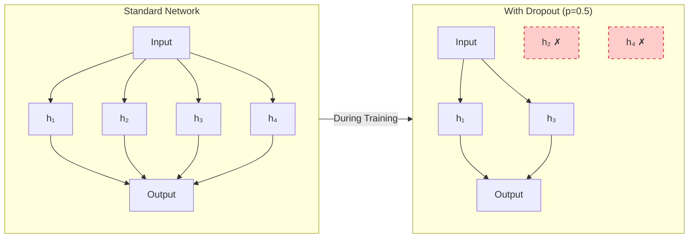
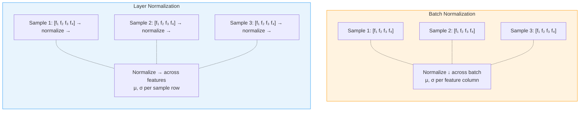

<p style="color: #666; font-size: 0.9em; margin-bottom: 1.5em;"><em>This is Preliminary Note 4 for the Protein &amp; Artificial Intelligence course (Spring 2026), co-taught by Prof. Sungsoo Ahn and Prof. Homin Kim at KAIST. It continues the protein solubility case study from Preliminary Note 3. Every technique is introduced in response to a specific problem observed during training, not as an abstract recipe.</em></p>

## Introduction

In Preliminary Note 3 you trained a convolutional neural network to predict protein solubility.
It works --- but not well enough.
The training loss looks great, but the validation loss tells a different story: the model is memorizing the training data rather than learning general patterns.
And even when we address that, we will discover that our evaluation is misleadingly optimistic because of hidden data leakage.

This note walks through the process of **systematically improving** a model.
Instead of presenting a catalog of techniques in the abstract, we start from the baseline solubility predictor and fix problems one at a time.
Each section follows a narrative arc: *observe a problem → understand why it happens → introduce a technique that addresses it → show the improvement*.

By the end, you will have a toolkit for diagnosing and fixing the most common training problems in protein machine learning.

### Roadmap

| Section | Problem Observed | Technique Introduced |
|---|---|---|
| 1. Diagnosing the Baseline | Training loss good, validation loss bad | Loss curve analysis |
| 2. Fighting Overfitting with Dropout | Model memorizes training data | Dropout |
| 3. Weight Decay and Simpler Solutions | Still overfitting after dropout | Weight decay (L2 regularization) |
| 4. Stabilizing Training with Normalization | Training is noisy and unstable | Layer Normalization |
| 5. Learning Rate Schedules | Model plateaus before converging | Warmup + cosine decay |
| 6. Knowing When to Stop | Validation loss starts rising again | Early stopping |
| 7. Tuning Hyperparameters | Performance depends on specific settings | Random search |
| 8. Evaluating Properly | Random split overestimates performance | Sequence-identity splits |
| 9. Handling Class Imbalance | Poor performance on the minority class | Weighted loss |

### Prerequisites

This note assumes you have worked through Preliminary Notes 2 and 3: building neural networks, training loops, loss functions, optimizers, and the solubility predictor case study.

---

## 1. Diagnosing the Baseline

Let us start by running the solubility predictor from Preliminary Note 3 and carefully examining its training behavior.

### What the Loss Curves Tell Us

<div class="col-sm-9 mt-3 mb-3 mx-auto">
    
    <div class="caption mt-1">Training and validation loss curves illustrating overfitting. Training loss decreases steadily, but validation loss begins increasing after ~40 epochs — the model is memorizing the training data rather than learning generalizable patterns. Early stopping (dashed line) would save the best model before overfitting begins.</div>
</div>

When we train the `ProteinSolubilityClassifier` for 100 epochs, a characteristic pattern emerges.
The training loss decreases smoothly toward zero --- the model is learning to classify the training proteins with high confidence.
But the validation loss tells a different story: it decreases initially (the model is learning general patterns), plateaus around epoch 30--40, and then starts *increasing*.

This growing gap between training and validation performance is the hallmark of **overfitting**.
The model has enough capacity (parameters) to memorize the specific training proteins rather than learning generalizable sequence-to-solubility patterns.
After epoch 40, every additional training step makes the model *worse* on new proteins.

How bad is the overfitting?
We can quantify it: if the training accuracy is 98% but the validation accuracy is 72%, the model is spending most of its capacity on memorization.
The 26-percentage-point gap is our primary target for improvement.

### What Causes Overfitting in Protein Models?

Protein datasets are typically small relative to model capacity.
A dataset of 5,000 proteins with a model containing 500,000 parameters means there are 100 parameters per training example --- plenty of room for the model to memorize each protein individually instead of learning general patterns.
The same phenomenon occurs in medical imaging, where a model trained on a few thousand X-rays can memorize patient-specific artifacts rather than learning general diagnostic patterns.

Additionally, protein sequences have rich internal structure (motifs, repeats, compositional biases) that a model can latch onto as "shortcuts" for the training set without these shortcuts being predictive on new data.
This mirrors the problem in image classification where models sometimes learn to recognize the background (e.g., grass behind cows, snow behind wolves) rather than the object itself.

The next five sections introduce techniques to combat this problem.

---

## 2. Fighting Overfitting with Dropout

### The Idea



**Dropout** is one of the most widely used regularization techniques.[^dropout-origin]
During training, we randomly "drop" (zero out) each neuron's output with probability $$p$$, where $$p$$ is typically between 0.1 and 0.5.
This has two complementary effects.

First, dropout prevents **co-adaptation**.
Without dropout, neurons can develop fragile interdependencies: neuron A only fires when neuron B fires, which only happens when neuron C fires.
These chains break down on new data.
Dropout forces each neuron to be independently useful.

Second, dropout implicitly trains an **exponential ensemble** of sub-networks.
Each training step uses a different random subset of neurons, effectively training a different architecture.
At test time, all neurons are active (with outputs scaled by $$1 - p$$ to compensate for the increased capacity), which approximates averaging predictions from all these sub-networks.

[^dropout-origin]: Dropout was introduced by Srivastava et al. (2014). The name comes from the idea of "dropping out" units from the neural network during training.

### Applying Dropout to Our Solubility Model

Our `ProteinSolubilityClassifier` already includes `nn.Dropout(0.3)` between the convolutional layers, but let us examine its effect more carefully.

A critical detail: dropout behaves differently during training and evaluation.
During training, neurons are randomly zeroed.
During evaluation, all neurons are active and outputs are scaled.
PyTorch handles this automatically, but you must explicitly switch modes by calling `model.train()` before training and `model.eval()` before evaluation.
Forgetting this switch is a common source of bugs where validation performance looks artificially poor.

### Choosing a Dropout Rate

For protein models, a dropout rate between 0.1 and 0.3 is a reasonable starting point.
Higher rates (0.4--0.5) can help when working with very small datasets but risk **underfitting** if set too aggressively --- the model never sees enough of its own neurons to learn effectively.
We will tune this as a hyperparameter in Section 7.

### Effect on Our Model

After adding dropout at rate 0.3, we observe: the training loss no longer decreases as rapidly (the model is intentionally handicapped during training), but the validation loss improves.
The gap narrows from 26 percentage points to roughly 15.
Better, but not yet satisfactory.

---

## 3. Weight Decay and Simpler Solutions

### The Idea

Even with dropout, our model still overfits.
The next line of defense is **weight decay**, which is L2 regularization applied to the model parameters.
Instead of minimizing just the task loss $$L_{\text{task}}$$, we minimize a combined objective:

$$
L_{\text{total}} = L_{\text{task}} + \lambda \sum_{i} w_i^2
$$

Here $$w_i$$ denotes each learnable weight in the model, and $$\lambda$$ (a positive scalar called the **regularization strength**) controls how strongly we penalize large weights.
Common values for $$\lambda$$ range from 0.001 to 0.1.

The intuition: large weights often indicate the model is fitting noise rather than signal.
A weight of magnitude 100 means the model is relying heavily on a single feature or feature combination, which is fragile.
By penalizing large weights, we encourage the model to distribute its representation across many small contributions --- a simpler, more robust solution.

### Applying Weight Decay with AdamW

In PyTorch, weight decay is built into the optimizer:

```python
# AdamW applies weight decay correctly (decoupled from the adaptive learning rate)
optimizer = torch.optim.AdamW(
    model.parameters(),
    lr=1e-4,
    weight_decay=0.01  # Regularization strength lambda
)
```

A subtle but important point: **AdamW** handles weight decay correctly by decoupling it from the adaptive learning rate scaling.
The older `Adam` optimizer with the `weight_decay` parameter implements L2 regularization in a way that couples the penalty with the per-parameter scaling, which changes its effective strength.
For most purposes, prefer `AdamW`.

### Effect on Our Model

Adding weight decay of 0.01 to our optimizer further reduces the train-validation gap.
The training accuracy drops slightly (the model is penalized for using large weights), but the validation accuracy improves.
Combined with dropout, the gap narrows to about 8 percentage points.

Weight decay is particularly valuable when fine-tuning a pre-trained protein language model (such as ESM[^esm]) on a small labeled dataset.
Without weight decay, the model's parameters can drift far from their well-regularized pre-trained values, destroying the general knowledge learned during pre-training.

[^esm]: ESM (Evolutionary Scale Modeling) is a family of protein language models developed by Meta AI. We cover protein language models in detail in a later lecture.

---

## 4. Stabilizing Training with Normalization

### The Problem

Even with regularization, our training curves are noisy --- the loss oscillates from batch to batch instead of decreasing smoothly.
This noise makes it harder for the optimizer to find good solutions, especially early in training when the model's activations can have wildly varying magnitudes.

### Layer Normalization

Normalization layers stabilize training by ensuring that layer inputs maintain reasonable distributions.
Without normalization, small changes in early layers can cascade into large changes in later layers --- a phenomenon called **internal covariate shift** --- making optimization difficult.



Two normalization approaches are common: **Batch Normalization** (BatchNorm), which normalizes across the batch dimension, and **Layer Normalization** (LayerNorm), which normalizes across the feature dimension.

For protein sequence data, **Layer Normalization is almost always preferred**, for two reasons:

1. With variable-length protein sequences, batches contain a mix of short and long proteins. BatchNorm's statistics become noisy because they average over proteins with very different lengths and padding amounts.

2. BatchNorm behaves differently during training (uses mini-batch statistics) and evaluation (uses running-average statistics), which can cause unexpected behavior with small batch sizes.

LayerNorm avoids both issues because it normalizes each sequence independently --- it never looks across the batch.

### Adding Normalization to Our Model

We can wrap our convolutional blocks with LayerNorm.
The pattern below uses "pre-norm" placement (normalize before transformation) and a residual connection:

```python
class ProteinBlock(nn.Module):
    """A single encoder block with pre-norm, feedforward, and residual connection."""
    def __init__(self, hidden_dim):
        super().__init__()
        self.linear1 = nn.Linear(hidden_dim, hidden_dim * 4)  # Expand
        self.linear2 = nn.Linear(hidden_dim * 4, hidden_dim)  # Project back
        self.layernorm = nn.LayerNorm(hidden_dim)
        self.dropout = nn.Dropout(0.1)

    def forward(self, x):
        # x shape: (batch_size, seq_len, hidden_dim)
        residual = x
        x = self.layernorm(x)          # Normalize before transformation
        x = self.linear1(x)
        x = nn.functional.gelu(x)      # GELU activation (smooth variant of ReLU)
        x = self.dropout(x)
        x = self.linear2(x)
        return residual + x            # Residual connection preserves gradient flow
```

The **residual connection** (`residual + x`) is equally important: it provides a shortcut path for gradients to flow backward through the network without being attenuated, making deeper networks trainable.

### Effect on Our Model

After adding LayerNorm, the training curves become noticeably smoother.
The loss decreases more consistently epoch-to-epoch, and the optimizer reaches a better solution in fewer epochs.

---

## 5. Learning Rate Schedules

### The Problem

After applying regularization and normalization, our model trains stably but plateaus.
The loss stops decreasing around epoch 30, and additional epochs produce no further improvement.
The issue: a fixed learning rate that was appropriate early in training is too large for fine-tuning near a good solution.

### Why the Learning Rate Matters So Much

<div class="col-sm-9 mt-3 mb-3 mx-auto">
    
    <div class="caption mt-1">Three common learning rate schedules. Step decay makes abrupt reductions at fixed intervals. Cosine annealing provides smooth decay that gradually slows exploration. Warmup + cosine starts low to stabilize early training, ramps up, then decays — the default choice for transformer-based protein models.</div>
</div>

The learning rate $$\eta$$ controls the step size of each gradient descent update.
If $$\eta$$ is too high, the optimizer overshoots good solutions and the loss oscillates.
If $$\eta$$ is too low, training takes impractically long.

The optimal learning rate is not constant throughout training.
Early on, we can take large steps because we are far from any minimum.
Later, we need smaller steps to fine-tune and avoid overshooting.
This motivates **learning rate schedules**: functions that adjust $$\eta$$ over the course of training.

### Warmup: Stabilizing Early Training

At the start of training, the model's weights are random, so gradients can be unusually large or point in misleading directions.
**Warmup** starts with a very small learning rate and gradually increases it over the first few hundred or thousand steps, giving the optimizer time to accumulate reliable gradient statistics.

### Cosine Annealing: Smooth Decay

After warmup, **cosine annealing** provides a smooth decay following a cosine curve:

$$
\eta_t = \eta_{\min} + \frac{1}{2}(\eta_{\max} - \eta_{\min})\left(1 + \cos\left(\frac{t}{T}\pi\right)\right)
$$

The cosine shape starts slowly, accelerates through the middle of training, and slows again as it approaches the minimum learning rate.

### The Standard Recipe: Warmup + Cosine Decay

The most common schedule in modern deep learning combines both:

```python
import math

def get_warmup_cosine_scheduler(optimizer, warmup_steps, total_steps, min_lr_ratio=0.01):
    """Warmup followed by cosine decay — the standard modern schedule."""
    def lr_lambda(current_step):
        if current_step < warmup_steps:
            # Linear warmup
            return float(current_step) / float(max(1, warmup_steps))
        else:
            # Cosine decay from 1.0 down to min_lr_ratio
            progress = float(current_step - warmup_steps) / float(
                max(1, total_steps - warmup_steps)
            )
            return min_lr_ratio + (1 - min_lr_ratio) * 0.5 * (
                1 + math.cos(math.pi * progress)
            )

    return torch.optim.lr_scheduler.LambdaLR(optimizer, lr_lambda)
```

A common rule of thumb: warm up for about 5--10% of total training steps.

### Alternative: Reduce on Plateau

When you do not know in advance how many training steps are needed, **reduce on plateau** monitors validation loss and reduces the learning rate when progress stalls:

```python
scheduler = torch.optim.lr_scheduler.ReduceLROnPlateau(
    optimizer,
    mode='min',       # 'min' for loss (lower is better)
    factor=0.5,       # Multiply LR by 0.5 when reducing
    patience=5,       # Wait 5 epochs before reducing
    min_lr=1e-6       # Do not reduce below this value
)

# In the training loop: pass the validation loss
scheduler.step(val_loss)
```

### Effect on Our Model

With warmup + cosine decay, the model breaks through its earlier plateau.
The initial warmup prevents the unstable early training we sometimes saw, and the cosine decay allows the optimizer to make progressively finer adjustments.
Validation loss improves by an additional 3--5%.

---

## 6. Knowing When to Stop

### The Problem

Even with a good learning rate schedule, there comes a point when continued training hurts more than it helps.
Validation loss may start rising again after reaching its best value, indicating that the model is beginning to overfit to the training data.

### Early Stopping

**Early stopping** is a form of regularization based on *time* rather than architecture.
The idea: monitor validation performance during training and stop when it stops improving.

Why does this work as regularization?
In the early phases of training, the model learns general, transferable patterns.
As training continues, it gradually begins to memorize training-specific noise.
The point at which validation performance peaks is the sweet spot between underfitting and overfitting.

```python
class EarlyStopping:
    """Stop training when validation loss stops improving."""
    def __init__(self, patience=10, min_delta=1e-4):
        self.patience = patience
        self.min_delta = min_delta
        self.best_loss = float('inf')
        self.counter = 0
        self.should_stop = False

    def step(self, val_loss):
        """Call once per epoch. Returns True if this is a new best model."""
        if val_loss < self.best_loss - self.min_delta:
            self.best_loss = val_loss
            self.counter = 0
            return True   # New best — save checkpoint
        else:
            self.counter += 1
            if self.counter >= self.patience:
                self.should_stop = True
            return False  # No improvement
```

In the training loop:

```python
early_stopping = EarlyStopping(patience=15)

for epoch in range(max_epochs):
    train_loss = train_one_epoch(model, train_loader, optimizer)
    val_loss = evaluate(model, val_loader)

    if early_stopping.step(val_loss):
        torch.save(model.state_dict(), 'best_model.pt')

    if early_stopping.should_stop:
        print(f"Early stopping at epoch {epoch}")
        break

# Load the best model for final evaluation
model.load_state_dict(torch.load('best_model.pt'))
```

The **patience** parameter controls how long to wait for improvement.
For protein models with small datasets (and therefore noisy validation estimates), a patience of 10 to 20 epochs is common.

---

## 7. Tuning Hyperparameters

### What to Tune

Not all hyperparameters are equally important.
Here is a rough hierarchy for protein deep learning:

**Critical (always tune):**
- **Learning rate:** Often the difference between success and failure.
- **Batch size:** Affects both optimization dynamics and GPU memory usage.
- **Model capacity:** Hidden dimensions and number of layers.

**Important (tune for best results):**
- Weight decay strength.
- Dropout rate.
- Learning rate schedule parameters (warmup steps, minimum LR).

**Usually fine with defaults:**
- Adam's $$\beta_1$$ (default 0.9) and $$\beta_2$$ (default 0.999).
- LayerNorm's $$\epsilon$$ (default $$10^{-5}$$).

### Random Search

**Random search** is more efficient than grid search because it does not waste trials on unimportant hyperparameters.
By sampling from continuous distributions, each trial explores a new value of every hyperparameter:

```python
import random

def sample_hyperparameters():
    """Sample a random hyperparameter configuration."""
    return {
        'lr': 10 ** random.uniform(-5, -3),             # Log-uniform: 1e-5 to 1e-3
        'batch_size': random.choice([16, 32, 64, 128]),  # Discrete choices
        'hidden_dim': random.choice([256, 384, 512]),
        'dropout': random.uniform(0.1, 0.4),             # Uniform: 0.1 to 0.4
        'weight_decay': 10 ** random.uniform(-4, -1),    # Log-uniform: 1e-4 to 0.1
        'warmup_ratio': random.uniform(0.05, 0.15)       # Fraction of total steps
    }

# Run 30 random trials
results = []
for trial in range(30):
    params = sample_hyperparameters()
    val_loss = train_and_evaluate(**params)
    results.append({'params': params, 'val_loss': val_loss})

best_trial = min(results, key=lambda x: x['val_loss'])
print(f"Best hyperparameters: {best_trial['params']}")
```

### A Practical Strategy

**Step 1: Sanity check.**
Can the model overfit a single batch?
If not, fix the model or data pipeline first.

**Step 2: Find a reasonable learning rate.**
Try 5--10 different learning rates (e.g., 1e-5, 3e-5, 1e-4, 3e-4, 1e-3) with default settings for everything else.
Pick the one that gives the best validation loss after 10 epochs.

**Step 3: Tune critical parameters together.**
Run 20--30 random search trials over learning rate, batch size, and model size jointly.

**Step 4: Tune regularization.**
With the best architecture and learning rate, sweep dropout and weight decay to control overfitting.

---

## 8. Evaluating Properly: Sequence-Identity Splits

### The Problem

After all our improvements, the solubility predictor achieves 85% validation accuracy.
Impressive?
Not necessarily.
We need to examine *how* we split the data.

If we used a random train/validation/test split, there is a high probability that some test proteins are closely related (>90% sequence identity) to proteins in the training set.
These homologous proteins almost certainly share the same solubility status.
The model can score well by memorizing similar sequences rather than learning true sequence-to-solubility patterns.
This is **data leakage** --- the test set contains information that was effectively available during training.

The same problem arises in other domains.
In medical imaging, if multiple scans from the same patient appear in both training and test sets, the model can memorize patient-specific features rather than learning general diagnostic patterns.
In speech recognition, if recordings from the same speaker are split across training and test, the model benefits from recognizing the speaker's voice rather than understanding speech in general.
The principle is universal: test data must be genuinely independent of training data.

### The Solution: Sequence-Identity Splits

The fix: cluster all proteins by sequence identity --- commonly at a 30% or 40% threshold --- and split the data at the **cluster** level, not the individual protein level.
This ensures that no test protein is closely related to any training protein.

```python
import subprocess
import numpy as np

def create_sequence_identity_splits(fasta_file, identity_threshold=0.3, train_ratio=0.8):
    """Split proteins into train/val/test sets respecting sequence identity.

    Requires MMseqs2 to be installed (https://github.com/soedinglab/MMseqs2).
    """
    # Step 1: Cluster proteins at the specified identity threshold
    subprocess.run([
        'mmseqs', 'easy-cluster',
        fasta_file, 'clusters', 'tmp',
        '--min-seq-id', str(identity_threshold)
    ])

    # Step 2: Parse cluster assignments
    clusters = parse_cluster_file('clusters_cluster.tsv')

    # Step 3: Shuffle and split clusters (not individual proteins)
    cluster_ids = list(clusters.keys())
    np.random.shuffle(cluster_ids)

    n_clusters = len(cluster_ids)
    n_train = int(n_clusters * train_ratio)
    n_val = int(n_clusters * 0.1)

    train_clusters = cluster_ids[:n_train]
    val_clusters = cluster_ids[n_train:n_train + n_val]
    test_clusters = cluster_ids[n_train + n_val:]

    # Step 4: Collect protein IDs from the assigned clusters
    train_ids = [pid for c in train_clusters for pid in clusters[c]]
    val_ids = [pid for c in val_clusters for pid in clusters[c]]
    test_ids = [pid for c in test_clusters for pid in clusters[c]]

    return train_ids, val_ids, test_ids
```

### The Reality Check

When we retrain our model using sequence-identity splits instead of random splits, the test accuracy typically drops by 5--15 percentage points.
This drop reflects the true difficulty of the task: predicting solubility for proteins that are genuinely different from anything in the training set.

The random-split accuracy was a mirage.
The sequence-identity-split accuracy is the honest answer.
Any paper that reports performance without controlling for sequence similarity should be read with skepticism.

A word of caution: even 30% sequence identity splits may not be sufficient for all tasks.
Proteins from the same CATH[^cath] superfamily can share structural features despite having diverged below 30% identity.
For the most rigorous evaluation, consider splitting at the fold or superfamily level.

[^cath]: CATH is a hierarchical classification of protein domain structures: **C**lass (secondary structure content), **A**rchitecture (spatial arrangement), **T**opology (fold), and **H**omologous superfamily.

---

## 9. Handling Class Imbalance

### The Problem

After switching to sequence-identity splits, we notice another issue: the model's performance on **insoluble** proteins is much worse than on soluble ones.
Looking at the data, we find that 70% of our dataset is soluble and only 30% is insoluble.
The model has learned a shortcut: predicting "soluble" for everything gives 70% accuracy with no effort.

This is a universal problem in machine learning.
In fraud detection, legitimate transactions outnumber fraudulent ones by 100-to-1, so a model that always predicts "legitimate" achieves 99% accuracy while catching zero fraud.
In medical diagnosis, rare diseases are vastly outnumbered by healthy cases, making accuracy a meaningless metric.
The solution is the same in all domains: change the loss function so that misclassifying the minority class costs more.

### Weighted Loss Functions

The simplest correction: assign higher weights to underrepresented classes, so that misclassifying an insoluble protein incurs a larger penalty:

```python
def compute_class_weights(labels, num_classes):
    """Compute inverse-frequency weights for class-balanced training."""
    counts = torch.bincount(labels.flatten(), minlength=num_classes).float()
    weights = 1.0 / (counts + 1)                    # Inverse frequency
    weights = weights / weights.sum() * num_classes  # Normalize
    return weights

# Apply to our solubility dataset
class_weights = compute_class_weights(train_labels, num_classes=2)
criterion = nn.CrossEntropyLoss(weight=class_weights)
```

With weighted loss, the model is penalized more heavily for misclassifying the minority class (insoluble proteins).
This forces it to pay attention to features that distinguish insoluble proteins rather than defaulting to "soluble."

### Effect on Our Model

After applying class weights, the overall accuracy may drop slightly (the model can no longer cheat by always predicting the majority class), but the **F1 score and recall for the minority class improve substantially**.
This is the metric that matters: a model that correctly identifies insoluble proteins is far more useful than one that achieves high accuracy by ignoring them.

---

## Key Takeaways

1. **Diagnose before you fix.** Always plot training and validation loss curves. The gap between them tells you whether the problem is overfitting, underfitting, or something else entirely.

2. **Regularization prevents overfitting.** Use dropout, weight decay, and early stopping together. For proteins, where datasets are small, regularization is not optional.

3. **Layer Normalization over Batch Normalization** for protein sequences, because LayerNorm avoids noisy batch statistics caused by variable-length padding.

4. **Learning rate is the most important hyperparameter.** Use warmup + cosine decay as the default schedule. Reduce on plateau is a good alternative when the total training duration is unknown.

5. **Early stopping** saves the best model and prevents wasted computation. Use a patience of 10--20 epochs for protein tasks.

6. **Random search** is more efficient than grid search for hyperparameter tuning. Focus on the critical parameters (learning rate, model size, batch size) first.

7. **Sequence-identity splits are mandatory** for honest evaluation of protein models. Random splits systematically overestimate performance due to data leakage from homologous sequences.

8. **Address class imbalance** with weighted losses. High accuracy on an imbalanced dataset is meaningless if the model ignores the minority class.

9. **Improvement is iterative.** Each technique provides incremental gains. The combination of all techniques together yields a model that is substantially better than the baseline.

---

## Exercises

All exercises use the protein solubility predictor from Preliminary Note 3 as their starting point.

### Exercise 1: Regularization Ablation

Train the solubility predictor under four conditions:
- (a) No regularization (no dropout, no weight decay)
- (b) Dropout only (rate 0.3)
- (c) Weight decay only ($$\lambda = 0.01$$)
- (d) Both dropout and weight decay

For each condition, plot training and validation loss curves on the same axes.
Answer: Which regularization technique has a larger effect?
Does combining them help beyond using either alone?

### Exercise 2: Data Leakage Experiment

Create two sets of train/test splits for the solubility dataset:
- (a) Random splits (proteins assigned uniformly at random)
- (b) Sequence identity splits at 30% using MMseqs2 or CD-HIT

Train the same model on both splits and compare test accuracy, F1, and AUC.
By how many percentage points does the random split overestimate performance?

### Exercise 3: Class Imbalance Experiment

Construct a version of the solubility dataset where 90% of examples are soluble and 10% are insoluble.
Train the model with:
- (a) Standard cross-entropy (unweighted)
- (b) Inverse-frequency weighted cross-entropy

Compare not just accuracy but also precision, recall, and F1-score for the *insoluble* class.
Why is accuracy a misleading metric for imbalanced tasks?

---

## References

- Srivastava, N., Hinton, G., Krizhevsky, A., Sutskever, I., & Salakhutdinov, R. (2014). Dropout: A simple way to prevent neural networks from overfitting. *Journal of Machine Learning Research*, 15, 1929--1958.

- Ioffe, S. & Szegedy, C. (2015). Batch Normalization: Accelerating deep network training by reducing internal covariate shift. *Proceedings of ICML*.

- Ba, J. L., Kiros, J. R., & Hinton, G. E. (2016). Layer Normalization. *arXiv preprint arXiv:1607.06450*.

- Loshchilov, I. & Hutter, F. (2017). SGDR: Stochastic gradient descent with warm restarts. *Proceedings of ICLR*.

- Loshchilov, I. & Hutter, F. (2019). Decoupled weight decay regularization. *Proceedings of ICLR*. (The paper introducing AdamW.)

- Bergstra, J. & Bengio, Y. (2012). Random search for hyper-parameter optimization. *Journal of Machine Learning Research*, 13, 281--305.

- Rao, R., Bhatt, N., Lu, A., Johnson, J., Ott, M., Auli, M., Russ, C., & Sander, C. (2019). Evaluating protein transfer learning with TAPE. *Advances in NeurIPS*. (Best practices for protein ML evaluation, including sequence identity splits.)

- Rives, A., Meier, J., Sercu, T., Goyal, S., Lin, Z., Liu, J., Guo, D., Ott, M., Zitnick, C. L., Ma, J., & Fergus, R. (2021). Biological structure and function emerge from scaling unsupervised learning to 250 million protein sequences. *PNAS*, 118(15).
