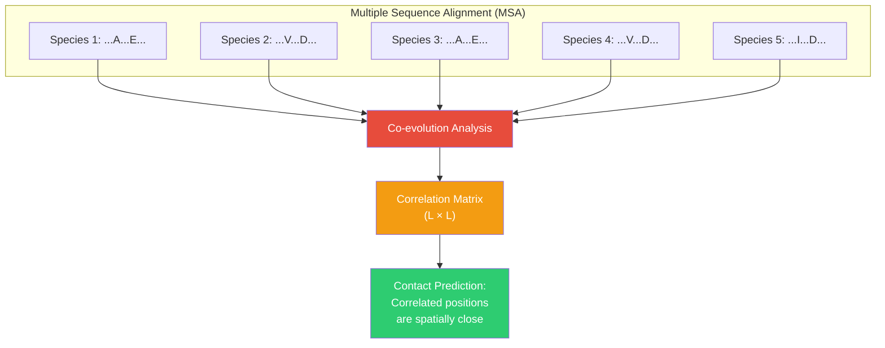
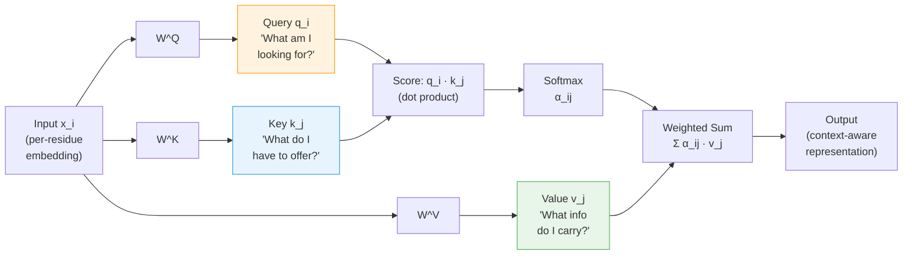
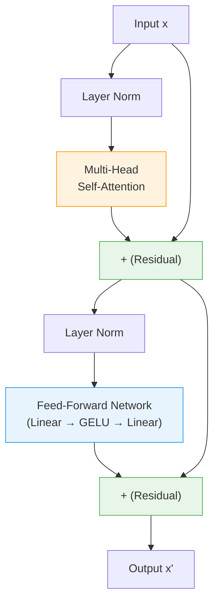
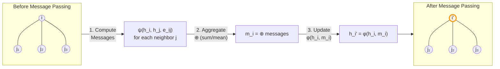

<p style="color: #666; font-size: 0.9em; margin-bottom: 1.5em;"><em>This is Lecture 1 of the Protein &amp; Artificial Intelligence course (Spring 2026), co-taught by Prof. Sungsoo Ahn and Prof. Homin Kim at KAIST. It assumes familiarity with the material covered in our preliminary notes on Python &amp; data basics, protein representations, AI fundamentals, and training &amp; optimization. If any concept feels unfamiliar, please review those notes first.</em></p>

## Introduction

Proteins are simultaneously one-dimensional and three-dimensional objects.  Their amino-acid sequences are linear strings, yet their biological functions arise from intricate three-dimensional folds where residues separated by hundreds of positions in sequence come into close spatial contact.  Modeling proteins therefore demands neural network architectures that can capture long-range dependencies along the chain *and* reason about the geometry of the folded structure.

Two families of architectures have risen to meet this challenge.  **Transformers** process protein sequences by letting every residue attend to every other residue, bypassing the information bottleneck of sequential models.  **Graph neural networks (GNNs)** operate directly on the three-dimensional contact graph of a protein structure, passing messages between spatially neighboring residues.  Together, they form the architectural backbone of nearly every state-of-the-art protein model, from ESM-2 to AlphaFold.

This lecture develops both families from first principles.  We begin with a biological motivation---co-evolution in protein families---and show how it maps onto the attention mechanism.  We then build the full transformer architecture piece by piece.  In the second half, we represent proteins as graphs and derive the message-passing framework, instantiating it in three concrete architectures: GCN, GAT, and MPNN.  We close with SE(3)-equivariant GNNs and the connection to AlphaFold.

### Roadmap

| Section | Topic | Why it is needed |
|---------|-------|-----------------|
| 1 | Co-evolution and the intuition for attention | Biological grounding for why pairwise interactions matter |
| 2 | Limitations of sequential processing | Concrete failures of RNNs that motivate a new architecture |
| 3 | The attention mechanism (Q/K/V) | Core computation that enables direct pairwise communication |
| 4 | Scaled dot-product attention | Numerical stability for training |
| 5 | Multi-head attention | Capturing multiple relationship types simultaneously |
| 6 | The full transformer architecture | Combining attention with feed-forward layers, normalization, and residual connections |
| 7 | Positional encoding | Injecting sequence-order information that attention alone lacks |
| 8 | Protein language models (ESM) | Applying transformers at evolutionary scale |
| 9 | Proteins as graphs | Representing 3D structure for neural processing |
| 10 | Message passing | The unifying computational pattern of all GNNs |
| 11 | GCN | The foundational graph convolutional architecture |
| 12 | GAT | Attention over graph neighborhoods |
| 13 | MPNN | The general framework with learnable message and update functions |
| 14 | SE(3)-equivariant GNNs | Respecting rotational and translational symmetry of physical structures |
| 15 | Connection to AlphaFold | How transformers and GNNs unite in structure prediction |

---

## 1. Co-Evolution: The Biological Root of Attention

We introduced MSAs and co-evolution in Preliminary Note 1. Here we explore in greater depth how these biological signals motivate the attention mechanism.

Consider a protein that has existed, in various forms, for billions of years.  Its relatives are scattered across every domain of life---from bacteria to whales to oak trees.  Each relative carries a slightly different version of the sequence, shaped by the survival challenges of its host organism.  By aligning these related sequences into a **multiple sequence alignment (MSA)**, biologists noticed something striking: certain pairs of positions tend to mutate together.

Suppose position 23 changes from alanine to valine in one lineage.  Position 87 often changes from glutamate to aspartate in the same lineage.  These **correlated mutations** are not coincidences.  They signal that residues 23 and 87 are physically close in the folded structure, or that they participate in the same functional interaction.  When one changes, the other must compensate to preserve the protein's function.

This phenomenon is called **co-evolution**[^coevol], and for decades computational biologists built methods around it---from correlated-mutation analysis to direct coupling analysis (DCA).  All these methods ask the same question: *which positions in a protein sequence are paying attention to each other?*


<div class="caption mt-1"><strong>Co-evolution in MSAs.</strong> Correlated mutations across homologous sequences reveal residue pairs that are in spatial contact. Positions 23 and 87 tend to mutate together across species, signaling a structural or functional relationship.</div>

[^coevol]: Co-evolution in this context refers to intramolecular co-evolution, where pairs of residues within a single protein co-vary across a family of homologous sequences.  This is distinct from the broader evolutionary biology concept of co-evolution between separate species.

The attention mechanism in neural networks formalizes exactly this intuition.  Instead of computing statistical correlations from evolutionary data, we let the network *learn* which positions should attend to which---directly from data.  And just as co-evolution reveals hidden three-dimensional structure lurking within one-dimensional sequences, attention allows neural networks to discover long-range relationships that sequential processing would miss.

---

## 2. The Limitations of Sequential Processing

In our preliminary notes, we introduced recurrent neural networks (RNNs), which process sequences one element at a time, passing information forward through a hidden state.  This approach has an intuitive appeal for proteins: reading the chain from the N-terminus to the C-terminus, accumulating context as you go.

But sequential processing creates three serious problems.

**The parallelization bottleneck.**  To compute the hidden state at position 100, you must first compute the hidden states at positions 1 through 99.  This fundamentally sequential dependence means you cannot exploit the parallelism of modern GPUs, which excel when they can perform many independent operations simultaneously.

**The long-range dependency problem.**  Information from the beginning of a sequence must pass through dozens or hundreds of intermediate steps before it can influence positions near the end.  Each step is an opportunity for information to be diluted or lost.  Even sophisticated gating mechanisms like LSTMs and GRUs struggle to maintain signals across very long spans.

**The information bottleneck.**  The entire context of a long sequence must be compressed into a fixed-size hidden state vector.  For a 500-residue protein, all information about the first 400 residues must fit into a vector of perhaps 256 or 512 numbers before it can influence the representation of residue 401.  Important details inevitably get lost.

Attention offers a radical alternative.  Instead of routing information through a long chain of intermediate steps, we create direct connections between every pair of positions.  Residue 1 can communicate with residue 500.  Residue 237 can communicate with residue 238.  Every pairwise relationship is available, and the network learns which ones matter.

---

## 3. Building the Attention Mechanism from the Ground Up

Imagine you encounter a cysteine at position 50 in a protein sequence and want to understand its role in context.  Which other positions should you pay attention to?

Perhaps there is another cysteine at position 127.  If these two cysteines form a disulfide bond, they are critical to each other despite being 77 positions apart.  You should attend strongly to position 127.

Or perhaps position 50 participates in a catalytic triad with residues at positions 95 and 143.  Again, these distant positions are functionally coupled and deserve attention.

The attention mechanism formalizes this reasoning through three learned projections: a **query**, a **key**, and a **value**[^qkv], as illustrated below.



[^qkv]: The names query, key, and value come from information retrieval.  Think of searching a database: you submit a query, it is matched against keys, and the corresponding values are returned.

**The query** $$q_i$$ represents what position $$i$$ is looking for.  Think of it as the question: "What kind of interaction partners am I seeking?"  A cysteine's query might implicitly encode: "I am looking for another cysteine that could form a disulfide bond with me."

**The key** $$k_j$$ represents what position $$j$$ has to offer.  It advertises: "Here is what I am and what I can provide."  The cysteine at position 127 has a key that signals: "I am a cysteine, potentially available for bonding."

**The value** $$v_j$$ represents the actual information transmitted when attention is paid.  Once position 50 decides to attend to position 127, the value determines what content flows.

Formally, let $$x_i \in \mathbb{R}^d$$ be the input representation of position $$i$$.  We compute the three vectors through learned linear transformations:

$$
q_i = W^Q x_i, \qquad k_i = W^K x_i, \qquad v_i = W^V x_i
$$

Here $$W^Q, W^K \in \mathbb{R}^{d_k \times d}$$ and $$W^V \in \mathbb{R}^{d_v \times d}$$ are learnable weight matrices, where $$d$$ is the input dimension, $$d_k$$ is the query/key dimension, and $$d_v$$ is the value dimension.

Next, we compute how much position $$i$$ should attend to position $$j$$ by taking the dot product of the query from $$i$$ with the key from $$j$$:

$$
\text{score}_{ij} = q_i \cdot k_j = x_i^T (W^Q)^T W^K x_j
$$

This dot product measures similarity in the transformed space.  If the query and key point in similar directions, the score is high, indicating strong attention.  If they point in different directions, the score is low.

We normalize these scores with the **softmax** function, converting them into a probability distribution:

$$
\alpha_{ij} = \frac{\exp(\text{score}_{ij})}{\sum_{k=1}^{N} \exp(\text{score}_{ik})}
$$

The attention weights $$\alpha_{ij}$$ sum to 1 across all positions $$j$$.  They represent a soft selection: position 50 might attend 40% to position 127, 30% to position 95, 20% to position 143, and distribute the remaining 10% among other positions.

Finally, we compute the output for position $$i$$ as a weighted sum of the values:

$$
\text{output}_i = \sum_{j=1}^{N} \alpha_{ij} \, v_j
$$

Positions with high attention weights contribute more.  Position 50's new representation is now informed by its interaction partners, weighted by how relevant each partner is.

---

## 4. Scaled Dot-Product Attention

There is a numerical detail we glossed over above.  When the query and key vectors have many dimensions, their dot products can grow large in magnitude.  Large scores push the softmax function into regions where its gradients are extremely small[^softmax_saturation], slowing or stalling training.

[^softmax_saturation]: When one input to softmax is much larger than the others, the output concentrates almost all probability mass on that single element.  The gradient with respect to the other elements becomes vanishingly small.

The fix is to scale the scores by the square root of the key dimension $$d_k$$:

$$
\text{Attention}(Q, K, V) = \text{softmax}\!\left(\frac{Q K^T}{\sqrt{d_k}}\right) V
$$

Here $$Q \in \mathbb{R}^{N \times d_k}$$, $$K \in \mathbb{R}^{N \times d_k}$$, and $$V \in \mathbb{R}^{N \times d_v}$$ are matrices whose rows are the query, key, and value vectors for all $$N$$ positions.  The scaling factor $$\sqrt{d_k}$$ ensures that the variance of the dot products remains approximately 1 regardless of $$d_k$$, keeping the softmax in a well-behaved regime.

Here is a self-contained implementation:

```python
import torch
import torch.nn as nn
import torch.nn.functional as F
import math


def scaled_dot_product_attention(query, key, value, mask=None):
    """
    Scaled dot-product attention for protein sequences.

    Args:
        query:  (batch, n_heads, seq_len, d_k) — what each residue is looking for
        key:    (batch, n_heads, seq_len, d_k) — what each residue advertises
        value:  (batch, n_heads, seq_len, d_v) — information to transmit
        mask:   optional mask to prevent attention to certain positions
                (e.g., padding tokens in variable-length protein batches)

    Returns:
        output:           (batch, n_heads, seq_len, d_v)
        attention_weights: (batch, n_heads, seq_len, seq_len)
    """
    d_k = query.size(-1)

    # Compute raw attention scores: (batch, n_heads, seq_len, seq_len)
    scores = torch.matmul(query, key.transpose(-2, -1)) / math.sqrt(d_k)

    # Mask out padding positions (set their scores to -inf before softmax)
    if mask is not None:
        scores = scores.masked_fill(mask == 0, float('-inf'))

    # Convert scores to probabilities
    attention_weights = F.softmax(scores, dim=-1)

    # Weighted sum of values
    output = torch.matmul(attention_weights, value)

    return output, attention_weights
```

---

## 5. Multi-Head Attention: Different Heads for Different Relationships

A single set of query, key, and value projections captures one type of pairwise relationship.  But proteins exhibit many types of relationships simultaneously.  A given residue might need to attend to:

- **Nearby positions** for local secondary-structure context.
- **Distant cysteines** for potential disulfide bonds.
- **Residues with complementary hydrophobicity** for core packing.
- **Co-evolving positions** that reveal functional constraints.

**Multi-head attention** runs $$h$$ independent attention operations in parallel, each with its own learned projections.  Think of each head as a specialist that looks for a specific kind of relationship.  Head 1 might learn to identify sequence neighbors.  Head 2 might discover potential interaction partners based on amino-acid chemistry.  Head 3 might capture secondary-structure patterns.  Head 4 might learn functional couplings.

Formally, each head $$i$$ computes:

$$
\text{head}_i = \text{Attention}(Q W_i^Q,\; K W_i^K,\; V W_i^V)
$$

where $$W_i^Q \in \mathbb{R}^{d \times d_k}$$, $$W_i^K \in \mathbb{R}^{d \times d_k}$$, and $$W_i^V \in \mathbb{R}^{d \times d_v}$$ are the head-specific projection matrices, and $$d_k = d_v = d / h$$.

We concatenate the outputs of all heads and project back to the model dimension with a final weight matrix $$W^O \in \mathbb{R}^{h \cdot d_v \times d}$$:

$$
\text{MultiHead}(Q, K, V) = \text{Concat}(\text{head}_1, \dots, \text{head}_h)\, W^O
$$

Here is a complete self-attention module:

```python
class SelfAttention(nn.Module):
    """
    Multi-head self-attention for protein sequences.

    Each residue attends to all other residues.  Multiple heads
    capture different types of inter-residue relationships.
    """

    def __init__(self, embed_dim, num_heads):
        super().__init__()
        self.embed_dim = embed_dim
        self.num_heads = num_heads
        self.head_dim = embed_dim // num_heads

        # Projection matrices for queries, keys, and values
        self.q_proj = nn.Linear(embed_dim, embed_dim)
        self.k_proj = nn.Linear(embed_dim, embed_dim)
        self.v_proj = nn.Linear(embed_dim, embed_dim)

        # Output projection (applied after concatenating all heads)
        self.out_proj = nn.Linear(embed_dim, embed_dim)

    def forward(self, x, mask=None):
        """
        Args:
            x: (batch, seq_len, embed_dim) — residue embeddings
            mask: optional padding mask

        Returns:
            output: (batch, seq_len, embed_dim) — updated residue embeddings
            attn_weights: (batch, num_heads, seq_len, seq_len)
        """
        batch_size, seq_len, _ = x.shape

        # Compute Q, K, V for all heads simultaneously
        q = self.q_proj(x)  # (batch, seq_len, embed_dim)
        k = self.k_proj(x)
        v = self.v_proj(x)

        # Reshape: split embed_dim into (num_heads, head_dim), then transpose
        q = q.view(batch_size, seq_len, self.num_heads, self.head_dim).transpose(1, 2)
        k = k.view(batch_size, seq_len, self.num_heads, self.head_dim).transpose(1, 2)
        v = v.view(batch_size, seq_len, self.num_heads, self.head_dim).transpose(1, 2)
        # Shape is now: (batch, num_heads, seq_len, head_dim)

        # Scaled dot-product attention
        attn_output, attn_weights = scaled_dot_product_attention(q, k, v, mask)

        # Concatenate heads: transpose back and reshape
        attn_output = attn_output.transpose(1, 2).contiguous().view(
            batch_size, seq_len, self.embed_dim
        )

        # Final linear projection
        output = self.out_proj(attn_output)

        return output, attn_weights
```

---

## 6. The Complete Transformer Architecture

<div class="col-sm-5 mt-3 mb-3 mx-auto">
    
    <div class="caption mt-1"><strong>The Transformer architecture.</strong> Input tokens are embedded and augmented with positional encodings, then processed by N repeated blocks of multi-head self-attention followed by feed-forward networks. Residual connections (dashed arrows) and layer normalization stabilize training. Architecture from Vaswani et al., 2017.</div>
</div>



A transformer is more than just attention.  It combines several components into a repeating building block called a **transformer block**.  Each block contains four elements:

1. **Multi-head self-attention** --- each position attends to all positions, capturing pairwise relationships.
2. **Layer normalization** --- normalizes the inputs to each sub-layer, stabilizing training dynamics[^layernorm].
3. **Feed-forward network (FFN)** --- a two-layer MLP applied independently to each position, providing non-linear transformation capacity.
4. **Residual connections** --- skip connections that add the input of each sub-layer to its output, facilitating gradient flow and allowing the model to easily preserve information.

[^layernorm]: Layer normalization computes the mean and variance across the feature dimension for each individual example, in contrast to batch normalization which computes statistics across the batch.  Layer normalization is preferred in transformers because it does not depend on batch size.

The data flow within a single transformer block is:

$$
\tilde{x} = \text{LayerNorm}(x + \text{MultiHeadAttention}(x))
$$

$$
x' = \text{LayerNorm}(\tilde{x} + \text{FFN}(\tilde{x}))
$$

The feed-forward network is typically a two-layer MLP with a wider hidden dimension (often $$4d$$) and a GELU activation:

$$
\text{FFN}(x) = W_2 \, \text{GELU}(W_1 x + b_1) + b_2
$$

A complete transformer stacks $$L$$ such blocks.  Information flows upward through the layers, with each layer refining the residue representations based on increasingly complex patterns.

```python
class TransformerBlock(nn.Module):
    """
    A single transformer block for protein sequence modeling.

    Combines multi-head self-attention with a position-wise
    feed-forward network, using residual connections and
    layer normalization for stable training.
    """

    def __init__(self, embed_dim, num_heads, ff_dim, dropout=0.1):
        super().__init__()

        # Multi-head self-attention sub-layer
        self.attention = nn.MultiheadAttention(
            embed_dim, num_heads, dropout=dropout, batch_first=True
        )
        self.norm1 = nn.LayerNorm(embed_dim)

        # Position-wise feed-forward sub-layer
        self.ff = nn.Sequential(
            nn.Linear(embed_dim, ff_dim),    # Expand to wider hidden dim
            nn.GELU(),                        # Smooth activation function
            nn.Dropout(dropout),
            nn.Linear(ff_dim, embed_dim),     # Project back to model dim
            nn.Dropout(dropout)
        )
        self.norm2 = nn.LayerNorm(embed_dim)

    def forward(self, x, mask=None):
        # Self-attention with residual connection
        attn_out, _ = self.attention(x, x, x, key_padding_mask=mask)
        x = self.norm1(x + attn_out)

        # Feed-forward with residual connection
        ff_out = self.ff(x)
        x = self.norm2(x + ff_out)

        return x
```

A full protein transformer encoder stacks multiple such blocks:

```python
class TransformerEncoder(nn.Module):
    """
    Transformer encoder for protein sequences.

    Maps a sequence of amino-acid tokens to a sequence of
    context-aware residue embeddings.
    """

    def __init__(self, vocab_size=33, embed_dim=256, num_heads=8,
                 ff_dim=1024, num_layers=6, max_len=1024, dropout=0.1):
        super().__init__()

        # Token embedding: amino acid identity -> vector
        self.token_embed = nn.Embedding(vocab_size, embed_dim)

        # Positional encoding (see next section)
        self.pos_encoding = SinusoidalPositionalEncoding(embed_dim, max_len)

        self.dropout = nn.Dropout(dropout)

        # Stack of transformer blocks
        self.layers = nn.ModuleList([
            TransformerBlock(embed_dim, num_heads, ff_dim, dropout)
            for _ in range(num_layers)
        ])

        self.norm = nn.LayerNorm(embed_dim)

    def forward(self, tokens, mask=None):
        # Embed tokens and add positional information
        x = self.token_embed(tokens)
        x = self.pos_encoding(x)
        x = self.dropout(x)

        # Pass through transformer blocks
        for layer in self.layers:
            x = layer(x, mask)

        return self.norm(x)
```

---

## 7. Giving Transformers a Sense of Position

There is a subtle but important property of the attention mechanism as we have described it: it is **permutation-equivariant**.  If you shuffle the input positions randomly, the outputs are shuffled in the same way.  The attention weights depend only on the *content* of each position, not on *where* that position sits in the sequence.

This is clearly problematic for proteins.  Position matters.  Two glycines at positions 3 and 4 (consecutive in the backbone) have a very different structural implication than glycines at positions 3 and 300.  The backbone connectivity of the chain imposes constraints that depend on sequence position.

The solution is **positional encoding**: we inject information about each position directly into the input representations.

### Sinusoidal positional encoding

The original transformer paper introduced a fixed encoding based on sine and cosine waves at different frequencies.  For position $$\text{pos}$$ and dimension $$i$$:

$$
\text{PE}_{(\text{pos},\, 2i)} = \sin\!\left(\frac{\text{pos}}{10000^{2i/d}}\right)
$$

$$
\text{PE}_{(\text{pos},\, 2i+1)} = \cos\!\left(\frac{\text{pos}}{10000^{2i/d}}\right)
$$

where $$d$$ is the embedding dimension.  The use of multiple frequencies at different scales allows the model to distinguish both nearby and distant positions.  An important property: the encoding of position $$\text{pos} + k$$ can be expressed as a linear function of the encoding of position $$\text{pos}$$, which means the model can learn to attend to relative positions.

```python
class SinusoidalPositionalEncoding(nn.Module):
    """
    Fixed sinusoidal positional encoding.

    Adds position-dependent patterns to the residue embeddings so that
    the transformer can distinguish position 5 from position 500.
    """

    def __init__(self, embed_dim, max_len=5000):
        super().__init__()

        pe = torch.zeros(max_len, embed_dim)
        position = torch.arange(0, max_len).unsqueeze(1).float()

        # Geometric progression of frequencies
        div_term = torch.exp(
            torch.arange(0, embed_dim, 2).float()
            * (-math.log(10000.0) / embed_dim)
        )

        pe[:, 0::2] = torch.sin(position * div_term)  # Even dimensions
        pe[:, 1::2] = torch.cos(position * div_term)  # Odd dimensions

        # Register as buffer (not a learnable parameter, but saved with model)
        self.register_buffer('pe', pe.unsqueeze(0))

    def forward(self, x):
        # x: (batch, seq_len, embed_dim)
        return x + self.pe[:, :x.size(1)]
```

### Learned positional embeddings

A simpler alternative treats positions like a vocabulary and learns an embedding vector for each position index.  This is more flexible but cannot generalize to sequence lengths beyond the training maximum.

### Rotary Position Embedding (RoPE)

Modern protein language models such as ESM-2 use **Rotary Position Embedding (RoPE)**[^rope].  Instead of adding positional information to the embeddings, RoPE encodes position through *rotations* of the query and key vectors.  The angle of rotation depends on position, so the dot product between a query at position $$i$$ and a key at position $$j$$ naturally becomes a function of their relative offset $$i - j$$.  This elegant approach handles relative positions without the need for explicit relative-position biases.

[^rope]: RoPE was introduced by Su et al. (2021) in "RoFormer: Enhanced Transformer with Rotary Position Embedding."  It has since become the default positional encoding in many large language models.

---

## 8. Protein Language Models: ESM and the Evolutionary Scale

The transformer architecture reaches its full potential for proteins when trained at scale.  The flagship example is **ESM (Evolutionary Scale Modeling)**, developed at Meta AI.

The training recipe is simple.  Take millions of protein sequences, randomly mask 15% of the amino acids in each sequence, and train the transformer to predict the identities of the masked residues.  This is **masked language modeling (MLM)**, the same objective that powered BERT in natural language processing[^bert].

[^bert]: BERT (Bidirectional Encoder Representations from Transformers) was introduced by Devlin et al. (2019).  Its masked-language-modeling objective was directly adopted for protein sequences by the ESM family of models.

Why does this work so well for proteins?  To predict a masked residue, the model must understand context: what other amino acids are nearby, what structural constraints exist, what functional requirements the protein must satisfy.  Through this simple fill-in-the-blank objective, the model implicitly learns biochemistry, protein folding principles, and evolutionary relationships.

```python
class ProteinBERT(nn.Module):
    """
    BERT-style masked language model for protein sequences.

    Trained to predict masked amino acids from context,
    learning rich residue representations in the process.
    """

    def __init__(self, vocab_size=33, embed_dim=768,
                 num_heads=12, num_layers=12):
        super().__init__()

        self.encoder = TransformerEncoder(
            vocab_size, embed_dim, num_heads,
            ff_dim=4 * embed_dim, num_layers=num_layers
        )

        # Masked language modeling head:
        # maps residue embeddings back to amino-acid probabilities
        self.mlm_head = nn.Sequential(
            nn.Linear(embed_dim, embed_dim),
            nn.GELU(),
            nn.LayerNorm(embed_dim),
            nn.Linear(embed_dim, vocab_size)
        )

    def forward(self, tokens, mask=None):
        hidden = self.encoder(tokens, mask)   # (batch, seq_len, embed_dim)
        logits = self.mlm_head(hidden)         # (batch, seq_len, vocab_size)
        return logits, hidden
```

**ESM-2**, the latest iteration at the time of writing, was trained on hundreds of millions of protein sequences with models ranging from 8 million to 15 billion parameters.  The resulting embeddings encode rich biological information:

```python
# Using ESM-2 to extract protein embeddings
import esm

# Load the 650M-parameter ESM-2 model
model, alphabet = esm.pretrained.esm2_t33_650M_UR50D()
batch_converter = alphabet.get_batch_converter()
model.eval()

# Prepare a protein sequence (first 24 residues of a hypothetical protein)
sequences = [("protein1", "MKTAYIAKQRQISFVKSHFSRQLE")]
batch_labels, batch_strs, batch_tokens = batch_converter(sequences)

# Extract per-residue embeddings from the final layer
with torch.no_grad():
    results = model(batch_tokens, repr_layers=[33])
    embeddings = results["representations"][33]
    # embeddings shape: (1, 26, 1280)
    # 26 = 24 residues + 2 special tokens (BOS, EOS)
```

Research has shown that ESM-2 embeddings capture:

- **Structural information.**  Residues that are close in 3D space produce similar embeddings, even if they are far apart in sequence.
- **Functional information.**  Catalytic residues, binding sites, and post-translational modification sites can be identified from their embeddings alone.
- **Evolutionary relationships.**  The attention patterns recapitulate the co-evolutionary signals that biologists have studied for decades.

Most remarkably, the attention weights from ESM can predict protein **contact maps**---which pairs of residues are in spatial proximity---with surprising accuracy.  This connects directly to the co-evolution intuition we started with.

<div class="col-sm-10 mt-3 mb-3 mx-auto">
    
    <div class="caption mt-1"><strong>Attention maps recapitulate structural contacts.</strong> Left: true contact map from a crystal structure (C&beta; &lt; 8&Aring;). Center: attention weights from a protein language model, averaged over heads. Right: overlay showing that high-attention residue pairs (red) coincide with true long-range structural contacts (blue squares).</div>
</div>

---

## 9. Proteins as Graphs: A Natural Representation

We now shift perspective.  So far, we have treated proteins as sequences---linear chains of amino acids.  But proteins are not truly linear objects.  They fold into intricate three-dimensional structures where residues distant in sequence come into close spatial contact.

A protein structure maps naturally onto a **graph** $$G = (V, E)$$.  The nodes $$V$$ are residues (or atoms, at finer resolution).  The edges $$E$$ represent spatial relationships: covalent bonds along the backbone, spatial proximity between C$$\alpha$$ atoms, hydrogen bonds, salt bridges, or hydrophobic contacts.

This graph representation offers three advantages.

**It encodes 3D structure directly.**  Instead of hoping that a sequence model will implicitly discover spatial relationships, we represent them explicitly in the graph topology.

**It handles variable size naturally.**  Proteins range from small peptides of 50 residues to massive complexes of thousands.  Graphs accommodate any number of nodes without fixed-size constraints.

**It can carry rich relational information.**  Edges can have features describing the type and strength of interactions.  You can have different edge types for backbone bonds, hydrogen bonds, and van der Waals contacts.

Here is how to convert a protein structure into a graph using PyTorch Geometric:

```python
import torch
from torch_geometric.data import Data


def protein_to_graph(coords, sequence, k=10, threshold=10.0):
    """
    Convert a protein structure to a graph for GNN processing.

    Each residue becomes a node.  Edges connect spatially
    nearby residues based on C-alpha distances.

    Args:
        coords: (N, 3) array of C-alpha coordinates in Angstroms
        sequence: string of one-letter amino acid codes (length N)
        k: number of nearest neighbors per residue
        threshold: maximum distance (Angstroms) for an edge

    Returns:
        PyTorch Geometric Data object with node features,
        edge indices, edge attributes, and coordinates
    """
    N = len(sequence)
    coords = torch.tensor(coords, dtype=torch.float32)

    # Node features: one-hot encoding of amino acid identity (20 standard AAs)
    aa_to_idx = {aa: i for i, aa in enumerate('ACDEFGHIKLMNPQRSTVWY')}
    x = torch.zeros(N, 20)
    for i, aa in enumerate(sequence):
        if aa in aa_to_idx:
            x[i, aa_to_idx[aa]] = 1.0

    # Pairwise C-alpha distance matrix
    dist = torch.cdist(coords, coords)  # (N, N)

    # Build edges: connect each residue to its k nearest neighbors
    # within the distance threshold
    edge_index = []
    edge_attr = []

    for i in range(N):
        _, neighbors = dist[i].topk(k + 1, largest=False)
        neighbors = neighbors[1:]  # exclude self-loop

        for j in neighbors:
            if dist[i, j] < threshold:
                edge_index.append([i, j.item()])
                edge_attr.append([dist[i, j].item()])

    edge_index = torch.tensor(edge_index, dtype=torch.long).T  # (2, E)
    edge_attr = torch.tensor(edge_attr, dtype=torch.float32)    # (E, 1)

    return Data(x=x, edge_index=edge_index, edge_attr=edge_attr, pos=coords)
```

---

## 10. Message Passing: The Unifying Framework



All graph neural networks share a common computational pattern called **message passing**.  The intuition is straightforward: each node gathers information from its neighbors, combines it, and updates its own representation.

Think of yourself as a residue in a folded protein.  You want to refine your representation based on your structural neighborhood.  You ask each neighbor to send you a *message* about its current state.  You aggregate all incoming messages, combine them with your own state, and produce an updated representation.

Formally, a single message-passing layer computes:

$$
h_i^{(\ell+1)} = \phi\!\left(h_i^{(\ell)},\; \bigoplus_{j \in \mathcal{N}(i)} \psi\!\left(h_i^{(\ell)},\, h_j^{(\ell)},\, e_{ij}\right)\right)
$$

The symbols in this equation deserve careful definition:

- $$h_i^{(\ell)} \in \mathbb{R}^{d}$$ is the representation (feature vector) of node $$i$$ at layer $$\ell$$.
- $$\mathcal{N}(i)$$ is the set of neighbors of node $$i$$ in the graph.
- $$e_{ij}$$ is the edge feature between nodes $$i$$ and $$j$$ (e.g., inter-residue distance).
- $$\psi$$ is the **message function**: given the states of two connected nodes and their edge feature, it computes the message to send.
- $$\bigoplus$$ is the **aggregation function**: it combines messages from all neighbors into a single vector.  Common choices are sum, mean, and max.
- $$\phi$$ is the **update function**: it combines the node's current state with the aggregated messages to produce the updated state.

Different GNN architectures correspond to different choices of $$\psi$$, $$\bigoplus$$, and $$\phi$$.  The next three sections instantiate the most important variants.

---

## 11. Graph Convolutional Networks (GCN): The Foundation

The **Graph Convolutional Network (GCN)**, introduced by Kipf and Welling (2017), is the simplest and most widely used GNN.  Its layer rule is:

$$
H^{(\ell+1)} = \sigma\!\left(\tilde{D}^{-1/2}\, \tilde{A}\, \tilde{D}^{-1/2}\, H^{(\ell)}\, W^{(\ell)}\right)
$$

This formula looks dense, but it has a clear interpretation.  Let us unpack each term:

- $$A \in \mathbb{R}^{N \times N}$$ is the adjacency matrix of the graph, where $$A_{ij} = 1$$ if residues $$i$$ and $$j$$ are connected.
- $$\tilde{A} = A + I$$ adds self-loops so that each node also considers its own features.
- $$\tilde{D}$$ is the diagonal degree matrix of $$\tilde{A}$$, where $$\tilde{D}_{ii} = \sum_j \tilde{A}_{ij}$$.
- The symmetric normalization $$\tilde{D}^{-1/2} \tilde{A} \tilde{D}^{-1/2}$$ scales contributions so that high-degree nodes do not dominate.
- $$H^{(\ell)} \in \mathbb{R}^{N \times d}$$ is the matrix of node features at layer $$\ell$$.
- $$W^{(\ell)} \in \mathbb{R}^{d \times d'}$$ is a learnable weight matrix.
- $$\sigma$$ is a nonlinear activation function (typically ReLU).

In plain language, each GCN layer computes a normalized weighted average of each node's own features and its neighbors' features, then applies a linear transformation and a nonlinearity.

```python
import torch_geometric.nn as gnn


class ProteinGCN(nn.Module):
    """
    Graph Convolutional Network for per-residue predictions.

    Each layer aggregates information from neighboring residues
    with symmetric normalization.
    """

    def __init__(self, in_dim, hidden_dim, out_dim, num_layers=3):
        super().__init__()
        self.layers = nn.ModuleList()

        # First layer: input features -> hidden
        self.layers.append(gnn.GCNConv(in_dim, hidden_dim))

        # Intermediate layers: hidden -> hidden
        for _ in range(num_layers - 2):
            self.layers.append(gnn.GCNConv(hidden_dim, hidden_dim))

        # Final layer: hidden -> output
        self.layers.append(gnn.GCNConv(hidden_dim, out_dim))

    def forward(self, x, edge_index):
        for layer in self.layers[:-1]:
            x = layer(x, edge_index)
            x = F.relu(x)
            x = F.dropout(x, p=0.1, training=self.training)

        x = self.layers[-1](x, edge_index)
        return x
```

The GCN treats all neighbors equally (up to the degree-based normalization).  This is both its strength---simplicity and computational efficiency---and its limitation: it cannot learn that some neighbors matter more than others for a given task.

---

## 12. Graph Attention Networks (GAT): Learning Which Neighbors Matter

Just as attention improved sequence modeling, it can improve graph neural networks.  The **Graph Attention Network (GAT)**, introduced by Velickovic et al. (2018), computes learned attention coefficients between each node and its neighbors.

The attention coefficient between node $$i$$ and neighbor $$j$$ is:

$$
\alpha_{ij} = \frac{\exp\!\left(\text{LeakyReLU}\!\left(\mathbf{a}^T [W \mathbf{h}_i \,\|\, W \mathbf{h}_j]\right)\right)}{\sum_{k \in \mathcal{N}(i)} \exp\!\left(\text{LeakyReLU}\!\left(\mathbf{a}^T [W \mathbf{h}_i \,\|\, W \mathbf{h}_k]\right)\right)}
$$

Here $$W \in \mathbb{R}^{d' \times d}$$ is a shared linear transformation, $$\mathbf{a} \in \mathbb{R}^{2d'}$$ is a learnable attention vector, and $$\|$$ denotes concatenation[^gat_concat].  The LeakyReLU activation prevents dead neurons.

[^gat_concat]: In the original GAT paper, the attention mechanism concatenates the transformed features of both the source and target nodes.  Later variants, such as GATv2, compute attention differently to increase expressive power.

The updated representation is a weighted sum:

$$
\mathbf{h}_i' = \sigma\!\left(\sum_{j \in \mathcal{N}(i)} \alpha_{ij}\, W \mathbf{h}_j\right)
$$

For proteins, learned attention over the structure graph is valuable because not all spatial neighbors are equally important.  A catalytic residue should attend strongly to other members of the active site.  A residue in the hydrophobic core should focus on neighbors that contribute to core stability.  GAT learns these patterns from data.

GAT also supports multi-head attention, just like the transformer.  Each head learns different attention patterns, and their outputs are concatenated (in intermediate layers) or averaged (in the final layer):

```python
class ProteinGAT(nn.Module):
    """
    Graph Attention Network for proteins.

    Learns which spatial neighbors are most important
    for each residue, using multi-head attention.
    """

    def __init__(self, in_dim, hidden_dim, out_dim,
                 num_heads=4, num_layers=3):
        super().__init__()
        self.layers = nn.ModuleList()

        # First layer: multi-head attention with concatenation
        self.layers.append(gnn.GATConv(in_dim, hidden_dim, heads=num_heads))

        # Hidden layers: input dim is hidden_dim * num_heads (due to concat)
        for _ in range(num_layers - 2):
            self.layers.append(
                gnn.GATConv(hidden_dim * num_heads, hidden_dim, heads=num_heads)
            )

        # Output layer: average heads instead of concatenating
        self.layers.append(
            gnn.GATConv(hidden_dim * num_heads, out_dim, heads=1, concat=False)
        )

    def forward(self, x, edge_index):
        for layer in self.layers[:-1]:
            x = layer(x, edge_index)
            x = F.elu(x)
            x = F.dropout(x, p=0.2, training=self.training)

        x = self.layers[-1](x, edge_index)
        return x
```

---

## 13. Message Passing Neural Networks (MPNN): The General Framework

The **Message Passing Neural Network (MPNN)** framework, introduced by Gilmer et al. (2017), provides maximum flexibility.  Instead of using fixed message and aggregation rules (as in GCN) or a specific attention mechanism (as in GAT), MPNN defines both the message function and the update function as arbitrary neural networks.

**Message function.**  Given the representations of two connected nodes and the edge between them, an MLP computes the message:

$$
m_{ij} = M_\theta\!\left(h_i^{(\ell)},\, h_j^{(\ell)},\, e_{ij}\right)
$$

**Aggregation.**  Messages from all neighbors are summed:

$$
m_i = \sum_{j \in \mathcal{N}(i)} m_{ij}
$$

**Update function.**  A second MLP combines the node's current state with the aggregated messages:

$$
h_i^{(\ell+1)} = U_\theta\!\left(h_i^{(\ell)},\, m_i\right)
$$

Here $$M_\theta$$ and $$U_\theta$$ are learned neural networks (typically MLPs).  This generality allows MPNNs to learn complex, task-specific communication patterns.

```python
class MPNNLayer(nn.Module):
    """
    A single message-passing layer.

    Messages are computed by an MLP that takes the features of
    both endpoint nodes and the edge features as input.  Node
    representations are updated by a second MLP.
    """

    def __init__(self, node_dim, edge_dim, hidden_dim):
        super().__init__()

        # Message network: (sender features, receiver features, edge features) -> message
        self.message_mlp = nn.Sequential(
            nn.Linear(2 * node_dim + edge_dim, hidden_dim),
            nn.ReLU(),
            nn.Linear(hidden_dim, hidden_dim)
        )

        # Update network: (current node features, aggregated messages) -> new features
        self.update_mlp = nn.Sequential(
            nn.Linear(node_dim + hidden_dim, hidden_dim),
            nn.ReLU(),
            nn.Linear(hidden_dim, node_dim)
        )

    def forward(self, x, edge_index, edge_attr):
        row, col = edge_index  # row[e] -> col[e] for each edge e
        N = x.size(0)

        # Compute a message for each edge
        message_input = torch.cat([x[row], x[col], edge_attr], dim=-1)
        messages = self.message_mlp(message_input)  # (E, hidden_dim)

        # Aggregate messages at each receiving node (sum)
        aggregated = torch.zeros(N, messages.size(-1), device=x.device)
        aggregated.scatter_add_(
            0, col.unsqueeze(-1).expand_as(messages), messages
        )

        # Update each node
        update_input = torch.cat([x, aggregated], dim=-1)
        x = self.update_mlp(update_input)

        return x
```

For proteins, the key advantage of MPNN over GCN and GAT is the ability to incorporate rich **edge features**: inter-residue distances, backbone dihedral angles, sequence separation, and bond types.  This makes MPNN the architecture of choice for structure-based protein design, as exemplified by **ProteinMPNN** (Dauparas et al., 2022), which we will study in a later lecture.

---

## 14. SE(3)-Equivariant GNNs: Respecting Physical Symmetry

When we work with 3D protein structures, there is a fundamental physical principle we should respect: the laws of physics do not depend on how we orient the coordinate system.  A protein's energy, its stability, and its function are the same whether we describe its coordinates in one frame or another.

This symmetry principle is formalized by the group **SE(3)**---the group of all rigid-body transformations in three dimensions, comprising rotations and translations[^se3].

[^se3]: SE(3) stands for "Special Euclidean group in 3 dimensions."  It is the set of all transformations of the form $$x \mapsto Rx + t$$, where $$R$$ is a $$3 \times 3$$ rotation matrix ($$R^T R = I$$, $$\det R = 1$$) and $$t$$ is a translation vector.

An **SE(3)-equivariant** model produces outputs that transform consistently under coordinate changes:

- **Invariant outputs** (such as energy or binding affinity) should not change at all when we rotate or translate the protein.
- **Equivariant outputs** (such as force vectors or coordinate updates) should rotate along with the protein.

Standard GNNs that operate on raw coordinates are not equivariant.  If you rotate the input coordinates, the outputs do not transform in a predictable way.  The model must therefore waste capacity learning the same function for every possible orientation, and it may generalize poorly to orientations not seen during training.

SE(3)-equivariant GNNs solve this by designing the message-passing operations to respect 3D symmetry.  The key strategies include:

1. **Operating on invariant quantities** such as pairwise distances $$\lvert\mathbf{r}_i - \mathbf{r}_j\rvert$$ and angles, which do not change under rotation.
2. **Processing equivariant quantities** such as direction vectors $$\mathbf{r}_i - \mathbf{r}_j$$ using operations that commute with rotation.
3. **Decomposing features by transformation behavior.** Some architectures use tools from group representation theory to decompose features into components that transform predictably under rotation --- scalars that do not change, vectors that rotate, and higher-order objects that transform according to specific rules.

Prominent examples of SE(3)-equivariant architectures include:

- **Tensor Field Networks (TFN)** and **SE(3)-Transformers**, which use more advanced mathematical machinery from group representation theory to achieve exact equivariance for features of arbitrary order.
- **E(n) Equivariant Graph Neural Networks (EGNN)**, which achieve equivariance through a simpler mechanism of updating coordinates using displacement vectors scaled by learned scalar weights.
- **Invariant Point Attention (IPA)**, the architecture used in AlphaFold's structure module, which applies attention in local residue frames to achieve equivariance.

The core insight is practical: by building the right symmetries into our models, we get better generalization with less data.  The model does not need to learn that a rotated protein has the same energy as the original---this is guaranteed by construction.

---

## 15. Putting It All Together: A Complete Protein Structure GNN

Let us assemble a complete GNN for making per-residue predictions from protein structures.  This model takes a protein structure as input, constructs edge features from 3D geometry, applies multiple rounds of message passing, and produces a prediction for each residue:

```python
class ProteinStructureGNN(nn.Module):
    """
    GNN for per-residue predictions from protein structure.

    Takes amino acid identities and 3D coordinates as input.
    Computes edge features from geometry (distances, sequence
    separation), applies message passing, and classifies
    each residue (e.g., secondary structure: helix/sheet/coil).
    """

    def __init__(self, node_dim=20, edge_dim=32,
                 hidden_dim=128, num_layers=5, num_classes=3):
        super().__init__()

        # Embed one-hot amino acid features into hidden dimension
        self.node_embed = nn.Linear(node_dim, hidden_dim)

        # Embed geometric edge features (distance + sequence separation)
        self.edge_embed = nn.Sequential(
            nn.Linear(2, edge_dim),
            nn.ReLU(),
            nn.Linear(edge_dim, edge_dim)
        )

        # Stack of MPNN layers with residual connections
        self.layers = nn.ModuleList([
            MPNNLayer(hidden_dim, edge_dim, hidden_dim)
            for _ in range(num_layers)
        ])

        self.norms = nn.ModuleList([
            nn.LayerNorm(hidden_dim)
            for _ in range(num_layers)
        ])

        # Per-residue classifier (e.g., 3 classes for helix/sheet/coil)
        self.classifier = nn.Linear(hidden_dim, num_classes)

    def forward(self, x, edge_index, pos):
        """
        Args:
            x:          (N, 20) one-hot amino acid features
            edge_index: (2, E) graph connectivity
            pos:        (N, 3) C-alpha coordinates

        Returns:
            logits: (N, num_classes) per-residue predictions
        """
        row, col = edge_index

        # Compute geometric edge features
        distances = (pos[row] - pos[col]).norm(dim=-1, keepdim=True)
        seq_sep = torch.abs(row - col).float().unsqueeze(-1)
        edge_attr = self.edge_embed(
            torch.cat([distances, seq_sep / 100.0], dim=-1)
        )

        # Embed node features
        x = self.node_embed(x)

        # Message passing with residual connections and normalization
        for layer, norm in zip(self.layers, self.norms):
            x = x + layer(x, edge_index, edge_attr)  # residual
            x = norm(x)

        # Per-residue classification
        logits = self.classifier(x)
        return logits
```

---

## 16. The Connection to AlphaFold

Everything we have discussed in this lecture converges in **AlphaFold** (Jumper et al., 2021), perhaps the most celebrated application of deep learning to biology.  AlphaFold combines three architectural ideas from this lecture.

**Transformers over multiple sequence alignments.**  AlphaFold's Evoformer module processes evolutionary information using attention mechanisms that operate over both the residue dimension and the MSA sequence dimension.  The row-wise attention identifies co-evolving positions---exactly the intuition from Section 1.

**Transformers over the pair representation.**  AlphaFold maintains a $$N \times N$$ pair representation that encodes all pairwise relationships between residues.  This representation is updated through attention and outer-product operations, capturing the kind of contact-map information that co-evolution reveals.

**Equivariant GNNs for structure refinement.**  The structure module uses **Invariant Point Attention (IPA)**, a form of SE(3)-equivariant attention.  Each residue is assigned a local coordinate frame.  Attention is computed using both the residue embeddings (from the Evoformer) and the geometric relationships between residue frames.  Because IPA operates in local frames, the overall computation is equivariant: rotating the initial coordinate estimate rotates the output in the same way.

The power of AlphaFold comes from the synergy between these components.  Transformers capture long-range dependencies in sequence and co-evolution.  Equivariant GNNs ensure that the predicted 3D coordinates respect the symmetries of physical space.  Neither component alone would suffice.

Similarly, **ESMFold** demonstrates that a pure transformer model trained on sequences alone can predict structure, showing that attention can discover 3D relationships without explicit structural input.  This underscores the remarkable capacity of the attention mechanism to learn spatial organization from evolutionary data.

---

## 17. Choosing the Right Architecture

Given the variety of architectures covered in this lecture, how do you choose the right one for a specific protein modeling task?

**For sequence-only tasks** (function prediction, subcellular localization, signal peptide detection):
- Start with pre-trained protein language models such as ESM-2.
- Fine-tune with task-specific heads.
- Transformers excel at capturing long-range sequence patterns.

**For structure-based tasks** (binding site prediction, stability prediction, function from structure):
- Use GNNs that take 3D coordinates as input.
- Consider SE(3)-equivariant architectures when the task requires predicting vectors or coordinate changes.
- MPNNs with rich edge features capture the local geometric environment.

**For joint sequence-structure modeling** (structure prediction, structure-conditioned design):
- Combine transformers for sequence processing with GNNs for structure reasoning.
- This is the AlphaFold paradigm.

**For very long proteins** (more than ~1,000 residues):
- Standard transformer self-attention has $$O(L^2)$$ time and memory complexity, which becomes prohibitive for long sequences.
- Use sparse attention, windowed attention, or efficient transformer variants.
- GNNs scale more naturally because each node only communicates with its local neighbors.

---

## Key Takeaways

1. **Attention enables direct pairwise interactions** between all positions in a sequence, overcoming the sequential bottleneck of RNNs and enabling models to capture long-range dependencies in proteins.

2. **Queries, keys, and values** have clear roles: queries ask "what am I looking for?", keys advertise "what do I have?", and values carry the information that gets transmitted.

3. **Multi-head attention** lets the model capture different types of relationships simultaneously---local context, disulfide-bond partners, hydrophobic contacts, co-evolutionary signals---with different heads specializing in different patterns.

4. **The transformer architecture** combines attention with feed-forward networks, layer normalization, and residual connections into a deep, trainable architecture.

5. **Positional encoding** is necessary because attention alone has no notion of sequence order.

6. **Protein language models** like ESM-2 learn rich, transferable representations by predicting masked amino acids, implicitly capturing biochemistry, structure, and evolution.

7. **Graph neural networks** represent proteins as graphs, naturally encoding 3D structural relationships through the message-passing framework.

8. **GCN, GAT, and MPNN** are three instantiations of message passing with increasing flexibility: GCN uses fixed aggregation, GAT learns attention weights over neighbors, and MPNN uses fully learnable message and update functions.

9. **SE(3)-equivariant GNNs** respect the rotational and translational symmetry of physical space, providing better generalization on 3D structure tasks.

10. **AlphaFold synthesizes transformers and equivariant GNNs**, demonstrating that these architectures are complementary and most powerful when combined.

---

## Exercises

**Exercise 1: Attention from scratch.**
Implement scaled dot-product attention without using any library attention functions.  Apply it to a small protein sequence (e.g., the first 50 residues of ubiquitin, PDB: 1UBQ) using random embeddings.  Visualize the $$N \times N$$ attention weight matrix as a heatmap.  Does the pattern change when you initialize the projection matrices differently?

**Exercise 2: Transformer vs. RNN for protein family classification.**
Build a 4-layer transformer encoder and a bidirectional LSTM, both with comparable parameter counts.  Train both on the task of classifying protein sequences into Pfam families.  Compare (a) training wall-clock time per epoch, (b) final test accuracy, and (c) the ability to classify sequences longer than those seen during training.

**Exercise 3: GCN vs. GAT on protein function prediction.**
Use the `protein_to_graph` function from Section 9 to construct graphs for a set of protein structures.  Train a GCN and a GAT on the task of predicting Gene Ontology (GO) molecular-function labels from structure.  For the GAT model, extract and visualize the learned attention weights on a specific protein.  Do the high-attention edges correspond to known functional sites?

**Exercise 4: MPNN with edge features for contact prediction.**
Implement an MPNN where the edge features include (a) C$$\alpha$$ distance, (b) sequence separation, and (c) backbone dihedral angles.  Train it to predict whether pairs of residues within 8 Angstroms are in contact.  Compare the results with contact maps extracted from ESM attention weights.  Which approach performs better for long-range contacts (sequence separation > 24)?

**Exercise 5: Equivariance verification.**
Take the `ProteinStructureGNN` from Section 15 and verify that it is *not* SE(3)-equivariant by (a) running it on a protein, (b) rotating the coordinates by a random rotation matrix, (c) running the model again, and (d) comparing the outputs.  Then modify the model to use only invariant edge features (distances and angles, not raw coordinate differences) and repeat the experiment.  Does the model become invariant to rotation?

---

## References

1. Vaswani, A., Shazeer, N., Parmar, N., Uszkoreit, J., Jones, L., Gomez, A. N., Kaiser, L., & Polosukhin, I. (2017). Attention Is All You Need. *Advances in Neural Information Processing Systems*, 30.

2. Rives, A., Meier, J., Sercu, T., Goyal, S., Lin, Z., Liu, J., Guo, D., Ott, M., Zitnick, C. L., Ma, J., & Fergus, R. (2021). Biological structure and function emerge from scaling unsupervised learning to 250 million protein sequences. *Proceedings of the National Academy of Sciences*, 118(15), e2016239118.

3. Lin, Z., Akin, H., Rao, R., Hie, B., Zhu, Z., Lu, W., Smestad, N., Costa, A., Fazel-Zarandi, M., Sercu, T., Candido, S., & Rives, A. (2023). Evolutionary-scale prediction of atomic-level protein structure with a language model. *Science*, 379(6637), 1123--1130.

4. Kipf, T. N., & Welling, M. (2017). Semi-Supervised Classification with Graph Convolutional Networks. *International Conference on Learning Representations (ICLR)*.

5. Velickovic, P., Cucurull, G., Casanova, A., Romero, A., Lio, P., & Bengio, Y. (2018). Graph Attention Networks. *International Conference on Learning Representations (ICLR)*.

6. Gilmer, J., Schoenholz, S. S., Riley, P. F., Vinyals, O., & Dahl, G. E. (2017). Neural Message Passing for Quantum Chemistry. *International Conference on Machine Learning (ICML)*.

7. Jumper, J., Evans, R., Pritzel, A., Green, T., Figurnov, M., Ronneberger, O., Tunyasuvunakool, K., Bates, R., Zidek, A., Potapenko, A., et al. (2021). Highly accurate protein structure prediction with AlphaFold. *Nature*, 596, 583--589.

8. Su, J., Lu, Y., Pan, S., Murtadha, A., Wen, B., & Liu, Y. (2021). RoFormer: Enhanced Transformer with Rotary Position Embedding. *arXiv preprint arXiv:2104.09864*.

9. Dauparas, J., Anishchenko, I., Bennett, N., Baek, H., Jang, R. J., Baker, D., et al. (2022). Robust deep learning-based protein sequence design using ProteinMPNN. *Science*, 378(6615), 49--56.

10. Devlin, J., Chang, M.-W., Lee, K., & Toutanova, K. (2019). BERT: Pre-training of Deep Bidirectional Transformers for Language Understanding. *Proceedings of NAACL-HLT*, 4171--4186.
