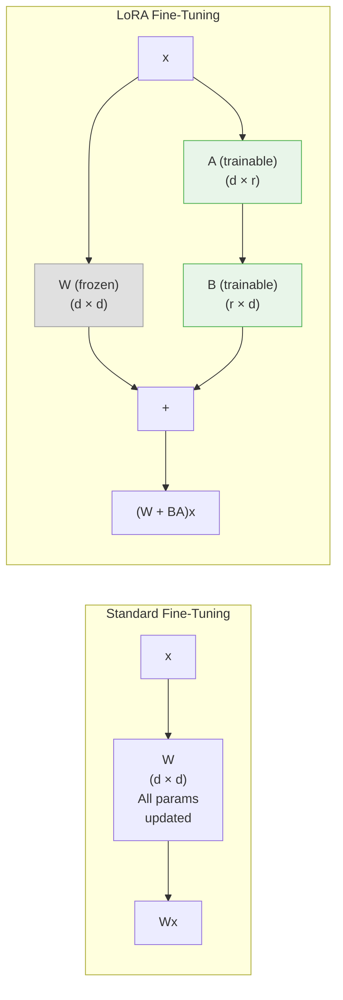
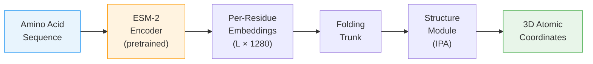

<p style="color: #666; font-size: 0.9em; margin-bottom: 1.5em;"><em>This is Lecture 3 of the Protein & Artificial Intelligence course (Spring 2026), co-taught by Prof. Sungsoo Ahn and Prof. Homin Kim at KAIST. The course covers computational methods at the intersection of machine learning and protein science. Lecture 1 introduced transformers and graph neural networks; Lecture 2 covered generative models (VAEs and diffusion). Here we turn to protein language models, the self-supervised approach that learns rich representations directly from raw protein sequences.</em></p>

## Introduction

What if amino acid sequences are sentences, and evolution is the author?

This is not a loose metaphor.
Over four billion years, natural selection has tested protein sequences against the harshest possible critic: survival.
The sequences we observe today are the ones that fold correctly, carry out their functions, and keep their organisms alive.
They are, in a precise statistical sense, the *grammatically correct* sentences in the language of life.

Protein language models (pLMs) take this analogy seriously.
They apply the same masked-prediction training that powers BERT and GPT to hundreds of millions of protein sequences, learning representations that encode evolutionary constraints, structural contacts, and functional motifs---all without a single experimental label.

The payoff is broad.
ESM-2 embeddings improve virtually every protein-understanding task that has been tested.
Zero-shot mutation scoring rivals purpose-built predictors.
ESMFold predicts three-dimensional structure from a single sequence, without multiple sequence alignments.
And LoRA fine-tuning makes all of this accessible on a single GPU.

This lecture develops the ideas behind protein language models from the ground up, starting with the protein-language analogy, moving through the masked language modeling objective, and arriving at practical tools for extracting embeddings, scoring mutations, fine-tuning with LoRA, and predicting structure.

### Roadmap

| Section | Why it is needed |
|---|---|
| [The Protein-Language Analogy](#the-protein-language-analogy) | Motivates why NLP techniques transfer to proteins |
| [Learning from Evolutionary Experiments](#learning-from-billions-of-evolutionary-experiments) | Explains the self-supervised signal hiding in sequence databases |
| [Masked Language Modeling](#masked-language-modeling) | Introduces the training objective that drives pLMs |
| [ESM-2 Architecture and Model Family](#esm-2-architecture-and-model-family) | Describes the state-of-the-art pLM and its Transformer backbone |
| [Extracting and Using Embeddings](#extracting-and-using-embeddings) | Shows how to get per-residue and sequence-level representations |
| [Zero-Shot Mutation Prediction](#zero-shot-mutation-prediction) | Demonstrates label-free fitness estimation |
| [Fine-Tuning for Specific Tasks](#fine-tuning-for-specific-tasks) | Adapts pLM representations to labeled datasets |
| [LoRA: Efficient Adaptation](#lora-efficient-adaptation) | Reduces trainable parameters to less than 1% |
| [ESMFold: From Embeddings to Structure](#esmfold-from-embeddings-to-structure) | Predicts 3D coordinates from a single sequence |
| [Attention Maps as Structure Windows](#attention-maps-as-structure-windows) | Interprets what the model has learned about contacts |
| [The Broader pLM Landscape](#the-broader-plm-landscape) | Surveys alternative models and their niches |
| [Practical Considerations](#practical-considerations) | Guides model selection, memory budgets, and batch processing |
| [Exercises](#exercises) | Hands-on problems to consolidate understanding |

---

## The Protein-Language Analogy

Before introducing any formulas, let us build intuition by placing proteins and natural language side by side.

In English, words combine into sentences according to grammatical rules.
Some word combinations are meaningful; most are not.
The meaning of a word depends on context: "bank" means one thing in "river bank" and another in "bank account."
Synonyms exist---words that differ in form but serve similar functions.
And language evolves over time while preserving core structural principles.

Proteins share every one of these properties.

**Amino acids are words.**
Twenty distinct chemical building blocks serve as the vocabulary[^selenocysteine].
Each has a characteristic side chain that determines its chemical personality: hydrophobic, charged, polar, aromatic, and so on.

[^selenocysteine]: Strictly speaking, there are 22 genetically encoded amino acids if we include selenocysteine and pyrrolysine, but the standard vocabulary for most pLMs uses the canonical 20.

**Protein sequences are sentences.**
A linear chain of amino acids encodes a specific three-dimensional structure and biological function, just as a sentence encodes meaning through a linear arrangement of words.

**Biochemical constraints are grammar.**
Most random strings of amino acids will not fold into stable structures.
They aggregate, misfold, or fail to function.
The sequences we observe in nature have passed through the filter of natural selection, which permits only "grammatically correct" protein sentences to survive.
This is analogous to the observation that most random strings of English letters do not form valid sentences.

**Context determines meaning.**
The same amino acid plays different roles depending on its neighbors.
A hydrophobic residue buried in the protein core contributes to thermodynamic stability.
The same residue on the protein surface might create a binding interface for a partner protein.
Histidine can act as a catalytic acid-base in an enzyme active site, coordinate a metal ion, or play a purely structural role---all depending on its sequence context.

**Conservative substitutions are synonyms.**
Leucine and isoleucine are both large, branched, hydrophobic amino acids.
In many sequence positions, one can replace the other without destroying function, just as "big" and "large" can often substitute for each other in English.
This is not random; it reflects the underlying biochemistry, the *semantics* of the protein language.

**Co-evolution mirrors co-occurrence.**
In English, "salt" frequently co-occurs with "pepper."
In proteins, pairs of residues that are in physical contact in the three-dimensional structure tend to mutate in a correlated fashion[^dca].
If one partner changes, the other compensates to maintain the interaction.
This co-evolutionary signal is the protein equivalent of word co-occurrence statistics.

[^dca]: This principle underlies direct coupling analysis (DCA) and related evolutionary coupling methods that predate deep learning approaches to contact prediction.

The following table summarizes the correspondence:

| Natural Language | Protein Language |
|---|---|
| Words / tokens | Amino acids |
| Sentences | Protein sequences |
| Grammar rules | Biochemical and physical constraints |
| Semantics (meaning) | Three-dimensional structure and function |
| Synonyms | Functionally equivalent substitutions (e.g., Leu / Ile) |
| Word co-occurrence | Co-evolution of contacting residues |
| Corpus of text | Protein sequence databases (UniProt, UniRef) |

This structural parallel suggests a concrete research strategy: apply the same machine learning techniques that have transformed natural language processing to protein sequences.
As we will see, the results exceed what the analogy alone might lead us to expect.

---

## Learning from Billions of Evolutionary Experiments

Why should a model trained to fill in missing amino acids learn anything useful about protein biology?

The answer lies in what the training data actually represents.
The UniProt database contains over 200 million protein sequences, and metagenomic surveys are adding billions more.
Each of these sequences is the outcome of a successful evolutionary experiment---a design that folds, functions, and keeps its organism alive.
The sequences that failed these tests are absent from our databases because their organisms did not survive.

When a model sees thousands of sequences from a single protein family, it observes statistical regularities that reflect genuine biological constraints:

- **Absolute conservation.** Some positions never change across the entire family.
  These are almost always critical for structure or function---active-site residues, disulfide-bonding cysteines, glycine residues in tight turns.
- **Constrained variation.** Some positions vary, but only within a restricted class of amino acids.
  A position that accepts leucine, isoleucine, and valine---but never aspartate---is almost certainly in the hydrophobic core of the protein.
- **Correlated variation.** Some positions change *together*.
  When residue 42 mutates from a small side chain to a large one, residue 108 compensates by mutating from large to small.
  This co-evolutionary signal reveals that the two positions are in spatial contact[^coevolution-structure].

[^coevolution-structure]: The connection between co-evolution and structural contact was exploited by methods such as EVcouplings and GREMLIN before the deep learning era. Protein language models learn the same signal implicitly.

The model does not need to be told about any of these concepts.
It discovers them by learning to predict masked amino acids accurately.
This is the core insight of self-supervised learning applied to biology: the sequences themselves contain the supervision.

The scale of available data makes this approach particularly powerful.
Hundreds of millions of protein sequences represent far more training data than exists for most natural language tasks.
Each sequence is the product of a distinct evolutionary lineage, providing diverse perspectives on what works in protein design.
By learning from this vast corpus, protein language models capture knowledge that would be impossible to encode by hand.

---

## Masked Language Modeling

<div class="col-sm-10 mt-3 mb-3 mx-auto">
    
    <div class="caption mt-1"><strong>Masked Language Modeling for proteins.</strong> Random amino acid positions are replaced with [MASK] tokens. The transformer encoder must predict the original identity at each masked position from the surrounding context. This self-supervised objective teaches the model evolutionary and structural constraints without any labels.</div>
</div>

The dominant training strategy for protein language models is **masked language modeling** (MLM)[^mlm-bert].
The concept is a fill-in-the-blank exercise applied at massive scale.

[^mlm-bert]: MLM was introduced by Devlin et al. (2019) as the training objective for BERT. Its application to proteins was pioneered by Rives et al. (2021) in the ESM family.

### The procedure


1. Take a protein sequence $$x = (x_1, x_2, \ldots, x_L)$$, where $$L$$ is the sequence length and each $$x_i$$ is one of the 20 standard amino acids.
2. Randomly select approximately 15% of positions to form the **mask set** $$\mathcal{M}$$.
3. Replace each selected position with a special `<mask>` token (with some exceptions described below).
4. Feed the corrupted sequence to the model and ask it to predict the original amino acid at each masked position.

### The objective

Let $$\theta$$ denote the model parameters and $$\mathcal{D}$$ denote the training set of protein sequences.
The MLM loss is:

$$
\mathcal{L}_{\text{MLM}} = -\mathbb{E}_{x \sim \mathcal{D}} \left[ \sum_{i \in \mathcal{M}} \log p_{\theta}(x_i \mid x_{\setminus \mathcal{M}}) \right]
$$

In words: maximize the log-probability that the model assigns to the correct amino acid $$x_i$$ at each masked position $$i$$, conditioned on all the *unmasked* positions $$x_{\setminus \mathcal{M}}$$.
The expectation is taken over sequences drawn from the training set.

No labels are required.
The raw sequences provide both the input (after masking) and the target (the original identities of the masked residues).
This makes MLM a form of **self-supervised learning**, and it is the reason protein language models can exploit the full scale of sequence databases.

### The masking strategy

Following the protocol introduced by BERT, the 15% of selected positions are not all treated identically:

- **80%** receive the `<mask>` token.
- **10%** are replaced with a *random* amino acid drawn uniformly from the vocabulary.
- **10%** are left unchanged.

This mixture prevents the model from learning a shortcut that only works when it sees the `<mask>` token.
By occasionally presenting random or unchanged tokens, the training forces the model to build representations that are useful regardless of whether a position is marked as masked.

### Implementation

The following code illustrates how masking works in practice:

```python
import torch

def mask_tokens(sequence, vocab_size, mask_token_id, mask_prob=0.15):
    """
    Apply the BERT-style masking strategy to a protein sequence.

    Args:
        sequence: Tensor of token IDs representing amino acids.
        vocab_size: Number of amino acid tokens in the vocabulary.
        mask_token_id: Integer ID of the <mask> token.
        mask_prob: Fraction of positions to mask (default 0.15).

    Returns:
        masked_sequence: The corrupted input sequence.
        labels: Original token IDs at masked positions; -100 elsewhere
                (so the loss function ignores unmasked positions).
    """
    labels = sequence.clone()

    # Step 1: Randomly select positions to mask
    probability_matrix = torch.full(sequence.shape, mask_prob)
    masked_indices = torch.bernoulli(probability_matrix).bool()

    # Only compute loss on masked positions
    labels[~masked_indices] = -100

    # Step 2: Of the masked positions, 80% get the <mask> token
    indices_replaced = (
        torch.bernoulli(torch.full(sequence.shape, 0.8)).bool()
        & masked_indices
    )
    sequence[indices_replaced] = mask_token_id

    # Step 3: 10% get a random amino acid
    indices_random = (
        torch.bernoulli(torch.full(sequence.shape, 0.5)).bool()
        & masked_indices
        & ~indices_replaced
    )
    random_tokens = torch.randint(vocab_size, sequence.shape)
    sequence[indices_random] = random_tokens[indices_random]

    # Step 4: The remaining 10% stay unchanged (no code needed)
    return sequence, labels
```

### MLM versus autoregressive modeling

An alternative to MLM is **autoregressive** (left-to-right) modeling, where the model predicts each amino acid conditioned only on the preceding ones:

$$
p(x) = \prod_{i=1}^{L} p(x_i \mid x_1, \ldots, x_{i-1})
$$

Models such as ProGen and ProtGPT2 use this approach.
Autoregressive modeling is natural for *generation* tasks---you sample one amino acid at a time and build a sequence from left to right.
However, for *understanding* tasks (embedding extraction, property prediction, mutation scoring), MLM is generally preferred because it produces **bidirectional** representations.
Each position is influenced by context on *both* sides, not just the left.

---

## ESM-2 Architecture and Model Family

**ESM-2** (Evolutionary Scale Modeling 2), developed by researchers at Meta AI, is the current state of the art among protein language models .
It combines the Transformer architecture with large-scale training on protein sequence databases, producing representations that capture evolutionary, structural, and functional information.

<div class="col-sm-9 mt-3 mb-3 mx-auto">
    
    <div class="caption mt-1">The ESM-2 model family spans four orders of magnitude in size, from 8M to 15B parameters. Performance on downstream tasks (here, long-range contact prediction precision) improves steadily with model scale, following a scaling law consistent with findings in natural language processing.</div>
</div>

### Training data

ESM-2 was trained on **UniRef50**, a clustered version of the UniProt database containing roughly 60 million representative protein sequences.
Clustering at 50% sequence identity ensures that the training set is diverse: no two sequences in UniRef50 share more than half their residues[^uniref].

[^uniref]: UniRef clusters are created by the UniProt consortium. UniRef50 clusters sequences at 50% identity; UniRef90 at 90%. ESM-2 uses UniRef50 for maximum diversity.

### The Transformer backbone

ESM-2 is built on the Transformer architecture introduced in Lecture 1.
The core component is the **self-attention mechanism**, which allows each position in the sequence to attend to every other position:

$$
\text{Attention}(Q, K, V) = \text{softmax}\!\left(\frac{QK^{T}}{\sqrt{d_k}}\right) V
$$

Here $$Q$$, $$K$$, and $$V$$ are the query, key, and value matrices, obtained by projecting the input embeddings through learned weight matrices $$W_Q$$, $$W_K$$, and $$W_V$$.
The scalar $$d_k$$ is the dimension of the key vectors; dividing by $$\sqrt{d_k}$$ prevents the dot products from growing too large before the softmax.

This mechanism is essential for proteins.
Amino acids that are far apart in sequence---say, positions 10 and 150---may be in direct physical contact in the folded structure.
A model limited to local context would miss such long-range interactions entirely.
Attention connects every position to every other position in a single layer.

ESM-2 uses **multi-head attention**, splitting the representation into multiple independent attention "heads" that each learn different types of relationships (sequential proximity, co-evolutionary coupling, structural contacts, etc.).

### Architectural refinements

ESM-2 incorporates three refinements over a vanilla Transformer:

**Rotary Position Embeddings (RoPE).**
Instead of adding fixed or learned position embeddings to the input, RoPE encodes relative positions by rotating the query and key vectors.
This helps the model generalize to sequences longer than those seen during training, because the attention score between two positions depends on their *relative distance* rather than their absolute positions.

**Pre-layer normalization.**
Layer normalization is applied *before* the attention and feedforward operations, rather than after.
This simple change stabilizes training, especially for very deep models with dozens of layers.

**SwiGLU activation.**
The feedforward sublayers use SwiGLU instead of the standard ReLU or GELU.
SwiGLU combines the Swish activation[^swish] (introduced in Preliminary Note 2) with a linear gating mechanism, providing more expressive nonlinear transformations:

[^swish]: Swish, also known as SiLU (Sigmoid Linear Unit), is defined as $$\text{Swish}(x) = x \cdot \sigma(x)$$, where $$\sigma$$ is the sigmoid function.

```python
import torch.nn as nn

class SwiGLU(nn.Module):
    """
    SwiGLU activation for Transformer feedforward layers.

    Given hidden state x of dimension hidden_size, SwiGLU computes:
        output = W3 * (SiLU(W1 * x) * W2 * x)
    where W1, W2 project to intermediate_size and W3 projects back.
    """
    def __init__(self, hidden_size, intermediate_size):
        super().__init__()
        self.w1 = nn.Linear(hidden_size, intermediate_size, bias=False)
        self.w2 = nn.Linear(hidden_size, intermediate_size, bias=False)
        self.w3 = nn.Linear(intermediate_size, hidden_size, bias=False)

    def forward(self, x):
        return self.w3(nn.functional.silu(self.w1(x)) * self.w2(x))
```

### The ESM-2 model family

ESM-2 is available in six sizes, offering a tradeoff between performance and computational cost:

| Model | Parameters | Layers | Embedding dim | Typical use case |
|---|---|---|---|---|
| ESM-2 8M | 8M | 6 | 320 | Quick prototyping, CPU-friendly |
| ESM-2 35M | 35M | 12 | 480 | Lightweight experiments |
| ESM-2 150M | 150M | 30 | 640 | Good accuracy-cost balance |
| ESM-2 650M | 650M | 33 | 1280 | High performance, fits on a single GPU |
| ESM-2 3B | 3B | 36 | 2560 | Near-state-of-the-art results |
| ESM-2 15B | 15B | 48 | 5120 | Maximum performance, requires multi-GPU |

For most research applications, the **650M-parameter** model (denoted `esm2_t33_650M_UR50D`) provides the best balance.
It runs comfortably on a single NVIDIA A100 or even a consumer RTX 3090, and its 1280-dimensional embeddings are nearly as informative as those from the 3B or 15B models.

### What does ESM-2 learn?

Without any supervision beyond the MLM objective, ESM-2 representations encode:

- **Secondary structure.** Residues in alpha-helices, beta-sheets, and loops occupy distinct regions of embedding space.
- **Solvent accessibility.** Buried (hydrophobic core) and exposed (surface) residues are readily distinguishable.
- **Functional sites.** Active-site residues, metal-binding sites, and other functional motifs have characteristic embedding signatures.
- **Evolutionary conservation.** Highly conserved positions produce embeddings distinct from variable ones.
- **Structural contacts.** Positions that are close in three-dimensional space have correlated embeddings, even when far apart in sequence.

These properties emerge from learning to predict masked amino acids.
The model is never told about structure, function, or conservation; it discovers them because they are encoded in the statistical patterns of protein sequences.

---

## Extracting and Using Embeddings

One of the most practical applications of ESM-2 is **embedding extraction**: passing a protein sequence through the model and collecting the internal representations for use in downstream tasks.

### Per-residue embeddings

For a protein of length $$L$$ processed by the 650M model, we obtain a matrix of shape $$(L, 1280)$$: one 1280-dimensional vector for each amino acid position.
Each vector encodes information about that residue in the context of the full sequence.

### Sequence-level embeddings

For tasks that require a single vector representing the entire protein (e.g., subcellular localization prediction, function classification), we need a **pooling** strategy to aggregate the $$L$$ per-residue vectors into one.
The simplest and most common approach is **mean pooling**: averaging across all residue positions.
Alternatives include using the embedding of a special beginning-of-sequence (BOS) token, or attention-weighted pooling that gives higher weight to "important" positions.

### Code: extracting ESM-2 embeddings

```python
import torch
import esm

def extract_esm_embeddings(sequences, model_name="esm2_t33_650M_UR50D"):
    """
    Extract ESM-2 embeddings for a list of protein sequences.

    Args:
        sequences: List of (label, sequence_string) tuples.
            Example: [("lysozyme", "MKALIVLGL..."), ("GFP", "MSKGEEL...")]
        model_name: Which ESM-2 checkpoint to use.

    Returns:
        Dictionary mapping each label to:
            - 'per_residue': Tensor of shape [L, 1280], one vector per position
            - 'mean': Tensor of shape [1280], the mean-pooled representation
    """
    # Load model and alphabet (tokenizer)
    model, alphabet = esm.pretrained.load_model_and_alphabet(model_name)
    batch_converter = alphabet.get_batch_converter()
    model.eval()

    device = torch.device("cuda" if torch.cuda.is_available() else "cpu")
    model = model.to(device)

    # Tokenize: converts amino acid strings to integer token IDs
    batch_labels, batch_strs, batch_tokens = batch_converter(sequences)
    batch_tokens = batch_tokens.to(device)

    # Forward pass: request representations from the last layer (layer 33)
    with torch.no_grad():
        results = model(
            batch_tokens,
            repr_layers=[33],      # extract from layer 33
            return_contacts=True   # also compute attention-based contacts
        )

    token_embeddings = results["representations"][33]

    # Package results, trimming the special BOS/EOS tokens
    embeddings = {}
    for i, (label, seq) in enumerate(sequences):
        seq_len = len(seq)
        # Positions 1 through seq_len correspond to actual residues
        # (position 0 is the BOS token)
        per_res = token_embeddings[i, 1:seq_len + 1].cpu()   # [L, 1280]
        embeddings[label] = {
            'per_residue': per_res,
            'mean': per_res.mean(dim=0),                       # [1280]
        }

    return embeddings

# --- Example usage ---
# seqs = [("T4_lysozyme", "MNIFEMLRIDE...")]
# emb = extract_esm_embeddings(seqs)
# print(emb["T4_lysozyme"]["mean"].shape)   # torch.Size([1280])
```

These embeddings can then serve as input features for any downstream predictor---a linear classifier, a small feedforward network, or a more complex model.
In many benchmarks, simply training a logistic regression on ESM-2 mean-pooled embeddings outperforms hand-crafted feature pipelines that took decades to develop.

---

## Zero-Shot Mutation Prediction

Perhaps the most striking capability of protein language models is **zero-shot prediction of mutational effects**.
Without any fine-tuning or task-specific labels, ESM-2 can estimate whether a single amino acid substitution is likely to be beneficial, neutral, or deleterious.

### The intuition

The model has learned the distribution of natural, functional protein sequences.
A mutation that pushes a sequence *away* from this distribution---into regions of sequence space that evolution has avoided---is likely to be harmful.
A mutation that keeps the sequence *within* the distribution is likely to be tolerated.

### The procedure

Let $$s$$ be the wild-type sequence, and suppose we want to score the mutation from amino acid $$a_{\text{wt}}$$ to $$a_{\text{mut}}$$ at position $$i$$.

1. **Mask** position $$i$$ in the sequence, replacing it with the `<mask>` token.
2. **Run** the masked sequence through the model to obtain predicted probabilities over the 20 amino acids at position $$i$$.
3. **Compare** the log-probability of the mutant amino acid to the log-probability of the wild-type amino acid:

$$
\Delta_{\text{score}} = \log p_{\theta}(a_{\text{mut}} \mid s_{\setminus i}) - \log p_{\theta}(a_{\text{wt}} \mid s_{\setminus i})
$$

A positive score means the model considers the mutant amino acid *more likely* than the wild type at that position, suggesting the mutation may be tolerated or even beneficial.
A negative score means the mutation moves away from the learned evolutionary distribution, suggesting it may be deleterious.

### Code: scoring a single mutation

```python
import torch

def predict_mutation_effect(sequence, position, original_aa, mutant_aa,
                            model, alphabet):
    """
    Score a single amino acid substitution using ESM-2 log-likelihood ratio.

    Args:
        sequence: Wild-type amino acid string (e.g., "MKTLLILAVVA").
        position: 0-indexed position of the mutation.
        original_aa: Single-letter code of the wild-type amino acid.
        mutant_aa: Single-letter code of the mutant amino acid.
        model: Loaded ESM-2 model (in eval mode).
        alphabet: ESM-2 alphabet object.

    Returns:
        float: Log-likelihood ratio.
            Positive  -> mutation may be tolerated or favorable.
            Negative  -> mutation is likely deleterious.
    """
    batch_converter = alphabet.get_batch_converter()

    # Create the masked sequence by replacing position i with <mask>
    seq_list = list(sequence)
    seq_list[position] = '<mask>'
    masked_seq = ''.join(seq_list)

    # Tokenize and run the model
    _, _, tokens = batch_converter([("seq", masked_seq)])
    tokens = tokens.to(next(model.parameters()).device)

    with torch.no_grad():
        logits = model(tokens)["logits"]

    # Convert logits to log-probabilities at the masked position
    # Note: position + 1 because the first token is the BOS token
    log_probs = torch.log_softmax(logits[0, position + 1], dim=-1)

    # Look up indices for the wild-type and mutant amino acids
    wt_idx = alphabet.get_idx(original_aa)
    mt_idx = alphabet.get_idx(mutant_aa)

    # Return the log-likelihood ratio
    return (log_probs[mt_idx] - log_probs[wt_idx]).item()
```

### Why does this work?

The model has absorbed the outcomes of hundreds of millions of evolutionary experiments.
At any given position, it has seen which amino acids appear across all known homologs and which are absent.
Mutations to amino acids that never appear at a position in any natural sequence receive low probability and negative scores.
Mutations to amino acids that are common at that position receive high probability and scores near zero or positive.

This captures the essence of evolutionary constraint.
Studies have shown that ESM-2 zero-shot scores correlate well with experimentally measured mutational fitness values from deep mutational scanning (DMS) experiments .
In many cases, the zero-shot predictor matches or exceeds the performance of supervised methods trained directly on experimental data.

### Practical significance

Experimental measurement of mutational effects is expensive and slow.
A typical DMS experiment covers all single-point mutations of a single protein, requires specialized equipment, and can take months.
Zero-shot pLM scoring provides an instant, free estimate that can:

- Prioritize mutations for experimental testing.
- Flag potentially harmful variants in clinical genomics.
- Guide protein engineering campaigns toward productive regions of sequence space.

---

## Fine-Tuning for Specific Tasks

While zero-shot capabilities are impressive, **fine-tuning** ESM-2 on task-specific labeled data can further improve performance.
Fine-tuning adapts the pretrained representations to a particular problem, learning which aspects of the embeddings are most relevant for the task at hand.

### Sequence classification

For tasks that assign a single label to an entire protein---such as predicting subcellular localization, enzyme class, or thermostability---we add a **classification head** on top of the mean-pooled ESM-2 embedding:

```python
import torch.nn as nn

class ESMClassifier(nn.Module):
    """
    Sequence-level classifier built on top of ESM-2 embeddings.

    Architecture:
        ESM-2 backbone -> mean pooling -> dropout -> MLP -> class logits
    """
    def __init__(self, esm_model, hidden_dim=1280, num_classes=10,
                 dropout=0.1):
        super().__init__()
        self.esm = esm_model
        self.dropout = nn.Dropout(dropout)
        self.classifier = nn.Sequential(
            nn.Linear(hidden_dim, hidden_dim // 2),
            nn.ReLU(),
            nn.Dropout(dropout),
            nn.Linear(hidden_dim // 2, num_classes)
        )

    def forward(self, tokens):
        # Extract ESM-2 embeddings from the last Transformer layer
        outputs = self.esm(tokens, repr_layers=[33])
        embeddings = outputs["representations"][33]   # [B, L, 1280]

        # Mean pooling over residue positions (exclude special tokens)
        # Token IDs 0, 1, 2 are padding, BOS, EOS respectively
        mask = (tokens != 0) & (tokens != 1) & (tokens != 2)
        mask = mask.unsqueeze(-1).float()             # [B, L, 1]
        pooled = (embeddings * mask).sum(1) / mask.sum(1)  # [B, 1280]

        return self.classifier(self.dropout(pooled))  # [B, num_classes]
```

### Per-residue prediction

For tasks that require a prediction at every position---such as secondary structure classification (helix / sheet / coil) or binding-site identification---we apply a classifier independently to each residue embedding:

```python
class ESMTokenClassifier(nn.Module):
    """
    Per-residue classifier built on ESM-2 embeddings.

    Useful for secondary structure prediction (3 classes: H, E, C),
    binding site detection, or disorder prediction.
    """
    def __init__(self, esm_model, hidden_dim=1280, num_labels=3):
        super().__init__()
        self.esm = esm_model
        self.classifier = nn.Sequential(
            nn.Linear(hidden_dim, hidden_dim // 4),
            nn.ReLU(),
            nn.Linear(hidden_dim // 4, num_labels)
        )

    def forward(self, tokens):
        outputs = self.esm(tokens, repr_layers=[33])
        embeddings = outputs["representations"][33]   # [B, L, 1280]
        return self.classifier(embeddings)            # [B, L, num_labels]
```

### Full fine-tuning versus frozen backbone

Two strategies exist for fine-tuning:

1. **Frozen backbone.** Freeze all ESM-2 parameters and train only the classification head. This is fast and requires minimal GPU memory, but the representations are not adapted to the task.
2. **Full fine-tuning.** Update all parameters, including the ESM-2 backbone. This typically gives the best performance but is computationally expensive and risks **catastrophic forgetting**: the model may lose its general-purpose capabilities as it overfits to the small task-specific dataset.

In practice, a middle ground often works best: freeze most of the ESM-2 layers and fine-tune only the last few, along with the classification head.
Or, better yet, use LoRA.

---

## LoRA: Efficient Adaptation



Full fine-tuning of a 650M-parameter model requires storing optimizer states and gradients for every parameter, which can demand 10--20 GB of GPU memory.
For the 3B or 15B variants, full fine-tuning is out of reach for most research labs.

**Low-Rank Adaptation (LoRA)** offers an elegant solution .

### The key insight

During fine-tuning, the weight updates $$\Delta W$$ are typically **low-rank**.
That is, the changes needed to adapt a pretrained model to a new task can be captured by a matrix of much lower rank than the original weight matrix.

### The formulation

For a pretrained weight matrix $$W \in \mathbb{R}^{d \times k}$$, LoRA decomposes the update into two small matrices:

- $$B \in \mathbb{R}^{d \times r}$$ (the "down-projection")
- $$A \in \mathbb{R}^{r \times k}$$ (the "up-projection")

where $$r$$ is the **rank**, a hyperparameter typically set to 4, 8, or 16.
The adapted weight matrix is:

$$
W_{\text{adapted}} = W_{\text{original}} + BA
$$

During the forward pass, the output for input $$x$$ is:

$$
h = W_{\text{original}} \cdot x + \frac{\alpha}{r} \cdot B A \cdot x
$$

The scalar $$\alpha$$ (often called `lora_alpha`) controls the magnitude of the adaptation relative to the original weights.
The ratio $$\alpha / r$$ serves as a learning rate scaling factor for the LoRA branch.

### Why LoRA works

**Massive parameter reduction.**
For a 1280-by-1280 weight matrix (1,638,400 parameters), LoRA with $$r = 8$$ introduces only $$1280 \times 8 + 8 \times 1280 = 20{,}480$$ trainable parameters---a 80-fold reduction.
Across an entire model, the total trainable parameter count drops to less than 1% of the original.

**Memory efficiency.**
Only the small LoRA matrices require optimizer states and gradients.
The original model weights remain frozen in memory but do not need gradient storage.

**No catastrophic forgetting.**
Because the original weights are untouched, the model retains its general-purpose capabilities.
Removing the LoRA adapter restores the original model exactly.

**Easy task switching.**
Different LoRA adapters (one per task) can be swapped in and out without reloading the base model.
This enables efficient multi-task deployment.

### Implementation from scratch

```python
import math
import torch
import torch.nn as nn

class LoRALayer(nn.Module):
    """
    Low-Rank Adaptation wrapper around a frozen linear layer.

    Args:
        original_layer: The pretrained nn.Linear to adapt.
        r: Rank of the low-rank matrices (default 8).
        alpha: Scaling factor (default 16).
        dropout: Dropout rate on the LoRA branch (default 0.1).
    """
    def __init__(self, original_layer, r=8, alpha=16, dropout=0.1):
        super().__init__()
        self.original_layer = original_layer
        self.r = r
        self.alpha = alpha

        in_features = original_layer.in_features
        out_features = original_layer.out_features

        # Freeze the original weights
        for param in self.original_layer.parameters():
            param.requires_grad = False

        # LoRA matrices: A is initialized with Kaiming, B with zeros
        # This ensures the LoRA branch outputs zero at the start of training
        self.lora_A = nn.Parameter(torch.zeros(r, in_features))
        self.lora_B = nn.Parameter(torch.zeros(out_features, r))
        nn.init.kaiming_uniform_(self.lora_A, a=math.sqrt(5))
        nn.init.zeros_(self.lora_B)

        self.dropout = nn.Dropout(dropout)
        self.scaling = alpha / r

    def forward(self, x):
        # Original (frozen) forward pass
        result = self.original_layer(x)

        # LoRA branch: x -> dropout -> A^T -> B^T -> scale
        lora_out = self.dropout(x) @ self.lora_A.T @ self.lora_B.T
        return result + lora_out * self.scaling
```

### Using LoRA with the PEFT library

In practice, the `peft` library from Hugging Face makes applying LoRA straightforward.
LoRA is typically applied to the **query** and **value** projection matrices in each attention layer, which have been empirically found to benefit most from adaptation:

```python
from transformers import EsmForSequenceClassification
from peft import get_peft_model, LoraConfig, TaskType

def create_lora_model(model_name, num_labels, r=8, alpha=16):
    """
    Wrap an ESM-2 model with LoRA adapters using Hugging Face PEFT.

    Args:
        model_name: HuggingFace model ID, e.g. "facebook/esm2_t33_650M_UR50D"
        num_labels: Number of output classes.
        r: LoRA rank.
        alpha: LoRA scaling factor.

    Returns:
        PEFT-wrapped model with only LoRA parameters trainable.
    """
    # Load the base ESM-2 model with a classification head
    model = EsmForSequenceClassification.from_pretrained(
        model_name, num_labels=num_labels
    )

    # Configure LoRA: target the attention projection matrices
    lora_config = LoraConfig(
        task_type=TaskType.SEQ_CLS,
        r=r,
        lora_alpha=alpha,
        lora_dropout=0.1,
        target_modules=["query", "key", "value"],
        bias="none"
    )

    peft_model = get_peft_model(model, lora_config)

    # Print summary: expect ~0.1-0.5% trainable parameters
    peft_model.print_trainable_parameters()
    return peft_model

# Example:
# model = create_lora_model("facebook/esm2_t33_650M_UR50D", num_labels=2)
# Output: "trainable params: 1,327,106 || all params: 652,528,898 || trainable%: 0.20"
```

LoRA has democratized fine-tuning of large protein language models.
Tasks that once required clusters of A100 GPUs can now be performed on a single consumer-grade GPU with 12--16 GB of memory.

---

## ESMFold: From Embeddings to Structure

The ultimate test of whether a language model truly "understands" proteins is whether its representations contain enough information to predict three-dimensional structure.
**ESMFold** demonstrates that they do .

### Architecture



ESMFold takes a protein sequence, passes it through the ESM-2 backbone to produce per-residue embeddings, and then feeds those embeddings into a structure prediction module that generates atomic coordinates.
The structure module is similar to the one used in AlphaFold2, operating on pairwise representations and iteratively refining coordinates.

### The key difference from AlphaFold2

AlphaFold2 requires a **multiple sequence alignment** (MSA) as input (introduced in Preliminary Note 1): a collection of evolutionary relatives of the query protein, aligned position by position.
Constructing this MSA is computationally expensive, often taking minutes to hours for a single protein.

ESMFold requires only a **single sequence**.
The ESM-2 embeddings already encode the evolutionary information that AlphaFold2 extracts from the MSA, because the language model has internalized this information during pretraining.
This makes ESMFold dramatically faster---seconds per structure instead of minutes.

### Code: predicting structure with ESMFold

```python
import torch
import esm

def predict_structure(sequence):
    """
    Predict protein 3D structure from a single amino acid sequence.

    Args:
        sequence: Amino acid string (e.g., "MKTLLILAVVA...").

    Returns:
        PDB-formatted string containing the predicted atomic coordinates.
    """
    # Load the ESMFold model
    model = esm.pretrained.esmfold_v1()
    model = model.eval()

    if torch.cuda.is_available():
        model = model.cuda()

    # Predict structure (returns a PDB string)
    with torch.no_grad():
        pdb_string = model.infer_pdb(sequence)

    return pdb_string

# Save to file and visualize in PyMOL, ChimeraX, or Mol*:
# with open("predicted.pdb", "w") as f:
#     f.write(predict_structure("MKTLLILAVVA..."))
```

### Performance

On the CAMEO benchmark (blind structure prediction), ESMFold achieves accuracy competitive with AlphaFold2 for many protein domains, especially those with abundant homologs in the training set.
For proteins with few known relatives---so-called "orphan" or "dark" proteins---ESMFold's accuracy can drop, because the language model has less evolutionary context to draw on.

The success of ESMFold demonstrates something profound: the statistical patterns in sequence data encode sufficient information to recover three-dimensional structure.
The grammar of proteins is inseparable from their physics.

---

## Attention Maps as Structure Windows

The attention mechanism in ESM-2 is not just a computational tool; it provides an **interpretable window** into what the model has learned.

### Attention correlates with structural contacts

Each attention head computes a matrix of attention weights, one weight for every pair of positions in the sequence.
Research has shown that these attention patterns correlate with **residue-residue contacts** in the three-dimensional structure .
Positions that are close in space (within about 8 Angstroms) tend to attend strongly to each other, even when they are far apart in sequence.

This means the model has discovered, purely from sequence statistics, the same principle that underlies evolutionary coupling analysis: co-evolving residues are in structural contact.

<div class="col-sm-10 mt-3 mb-3 mx-auto">
    
    <div class="caption mt-1"><strong>Attention weights predict structural contacts.</strong> Left: true residue-residue contact map from a crystal structure. Center: attention weights from ESM-2, averaged across heads. Right: overlay showing that high-attention pairs correspond to true long-range contacts. The model discovers 3D proximity from sequence data alone.</div>
</div>

<div class="col-sm-10 mt-3 mb-3 mx-auto">
    
    <div class="caption mt-1"><strong>Attention as structure predictor.</strong> Left: ESM-2 attention map (averaged over heads and layers) for a 50-residue protein. Right: true structural contacts (8 Å threshold). The strong correspondence demonstrates that protein language models learn to encode 3D structural information purely from sequence statistics.</div>
</div>

### Code: extracting and processing attention maps

```python
import torch

def extract_attention_maps(model, tokens, layer=-1):
    """
    Extract attention maps from a specific ESM-2 layer.

    Args:
        model: Loaded ESM-2 model.
        tokens: Tokenized input (shape [1, L]).
        layer: Which layer to extract from (-1 = last layer).

    Returns:
        Attention tensor of shape [num_heads, L, L].
    """
    with torch.no_grad():
        outputs = model(tokens, return_contacts=True)

    attentions = outputs["attentions"]
    return attentions[layer][0]   # [num_heads, L, L]


def attention_to_contacts(attention, threshold=0.5):
    """
    Derive a predicted contact map from attention weights.

    Steps:
        1. Average over attention heads.
        2. Symmetrize (contacts are undirected).
        3. Apply APC (Average Product Correction) to remove background.
        4. Threshold to get binary predictions.

    Args:
        attention: Tensor of shape [num_heads, L, L].
        threshold: Cutoff for binary contact prediction.

    Returns:
        Binary contact map of shape [L, L].
    """
    # Average over heads
    attn_mean = attention.mean(0)                     # [L, L]

    # Symmetrize: contacts are undirected
    attn_sym = (attn_mean + attn_mean.T) / 2

    # APC correction: remove phylogenetic background signal
    row_mean = attn_sym.mean(1, keepdim=True)
    col_mean = attn_sym.mean(0, keepdim=True)
    overall_mean = attn_sym.mean()
    apc = (row_mean * col_mean) / overall_mean
    corrected = attn_sym - apc

    return (corrected > threshold).float()
```

The APC (Average Product Correction) step is borrowed from the evolutionary coupling literature.
It removes the background correlation that arises because all positions share a common phylogenetic history, isolating the direct coupling signal that reflects physical contacts.

### Different heads, different relationships

Not all attention heads learn the same thing.
Studies have found that different heads specialize:

- Some heads capture **sequential proximity**---attending primarily to nearby residues.
- Some capture **long-range contacts**---attending to residues that are far in sequence but close in structure.
- Some appear to encode **secondary structure periodicity**---attending at intervals of 3--4 residues (the pitch of an alpha-helix).

This specialization emerges entirely from the MLM training objective.
No structural supervision is provided.

---

## The Broader pLM Landscape

ESM-2 is the most widely used protein language model, but it is not the only one.
Several alternatives exist, each with distinct strengths.

**ProtTrans** , developed at the Technical University of Munich, offers models based on multiple Transformer architectures---BERT, ALBERT, XLNet, and T5.
The **ProtT5-XL** variant has been particularly popular for per-residue prediction tasks, offering a good balance of performance and efficiency with its encoder-decoder architecture.

**ProGen** and **ProGen2**, developed at Salesforce, use **autoregressive** modeling (left-to-right generation, like GPT).
This makes them especially effective for *protein design* and *sequence generation* tasks, where sampling new sequences from the learned distribution is the goal.

**ProtGPT2** follows a similar autoregressive strategy and has been shown to generate novel protein sequences that fold into stable structures, as validated by AlphaFold2 predictions.

**Ankh**, developed at TU Munich, offers efficient training strategies that achieve competitive performance with significantly less compute than ESM-2, making pretraining more accessible to resource-constrained groups.

**ProteinBERT**, developed at Google, incorporates Gene Ontology (GO) annotations during pretraining.
By jointly predicting masked amino acids and GO terms, it explicitly learns functional information alongside sequence patterns.

| Model | Training objective | Key strength |
|---|---|---|
| ESM-2 | Masked LM | General-purpose embeddings, wide size range |
| ProtT5-XL | Span denoising (T5-style) | Per-residue tasks, encoder-decoder flexibility |
| ProGen / ProGen2 | Autoregressive LM | Sequence generation and design |
| Ankh | Masked LM | Compute-efficient pretraining |
| ProteinBERT | Masked LM + GO prediction | Function-aware representations |

For general-purpose embedding extraction, ESM-2 remains the default choice due to its strong benchmark performance and the availability of models at multiple scales.
For generation tasks, autoregressive models such as ProGen2 are more natural.

---

## Practical Considerations

Deploying protein language models in a research workflow involves several practical choices.

### Model size selection

- **8M / 35M**: Fast inference, CPU-friendly. Good for pipeline prototyping and debugging.
- **150M**: Reasonable performance at low cost. Suitable when GPU resources are limited.
- **650M**: The recommended default. Fits on a single GPU with 4+ GB VRAM for inference, ~16 GB for LoRA fine-tuning.
- **3B / 15B**: Marginal gains over 650M on most tasks. Use when accuracy is paramount and multi-GPU resources are available.

### Sequence length

ESM-2 was trained on sequences up to **1024 amino acids**.
Longer sequences require one of three strategies:

1. **Truncation**: Use only the first 1022 residues (leaving room for BOS/EOS tokens). Information beyond the cutoff is lost.
2. **Chunking**: Split the sequence into overlapping windows, embed each window, and merge the results. Residues in overlapping regions can be averaged.
3. **Longer-context models**: Some newer models support longer sequences natively.

### GPU memory budget

| Model | Inference (approx.) | LoRA fine-tuning (approx.) | Full fine-tuning (approx.) |
|---|---|---|---|
| ESM-2 35M | < 1 GB | ~2 GB | ~4 GB |
| ESM-2 150M | ~1 GB | ~4 GB | ~8 GB |
| ESM-2 650M | ~2.5 GB | ~8 GB | ~24 GB |
| ESM-2 3B | ~12 GB | ~24 GB | ~80 GB+ |

### Batch processing

When embedding many sequences, group them by length and pad within each batch.
The ESM library's `batch_converter` handles this automatically, but custom pipelines should be careful to avoid excessive padding, which wastes compute.

### Reproducibility

Set random seeds (`torch.manual_seed`, `numpy.random.seed`) and use deterministic CUDA operations (`torch.use_deterministic_algorithms(True)`) when comparing methods.
This is especially important for fine-tuning experiments where small differences in initialization can lead to different results.

---

## Key Takeaways

1. **Proteins are a language** with amino acids as tokens, sequences as sentences, and evolutionary constraints as grammar. This structural parallel justifies applying NLP techniques to protein sequences.

2. **Masked language modeling** learns rich representations from raw sequences without any labels. By predicting masked amino acids, the model implicitly discovers conservation, co-evolution, secondary structure, and functional motifs.

3. **ESM-2** is the current state-of-the-art protein language model, available in sizes from 8M to 15B parameters. The 650M model offers the best performance-cost tradeoff for most applications.

4. **ESM-2 embeddings** encode evolutionary, structural, and functional information. They serve as powerful drop-in features for downstream prediction tasks.

5. **Zero-shot mutation prediction** requires no task-specific training. The log-likelihood ratio at a masked position estimates mutational fitness, often matching supervised methods.

6. **LoRA** reduces trainable parameters to less than 1% of the original model, making fine-tuning accessible on consumer GPUs without catastrophic forgetting.

7. **ESMFold** demonstrates that language model embeddings contain sufficient information to predict three-dimensional protein structure from a single sequence.

8. **Attention maps** correlate with structural contacts, revealing that the model has discovered the connection between co-evolution and spatial proximity.

---

## Exercises

**Exercise 1: Embedding Visualization.**
Extract ESM-2 embeddings (mean-pooled) for at least 50 members of a protein family (e.g., kinases from Pfam PF00069, or proteases from PF00089).
Use UMAP or t-SNE to project the 1280-dimensional embeddings into 2D.
Do sequences with similar functions cluster together?
Color the points by organism or subfamily and describe what you observe.

**Exercise 2: Zero-Shot Mutation Benchmark.**
Choose a protein with publicly available deep mutational scanning (DMS) data (e.g., GFP from Sarkisyan et al., 2016, or GB1 from Olson et al., 2014).
Use ESM-2 to compute the log-likelihood ratio for every single-point mutation.
Calculate the Spearman correlation between your predictions and the experimental fitness values.
How does performance vary across different secondary structure regions (helix vs. sheet vs. loop)?

**Exercise 3: LoRA vs. Full Fine-Tuning.**
Take a small binary classification dataset (e.g., thermophilic vs. mesophilic proteins, or soluble vs. membrane proteins).
Compare three approaches: (a) frozen ESM-2 650M backbone + linear head, (b) LoRA fine-tuning of ESM-2 650M (rank 8), and (c) full fine-tuning of ESM-2 35M.
Report accuracy, training time, and peak GPU memory for each.
Which approach gives the best accuracy per unit of compute?

**Exercise 4: Layer-wise Information Content.**
Extract embeddings from *every* layer of ESM-2 650M (layers 1 through 33) for a set of proteins with known secondary structure annotations.
Train a simple linear classifier (logistic regression) on embeddings from each layer to predict secondary structure (H/E/C).
Plot accuracy vs. layer number.
At which layer does structural information peak?
Does the last layer always give the best features?

**Exercise 5: Attention-Derived Contacts.**
For a protein with a known crystal structure (e.g., T4 lysozyme, PDB 2LZM), extract attention maps from ESM-2 and convert them to a predicted contact map using the APC-corrected procedure described in this lecture.
Compare your predicted contacts to the true contact map derived from the crystal structure (define a contact as C-beta distance < 8 Angstroms).
Report precision at $$L/5$$ (the fraction of your top $$L/5$$ predicted contacts that are true contacts, where $$L$$ is the sequence length).
Which attention heads contribute most to contact prediction accuracy?

---

## References

1. Rives, A., Meier, J., Sercu, T., Goyal, S., Lin, Z., Liu, J., Guo, D., Ott, M., Zitnick, C.L., Ma, J., & Fergus, R. (2021). Biological structure and function emerge from scaling unsupervised learning to 250 million protein sequences. *Proceedings of the National Academy of Sciences*, 118(15), e2016239118.

2. Lin, Z., Akin, H., Rao, R., Hie, B., Zhu, Z., Lu, W., Smetanin, N., Verkuil, R., Kabeli, O., Shmueli, Y., dos Santos Costa, A., Fazel-Zarandi, M., Sercu, T., Candido, S., & Rives, A. (2023). Evolutionary-scale prediction of atomic-level protein structure with a language model. *Science*, 379(6637), 1123--1130.

3. Hu, E.J., Shen, Y., Wallis, P., Allen-Zhu, Z., Li, Y., Wang, S., Wang, L., & Chen, W. (2022). LoRA: Low-Rank Adaptation of Large Language Models. *Proceedings of the International Conference on Learning Representations (ICLR)*.

4. Elnaggar, A., Heinzinger, M., Dallago, C., Rehawi, G., Wang, Y., Jones, L., Gibbs, T., Feher, T., Angerer, C., Steinegger, M., Bhowmik, D., & Rost, B. (2022). ProtTrans: Toward understanding the language of life through self-supervised learning. *IEEE Transactions on Pattern Analysis and Machine Intelligence*, 44(10), 7112--7127.

5. Meier, J., Rao, R., Verkuil, R., Liu, J., Sercu, T., & Rives, A. (2021). Language models enable zero-shot prediction of the effects of mutations on protein function. *Advances in Neural Information Processing Systems (NeurIPS)*, 34, 29287--29303.

6. Devlin, J., Chang, M.W., Lee, K., & Toutanova, K. (2019). BERT: Pre-training of deep bidirectional transformers for language understanding. *Proceedings of the 2019 Conference of the North American Chapter of the Association for Computational Linguistics (NAACL)*.

