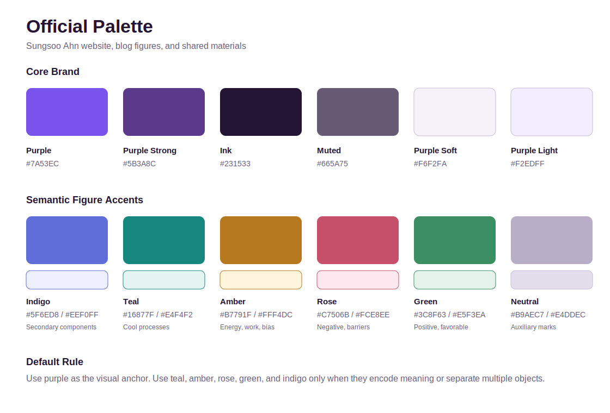

# Official Palette

This is the shared palette for Sungsoo Ahn's website, blog figures, and related presentation materials.

## Core Colors

| Name | Hex | Use |
| --- | --- | --- |
| Purple | `#7A53EC` | Primary brand accent, links, and main figure emphasis |
| Purple Strong | `#5B3A8C` | Dark purple accent, headings, outlines, and hover states |
| Ink | `#231533` | Primary text |
| Muted | `#665A75` | Secondary text and annotations |
| Purple Soft | `#F6F2FA` | Soft page and card tint |
| Purple Light | `#F2EDFF` | Light figure fill and selected-region background |

## Figure Accents

| Name | Hex | Light Fill | Use |
| --- | --- | --- | --- |
| Indigo | `#5F6ED8` | `#EEF0FF` | Secondary model/component color |
| Teal | `#16877F` | `#E4F4F2` | Cool processes, diffusion, relaxation, and correction |
| Amber | `#B7791F` | `#FFF4DC` | Energy, work, bias, and warning-like emphasis |
| Rose | `#C7506B` | `#FCE8EE` | Negative change, loss, barriers, and high-risk emphasis |
| Green | `#3C8F63` | `#E5F3EA` | Positive change, favorable regions, and accepted states |
| Neutral | `#B9AEC7` | - | Auxiliary marks and inactive elements |

## Structure Colors

| Name | Hex | Use |
| --- | --- | --- |
| Grid | `#E4DDEC` | Grid lines and subtle dividers |
| Spine | `#C8BBD8` | Axes, borders, and quiet outlines |

## Usage Rules

- Use `#7A53EC` as the primary visual anchor.
- Use semantic accents only when they encode meaning or separate multiple objects.
- Use light fills with matching dark strokes for boxes, regions, and callouts.
- Keep text in `#231533` or `#665A75`; avoid saturated colors for long labels.
- Avoid rainbow colormaps and arbitrary decorative colors.

## Code References

- Machine-readable source: `_data/palette.yml`
- Blog figure constants: `scripts/blog_figure_style.py`
- Site theme variables: `_sass/_variables.scss`

